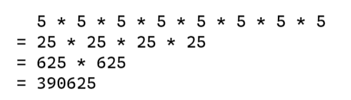

**快速幂、二进制取幂（Binary Exponentiation）** 是一个在 `O(log n)` 时间复杂度计算 x 的 n 次方的思维，其实有点类似我们自己手算 n 次方时使用的拆分技巧。

## 循环取幂

假如我们不借助编程语言的内置函数，来计算 x 的 n 次方，那么可能会使用循环来将 n 个 x 乘在一起得到结果，如下：


```Kotlin
// 5^8
val x = 5
val n = 8
var r = x

for (i in 1 until n) {
    r *= x
}

println(r) // 390625
```

这种方式是时间复杂度是 `O(n)`，在 n 比较大的时候，算法性能会比较差。

假如平时让我们在纸上手算，我们应该不会使用这么笨的方法，一个个去乘，这样随着数越大，计算难度也会增加很多。

## 更省力的手算

对于 n 比较大的情况，我们手算可以先拆分成多对平方值，算过的值在后面的计算中可以直接得出，转换为另外两个数的平方。这样不断将一对相同的平方合并为一个数平方，可以很好的减少我们的计算量和计算难度。

对于 `5^8`，我们可以拆分成 4 个 `5^2` 相乘，那么最终我们所需要计算的只有 `5*5`、`25*25`、`625*625`，直接将 7 次计算减少为 3 次计算。



当然我们的 n 可能出现奇数的情况，在计算中有一个数无法成对，但我们只要在其它平方计算结束的时候，再把这些数乘进入就好了。


对于这种计算方式，每次我们所需要计算的次数都可以减少接近一半，因此如果在代码中采用这个思路去计算 x 的 n 次方，时间复杂度将会降低到 `O(log n)`

## 快速幂的代码实现

我们在代码中不可能像手写一样拆分成 n 个 x 再去组合，这不仅没有优化到效率，反而会让时间复杂度变的更糟糕。

我们可以使用递归来实现，在代码中的拆分应当是以 n 为控制量，不断除 2 来达到跳过多余的计算。


在递归时我们只需要返回当前的平方，当余数为 1 时，代表有单身狗，我们帮它乘到结果上。

```Kotlin
fun pow(x:Long, n:Long) : Long {
    if (n == 0L) return 1;
    val res = pow(x, n / 2)
    return res * res * if (n % 2 == 1L) x else 1
}
```

当然递归会有造成额外的空间开销，因此我们可以使用循环来实现，此外，我们也可以使用右移和与运算来代替除 2 和求余。

```Kotlin
fun binaryPow(_x:Long, _n:Long) : Long {
    var x = _x
    var n = _n
    var res = 1L
    while (n > 0) {
        // n & 1
        if (n.and(1) == 1L) res *= x
        x *= x
        // n >> 1
        n = n ushr 1
    }
    return res
}
```

## more

- [斐波那契数列：可使用快速幂优化](https://zh.wikipedia.org/wiki/%E6%96%90%E6%B3%A2%E9%82%A3%E5%A5%91%E6%95%B0)
- [爬楼梯 - 力扣：方法二利用矩阵快速幂](https://leetcode-cn.com/problems/climbing-stairs/solution/pa-lou-ti-by-leetcode-solution/)

## 参考

快速幂 - OI Wiki：<https://oi-wiki.org/math/quick-pow/>
