## 机器学习（Machine Learning, ML）

在了解神经网络之前，我们需要先知道机器学习和神经网络之间的关系。

机器学习是人工智能中的一个分支， 主要研究如何让计算机模拟人类的学习行为来获得知识和技能，在实践上就是通过让泛型算法（Generic Algorithm，和 C/C++ 中的泛型算法不是一个东西）自己在输入的数据上建立逻辑模型，并通过该模型来得到目标结论。


泛型算法能处理的问题取决于我们所定义好的输入/输出的数据格式，而处理问题的条件和逻辑，则由泛型算法通过对输入数据进行分析学习构建处理逻辑参数，构建后的逻辑也能适应非预设数据的处理。神经网络属于机器学习泛型算法中的一种实现方案。

> - 根据泛型算法的学习方式，也可以将机器学习分为监督式学习、弱监督学习、半监督学习、非监督式学习、迁移学习、强化学习等。
> - 人工智能中许多维度的分类都存在交叉关系，因此通常不会为任何一个方法论进行确切的归类。

## 神经网络结构

【概念】机器学习中的神经网络模型是一种模仿生物神经网络结构和功能的模型，因此也被称为人工神经网络或类神经网络。人工神经网络由多个人工神经元（处理单元）以及传递信号的链接形成拓扑结构，由于泛型算法能处理的问题取决于输入/输出的数据格式，因此神经网络基本会分为3个层：

- Input Layer：输入层，用于接收外界数据，节点数量根据输入的数据类型决定
- Hidden Layer：隐含层，负责对输入层提供的数据进行信息处理、信息转化，通常这一层会有多个层次，每层会将处理结果向后面传递。
- Output Layer：输出层，将隐含层提供的输出信息转化层最终结果，节点数量根据输出的结构类型决定

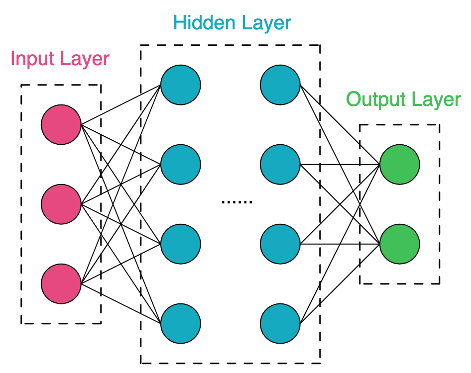

【生物知识点复习】生物神经元通常具有多个树突，树突用于接收信号，接收的信号在细胞体内整合产生阶梯性生电，而轴突用于传递信号，当细胞体的电位影响达到一定的阈值，则代表这个神经元被激活，激活的神经元会产生神经冲动（电脉冲），通过轴突传导出去，轴突尾端有许多和其他神经元树突产生连接的突触，电信号会通过这些突触传递给其他神经元，突触在一次突触事件中产生的电位幅度与突触的强度有关。

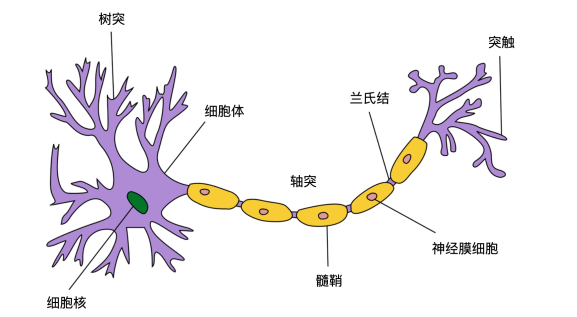

人工神经元也是模拟生物神经元的结构和特性，下面是一个典型的人工神经元结构，以及人工神经元和生物神经元中各个行为的对照表。

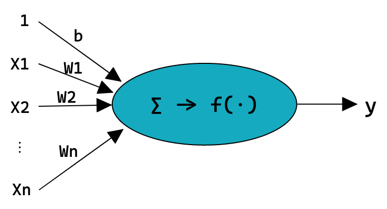

| **生物神经元** | **人工神经元** |
| --- | --- |
| 输入，即上一个神经元轴突传递过来的电信号 | x𝑖 也就是下一个神经元的输出 y |
| 突触强度 | w𝑗 权重 |
| 树突接收到的电信号 | x𝑖 * w𝑗 |
| 信号积累，阶段性生电 | ∑(x𝑖 * w𝑗) |
| 神经元激活 | 𝑓(·) 激活函数 |
| 轴突电信号传递 | y 也就是下一个神经元的输入 x𝑖 |

### 线性回归
从上面的对照表可以看出，一个神经元对上一层的输入处理其实就是将各个输入值加权求和，本质上就是一个线性回归 `𝑓(𝑥;𝑤) = 𝑤1𝑥1 + 𝑤2𝑥2 + ⋯ + 𝑤D𝑥D + 𝚋`。线性回归模型是机器学习中最基础最广泛的模型，主要用于分析自变量和因变量之间的关系。
为什么使用的是线性回归呢？
线性回归可以用来描述自变量和因变量之间的关系，机器学习中大部分问题都是分析数据里特征的关系来建立模型，因此在机器学习中很多问题都可以转换为线性回归问题来处理。
例如我们有如下左图关于面积和房价关系的数据，那么可以用一个一元线性回归模型来拟合这些数据，从而得到一个可以根据面积来预估房价的模型。当房屋特征变多时，也可以根据回归函数的参数建立一个没有 Hidden Layer 的神经网络。

| 面积和房价的线性拟合 | 多个房屋特征的神经网络 |
| --- | --- |
| 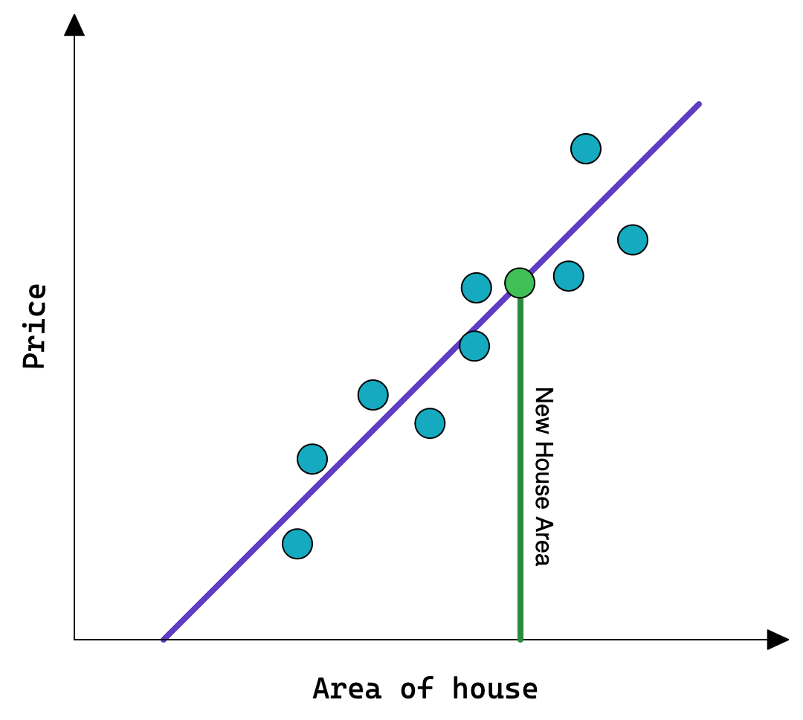 | 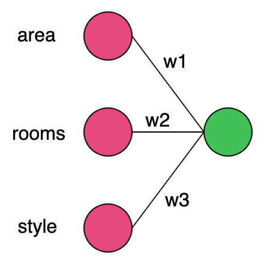 |

有时候特征向量与因变量并不是简单的线性关系，例如我们给的不是面积，而是房子的长宽，那么将会存在特征之间相乘的计算逻辑。或者有时候特征向量之间可能也存在关系，例如加上时间维度来预测未来的房价，那么其他特征带来的效果可能会跟着时间变化发生变化。如果我们在各个线性回归的关系上再次建立回归模型，那么工作量和计算量将会特别高，但多层的神经网络来处理这个问题就非常方便。

神经网络本身是由许多节点组成的，每个节点的输入输出都可以认为是一次线性转化，因此可以认为神经网络会将问题分为多个子问题来处理，不同纬度的问题会被分到各个层级，同一纬度的子问题会被分到各个神经元。每个神经元利用线性回归来对输入数据的特征进行线性转换（这个过程也称为特征提取），将子问题分析结果反馈给下一层级（父问题）继续处理。

没有 Hidden Layer 的神经网络只能用于表示线性回归函数，但多层的网络则可以在线性回归上建立更高纬度的模型。下面是 [The Number of Hidden Layers](https://www.heatonresearch.com/2017/06/01/hidden-layers.html) 中总结的常见层数体系结构的功能：

| **The Number of Hidden Layers** | **Feature** |
| --- | --- |
| 没有隐含层 | 仅能够表示线性可分函数或决策 |
| 隐含层数=1 | 可以拟合任何“包含从一个有限空间到另一个有限空间的连续映射”的函数 |
| 隐含层数=2 | 搭配适当的激活函数可以表示任意精度的任意决策边界，并且可以拟合任何精度的任何平滑映射 |
| 隐含层数>2 | 多出来的隐藏层可以学习复杂的描述 |

> 层数越深，理论上拟合函数的能力增强，效果按理说会更好，但是实际上更深的层数可能会带来过拟合的问题，同时也会增加训练难度，使模型难以收敛。

这时我们可以通过增加隐含层层数来增加模型的数据处理维度，以处理更加复杂的房价关系问题。

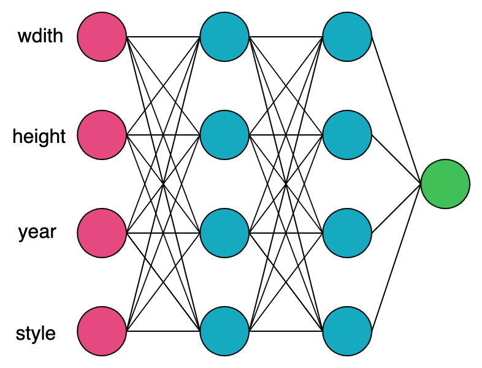

在分类问题中，线性回归也可以用来作为判别函数，例如有一个 `𝑓(𝑥;𝑤)= 𝒘T𝒙 + 𝚋` 将特征空间中满足线性判别函数 `y=0` 的点组成一个决策边界，将特征空间分为两个区域，每个区域对应一个类别，下图是二分类的例子。

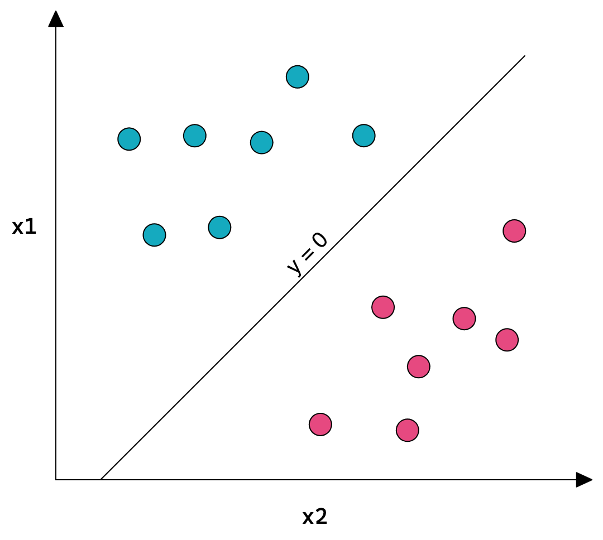

当分类问题是类别数C大于2的多分类问题时，一般需要通过“一对其余”、“一对一”或“argmax”方式来设计多个线性判别函数。

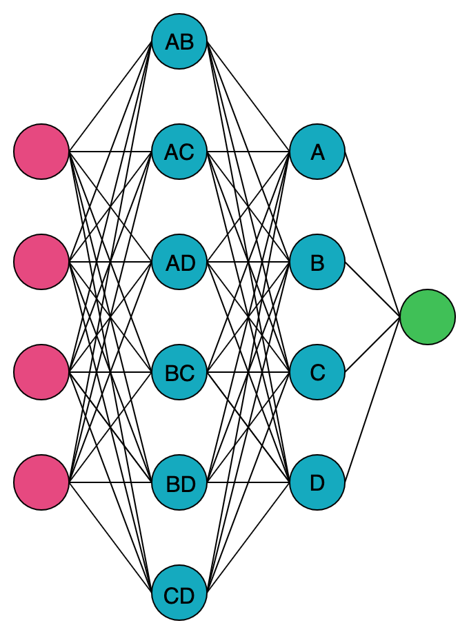

### 激活函数

如果神经网络每一层都只是接收上一层输入函数的线性变化，那么无论神经网络模型多复杂最终输出也是线性组合，纯粹的线性组合并不能解决更复杂的问题。

例如我们知道房价不会为负数，也就是房价预估的输出实际上不是一个线性回归问题，上面的线性回归函数只是满足了我们对数据的拟合，函数计算值并不能作为最后的结果输出。因此在人工神经元进行线性转换后，需要再作用于另一个函数，也就是激活函数。

激活函数可以分为线性激活函数（例如 `𝑓(x)=x`），以及非线性激活函数。由于神经元对输入数据的处理本身就是进行线性转换，因此为了增加网络的表达能力，激活函数一般使用的是非线性激活函数。

激活函数一般需要具备以下几点特性：
- 连续并且可导出（允许少数点上不可导），可导的激活函数 可以直接利用数值优化的方法来学习网络参数
- 激活函数及其导函数要尽可能简单，有利于提高网络计算效率
- 激活函数的导函数的值域要在一个合适的区间，区间大小会影响训练的效率和稳定性

常用的激活函数有 ReLU、Sigmoid、Tanh、Softmax 等。

以线性修正函数（Rectified Linear Unit, ReLU）为例，当 x 大于 0 时，输出 x 的值，当 x 小于等于 0 时，输出 0，其表达式如下

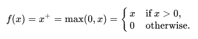 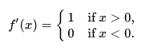

```python
import matplotlib.pyplot as plt
import numpy as np

rule = lambda z: np.maximum(0, z)

start = -10
stop = 10
step = 0.1
num = (stop - start) / step
x = np.linspace(start, stop, int(num))
y = rule(x)

plt.plot(x, y, label='ReLU')
plt.grid(True)

plt.legend()
plt.show()
```

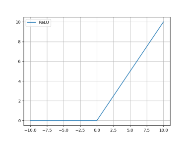

例如当我们把 ReLU 应用到房屋预测模型的神经元中，那么将会得到下面的逻辑回归模型。

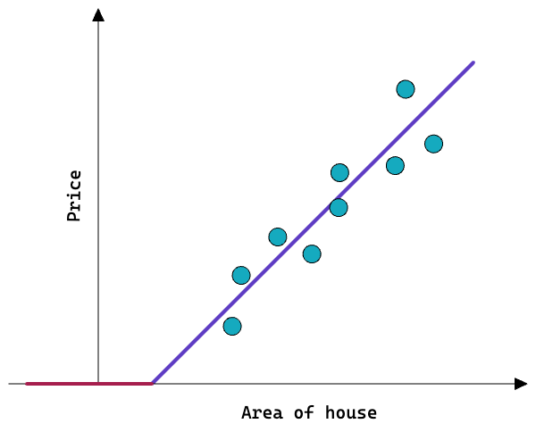

### 逻辑回归

逻辑回归（Logistic Regression）是线形回归中使用 Sigmoid 作为激活函数的线性模型。常用与处理二分类问题。线形回归在二分类中只能拟合出一个决策边界，分类问题最终需要根据这个决策边界来得到最终类别结果。

二分类中使用逻辑回归的表达式为

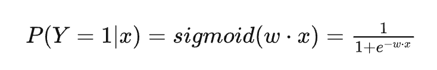

```python
import matplotlib.pyplot as plt
import numpy as np

sigmoid = lambda z: 1 / (1 + np.exp(-z))
start = -10
stop = 10
step = 0.01
num = (stop - start) / step
x = np.linspace(start, stop, int(num))
y = sigmoid(x)

plt.plot(x, y, label='Sigmoid')
plt.grid(True)

plt.legend()
plt.show()
```


为什么选择 Sigmoid 作为逻辑回归的激活函数可以看[【参考5】](https://blog.csdn.net/woshicao11/article/details/81458972)的文章

Logistic 回归可以看作预测值为“标签的对数几率”的线性回归模型．因此， Logistic回归也称为对数几率回归（Logit Regression）。

一维数据二分类（图来自[神经网络与深度学习](https://nndl.github.io/nndl-book.pdf)）

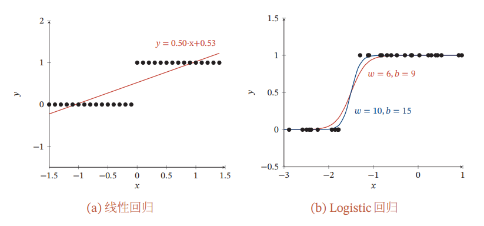

二维数据二分类

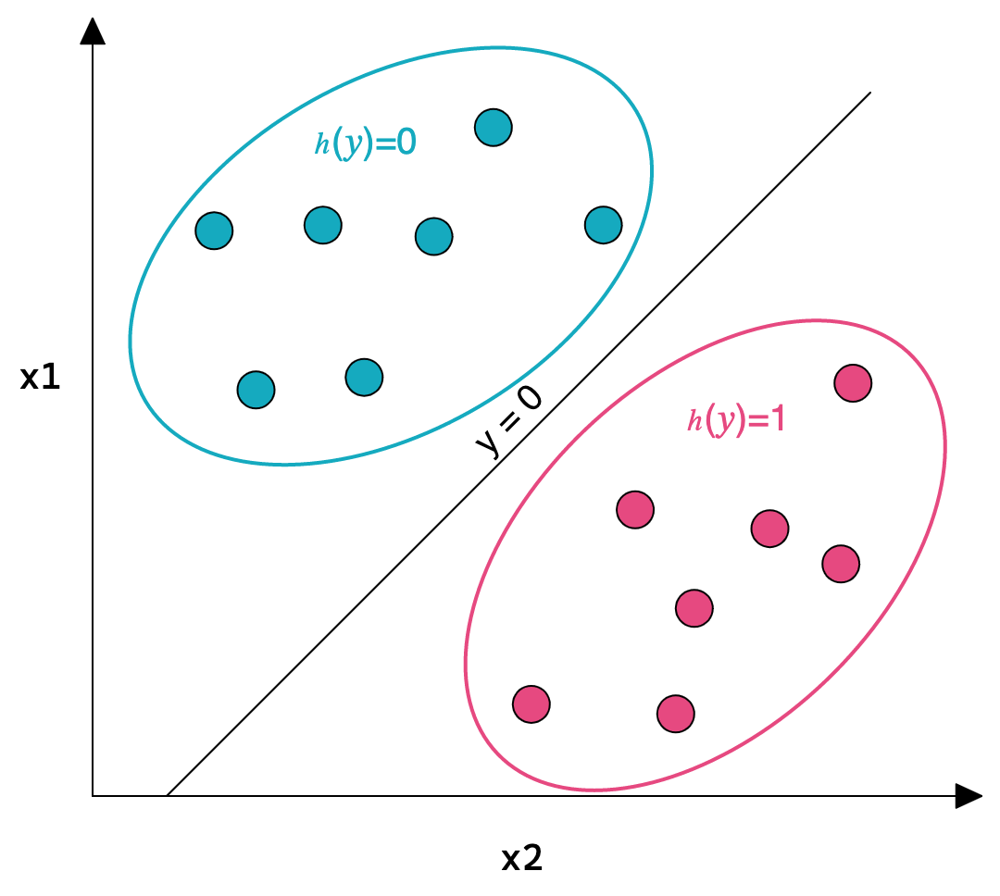

> 多分类问题中使用的是 softmax 函数

### 前馈神经网络

前馈神经网络模型是神经网络中最简单最基础的模型，本文许多知识点都是以前馈神经网络为基础来讲解。前馈神经网络每层的每个节点，都会和上一层/下一层的所有节点建立连接，该层为全连接层，所有层次都是全连接层的网络也称为全连接网络。

实际上网络可以根据不同特征之间的关系来建立对应的连接，并不需要全部连接在一起，但这会增加许多模型结构建立的人为工作量。

全连接网络在训练的过程中，那些不需要的连接权重会被置 0（或接近0），此时可以认为两个节点之间是没有连接关系的，这样我们就不需要再去关心那些节点应该连接起来了。

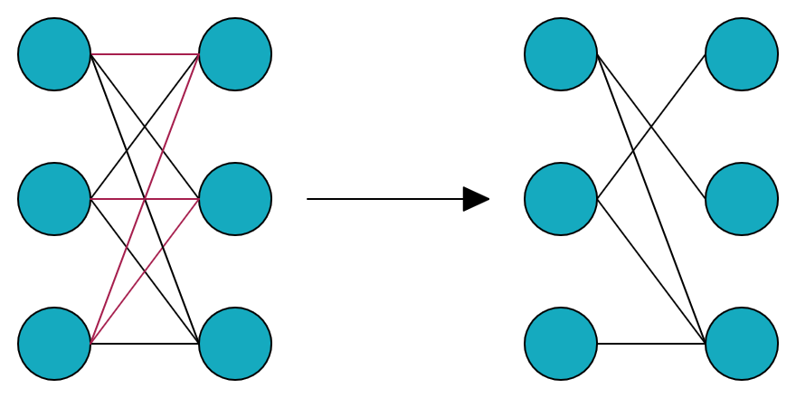

## 损失函数

对于单个神经元来说，需要确定的参数就是权重 _ω_j 的值，所有神经元之间连接的权重组成权重矩阵，权重矩阵大幅决定了模型最终输出结果的准确性，在机器学习中，会使用损失函数来评估一个模型的好坏。

损失函数（误差函数、代价函数，Cost Function / Loss function）用于衡量模型的预测值  𝑓(x) 和预期值 y 的不一致程度，它是一个非负实值函数，损失函数在测试数据上输出的值越小，可以认为模型的准确度越高。

模型训练最终目的就是得到最佳的权重，使损失函数在测试数据上的值最小。

损失函数有多种，例如线性回归经常使用的平方损失。

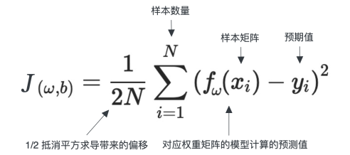

对于线性回归函数，我们可以使用**最小二乘法则**来得到各个权重最佳值，最小二乘法的公式如下，其中 𝜃 代表权重矩阵，通过损失函数对 𝜃 求导取 0 从而得到最优 𝜃。

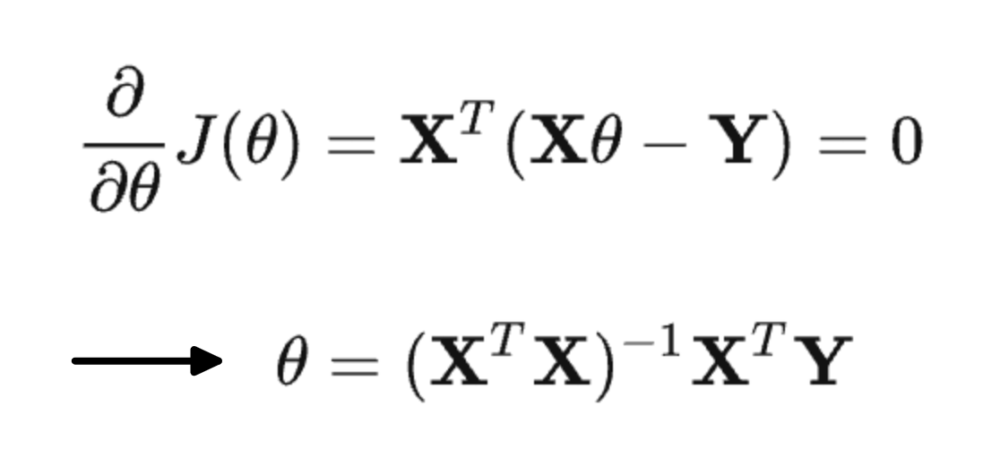

使用最小二乘法则的使用需要考虑下面两个问题：

- 需要计算逆矩阵，时间复杂度为 O(n^3)，当特征数变多时将会非常耗时
- 需要 XTX 可逆，当训练样本数小于特征数，或者特征之间存在线性关系，那么 XTX 将不可逆
- 最小二乘法只适用于线性模型

对于神经网络而言，由于上面的问题，一般并不推荐使用最小二乘法则来计算神经网络的权重矩阵。
我们可以将权重矩阵的计算问题，转化为损失函数的优化问题，使用最优化方法来优化损失函数的输出，得到目标权重矩阵。

## 梯度下降

梯度下降算法（Gradient Descent）属于最优化方法的一种，由于它的时间复杂度和初始要求都比较低，相对其他最优化方法，更加适合神经网络这种特征维度大的场景。

梯度下降算法的思路是，先给所有权重一个初始值，每次迭代时更新权重，使损失函数的值往期望的方向变化。
就像一个人在下山，会根据当前位置，往低的地方迈出一步，最终到局部最低点。

```python
from matplotlib import pyplot, cm
import numpy as np

fig = pyplot.figure()
axes = pyplot.axes(projection='3d')

xx = np.arange(-10,10,0.1)
yy = np.arange(-10,10,0.1)
X, Y = np.meshgrid(xx, yy)
Z = X**2+Y**2+10

axes.plot_surface(X,Y,Z,alpha=0.9,cmap=cm.coolwarm)
axes.contour(X,Y,Z,zdir='z', offset=-5,cmap="rainbow")

axes.set_xlabel('w1')
axes.set_xlim(-9, 9)
axes.set_ylabel('w2')
axes.set_ylim(-9, 9)
axes.set_zlabel('cost')
axes.set_zlim(-5, 200)

pyplot.show()
```

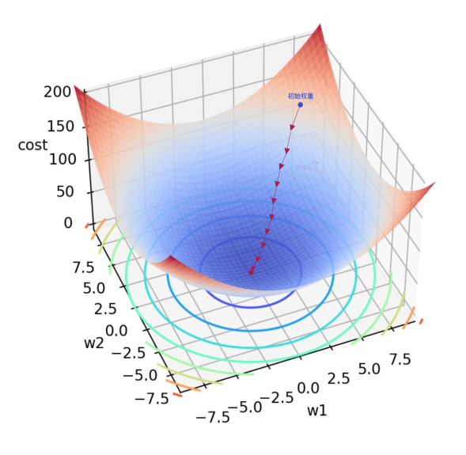

梯度下降算法中，每次迭代更新时所有权重要一起更新，从而达到整体位置的向下偏移，每个权重的更新公式如下，其中：

- `:=`号为赋值符号
- `𝜔𝑗` 为进行更新的权重
- `𝛼` 为学习速率，该值应当大于 0
- 后面那部分为损失函数的偏导数，也就是损失函数在 `𝜔𝑗` 方向的斜率

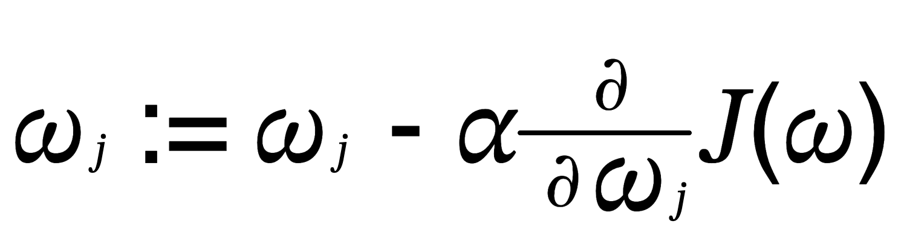

- 当损失函数在 `𝜔𝑗` 方向的斜率是负数时， `𝜔𝑗` 减去一个负数， `𝜔𝑗` 变大
- 当损失函数在 `𝜔𝑗` 方向的斜率是正数时， `𝜔𝑗` 减去一个正数， `𝜔𝑗` 变小

无论是偏导数是正数还是负数，`𝜔𝑗` 损失函数总会向着 0 值的方向变化，最终接近 `𝜔𝑗`  的局部最优解。

```python
from matplotlib import pyplot
import numpy as np

fig = pyplot.figure()

X = np.arange(-10,10,0.1)
Y = X**2

pyplot.plot(X, Y)
pyplot.xlabel("w")
pyplot.ylabel("cost")
pyplot.ylim(0, 100)
pyplot.ylim(0, 100)
pyplot.xticks([])
pyplot.yticks([])

pyplot.show()
```


### 学习速率

学习速率 `𝛼` 决定了梯度下降每次迭代时，权重 `𝜔𝑗` 的更新距离，也可以称为单次训练的步长。

当 `𝛼` 太小时，每次迭代带来的下降值也会非常小，这意味着需要迭代更多次数才能到达局部最优解。

当 `𝛼` 太大时，每次迭代权重 `𝜔𝑗` 的变化也会很大，这可能出现两个问题：
- 损失函数导数变小，但接近最小值时发生震荡，无法收敛
- 损失函数导数变大，学习速率不变，结果发散


为了解决学习速率的问题，目前也有很多对学习速率进行改良的梯度下降算法：
- AdaGrad：每次迭代时，学习速率根据梯度平方积累值的增加逐渐衰减
- RMSprop：AdaGrad 优化版，在衰减过程中进行加权移动
- Monmentum：基于物理加速度和阻力的思路，更新参数时加上一个冲量，当冲量和梯度方向相同时冲量会增加，相反时冲量会减少
- Adam：自适应矩估计，Monmentum + RMSprop 的结合体

### 非凸函数

上面提到的权重矩阵求解都是指局部最优解。拟合函数并不总是像上面的图一样，是一个弓形的函数（凸函数），当集合里面任意两个点的连线都在落集合里面，否则则认为是非凸问题。

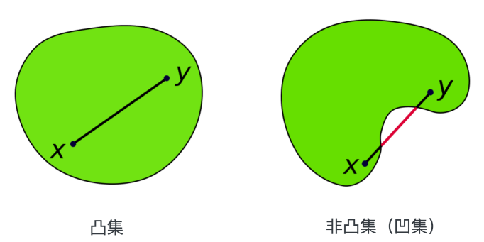

机器学习中许多问题属于非凸问题，非凸优化问题可能存在多个局部最优解，因此使用梯度下降算法得到的不一定是全局最优解，这与初始权重使损失函数值落在哪一点有关系。

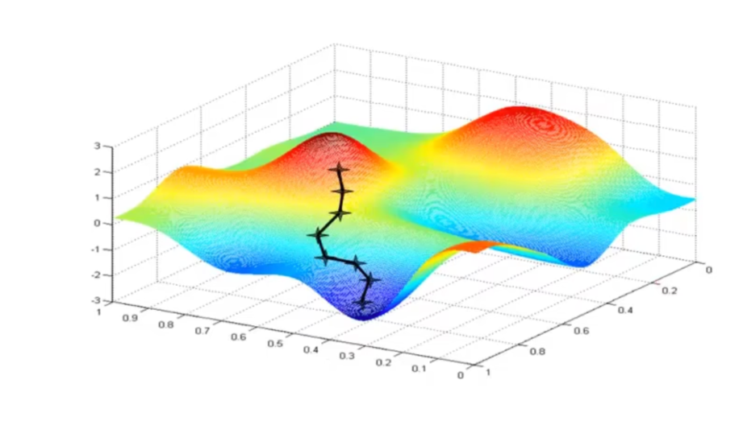

### 小批量梯度下降

- **批量梯度下降（Batch Gradient Descent, BGD）**
    
    BGD 是训练时，采用整个样本来优化算法。BGD 虽然迭代次数能相对比较少，但一次迭代都要遍历所有样本，需要大量的时间，并且更新在所有样本遍历完才发生，在全连接网络中多余的参数更新也会被计算进去。

- **随机梯度下降（Stochastic Gradient Descent, SGD）**

    每次迭代使用一个样本来更新参数。SGD 相比 BGD 会多出噪声，提高了泛化误差，但学习过程较慢，遇到局部极小或鞍点容易卡在梯度 0 的地方。现在的 SGD** **更多指的是小批量随机梯度下降，下文也一样。

- **小批量梯度下降（Min-batch Gradient Descent, MBGD）**

    BGD 和 SGD 的结合，即每次迭代从打乱的训练集中随机抽取一小批数据样本来更新。

## 反向传播算法

由于神经网络模型的误差计算在输出层，因此使用梯度下降算法来训练时，隐含层没办法直接获得误差来更新参数。这时可以通过反向传播算法来将误差传递给上一层来更新权重。

反向传播算法（Back Propagation, BP）是一个和其他最优化方法结合更新神经网络参数的方法，其的思路是，当前节点计算出来的结果与预期值的误差，和上一层节点的输入有关，上层各节点的输入对误差带来的影响应该是不同的，因此需要合理地将误差分配给上层的神经元，控制上层权重变化比例来更快的降低代价。

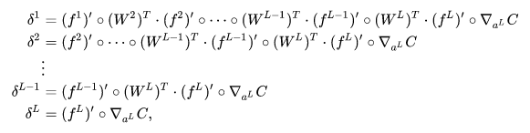

反向传播算法和梯度下降结合使用时，可以直接计算权重相对于最终输出（损失）的梯度，不用计算隐藏层值相对于权重变化的导数。

反向传播的公式推导并不容易，我们先直接记下公式

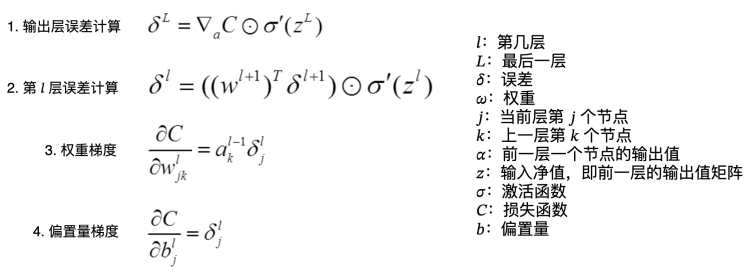

使用反向传播算法的神经网络训练流程如下：
1. 从训练集里随机获取一个/批训练样本
2. 前馈计算每层的净输入和激活值，直到最后一层
3. 使用公式 1 计算输出值和预期值的误差
4. 使用公式 2 反向传播计算每一层的误差值
5. 使用公式 3 和 4 更新权重参数和偏置量
6. 回到 1 进行下一次迭代

到这里，一个基础的前馈神经网络模型的输出和训练流程都讲到了，下面可以开始动手写代码了。

## 代码实践

本次代码实践使用手写图片识别作为的例子，因为有开放的数据集，并且手写时模型结构也可以定义的比较简单。

手写图片的数据集可以从 [MNIST 官网](http://yann.lecun.com/exdb/mnist/)下载，为了方便，我们使用 TrochVision 来获取 MNIST 数据集，它会自动帮我们下载 MNIST 数据集并解压，获取时也会提供了对应的数据转换。

这里会再使用一个 numpy 的库，这个库可以帮助我们完成一些复杂的矩阵计算。

```python
import numpy as np
import torchvision

torchvision.datasets.MNIST(root='data/', train=True, download=True)
```

首先我们先来看看 MNIST 数据长什么样。

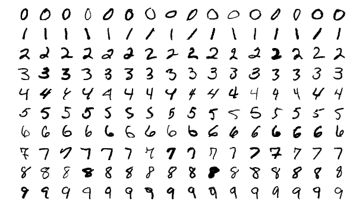

MNIST 数据集为 0～9 的手写数字图片，有 60000 张训练样本，还有 10000 张测试样本，每张图片的分辨率为  28 * 28。
我们可以定义 28 * 28 = 784 个节点的输入层，使用 10 个节点的输出层，每个节点输出代表 0～9 各数字的决策值，输出 1 时代表为该数字。

### 定义模型结构

手写图片识别属于分类问题，因此我们可以采用逻辑回归，先定义 Sigmoid 激活函数以及其导数形式

```python
sigmoid = lambda z: 1 / (1 + np.exp(-z))
derivative_sigmoid = lambda z: sigmoid(z) * (1 - sigmoid(z))
```

图片特征提取属于高维度的回归问题，二维矩阵 + 矩阵特征转换，因此可以定义一个 3 层的神经网络（1层输入，2层隐含，1层输出）。训练方式使用 MBGD 算法 + BP 算法。因此我们可以简单地定义下面的的模型结构。

```python
class NeuralNetwork(object):
    def __init__(self, l0, l1, l2, l3, batch_size=6):
        """
        初始化神经网络
        :param l0: 输入层节点数
        :param l1: 隐含层 l1 节点数
        :param l2: 隐含层 l2 节点数
        :param l3: 输出层节点数量
        :param batch_size: 单次训练批次数据量
        """
        self.lr = 0.5  # 学习率
        self.batch_size = batch_size
        # 各层权重与偏置量
        self.w1 = np.random.randn(l0, l1) * 0.01
        self.b1 = np.random.randn(l1) * 0.01
        self.w2 = np.random.randn(l1, l2) * 0.01
        self.b2 = np.random.randn(l2) * 0.01
        self.w3 = np.random.randn(l2, l3) * 0.01
        self.b3 = np.random.randn(l3) * 0.01
```

### 算法实现

定义了模型的结构，接下来就是前馈传播和反向传播算法的实现了，由于反向传播算法需要使用到各层在前馈时的净输入和激活值，因此前馈方法会将这些数据返回，用于反向传播。

只需要使用代码将数据代入上面提到的公式，因此实现起来很简单。

```python
# in NeuralNetwork
def forward(self, x):
    """
    向前传播推导结果
    :param x: 输入的 [784] 向量矩阵
    :return: 输出各层的净输入和激活值
    """
    z1 = np.dot(x, self.w1) + self.b1
    o1 = sigmoid(z1)

    z2 = np.dot(o1, self.w2) + self.b2
    o2 = sigmoid(z2)

    z3 = np.dot(o2, self.w3) + self.b3
    o3 = sigmoid(z3)
    return z1, o1, z2, o2, z3, o3

# in NeuralNetwork
def backward(self, x, z1, o1, z2, o2, err3):
    """
    反向传播更新权重
    """
    dot_w3 = np.dot(o2.T, err3) / self.batch_size
    dot_b3 = np.sum(err3, axis=0) / self.batch_size

    err2 = np.dot(err3, self.w3.T) * derivative_sigmoid(z2)
    dot_w2 = np.dot(o1.T, err2) / self.batch_size
    dot_b2 = np.sum(err2, axis=0) / self.batch_size

    err1 = np.dot(err2, self.w2.T) * derivative_sigmoid(z1)
    dot_w1 = np.dot(x.T, err1) / self.batch_size
    dot_b1 = np.sum(err1, axis=0) / self.batch_size

    self.w3 -= self.lr * dot_w3
    self.b3 -= self.lr * dot_b3
    self.w2 -= self.lr * dot_w2
    self.b2 -= self.lr * dot_b2
    self.w1 -= self.lr * dot_w1
    self.b1 -= self.lr * dot_b1
```

### 训练与测试

最后编写训练和测试的方法，测试时使用完成训练的模型。由于我们采用小批次梯度，因此取数据时需要按照每个批次的数据量来取。另外一次样本的遍历可能不足以让模型得到很好的效果，因此我们可以进行多次全样本的训练。训练时我们也可以计算一下当前批次的损失，来观察模型的拟合情况。

测试时采用一次性计算，得到所有测试数据的结果矩阵，对预测结果获取最大值索引，也就是单个样本预测结果为 1 的位置，该位置为样本的预测结果数值，最后计算样本预测值和预期值的匹配数量，来得到准确率。

```python
def train(nn, data, targets):
    for cou in range(10):
        for i in range(0, 60000, nn.batch_size):
            x = data[i:i + nn.batch_size]
            y = targets[i:i + nn.batch_size]
            z1, o1, z2, o2, z3, o3 = nn.forward(x)
            err3 = (o3 - y) * derivative_sigmoid(z3)
            loss = np.sum((o3 - y) * (o3 - y)) / nn.batch_size
            print("cou:" + str(cou) + ", err:" + str(loss))
            nn.backward(x, z1, o1, z2, o2, err3)


def test(nn, data, targets):
    _, _, _, _, _, o3 = nn.forward(data)
    result = np.argmax(o3, axis=1)
    precision = np.sum(result == targets) / 10000
    print("Precision:", precision)
```

### 数据预处理

在获取数据时，我们需要先将图片二维的像素数据平铺成一维矩阵，将对应的数字标签 0～9 转换成 1 维矩阵的输出，例如 3 转换为 [0, 0, 0, 1, 0, 0, 0, 0, 0, 0]。由于测试数据的标签不需要参与反向传播，我们不做矩阵转换，这样可以方便我们对预测结果做计算。

```python
def target_matrix(targets):
    """
    数字标签转换
    :param targets: 对于的数字标签矩阵
    :return:
    """
    num = len(targets)
    result = np.zeros((num, 10))
    for i in range(num):
        result[i][targets[i]] = 1
    return result

    
# 训练数据
def load_train_data():
    train_data = torchvision.datasets.MNIST(root='data/', train=True, download=True)
    # Numpy 矩阵转换
    train_data.data = train_data.data.numpy()  # [60000,28,28]
    train_data.targets = train_data.targets.numpy()  # [60000]
    # 输入向量处理，将二维数据平铺
    train_data.data = train_data.data.reshape(60000, 28 * 28) / 255.  # (60000, 784)
    # 标签转换
    train_data.targets = target_matrix(train_data.targets)  # (60000, 10)
    return train_data


# 测试数据
def load_test_data():
    test_data = torchvision.datasets.MNIST(root='data/', train=False)
    test_data.data = test_data.data.numpy()  # [10000,28,28]
    test_data.targets = test_data.targets.numpy()  # [10000]
    test_data.data = test_data.data.reshape(10000, 28 * 28) / 255.  # (10000, 784)
    return test_data
```

最后把上面的步骤组织起来

```python
def demo():
    nn = NeuralNetwork(784, 200, 30, 10)
    train_data = load_train_data()
    train(nn, train_data.data, train_data.targets)
    test_data = load_test_data()
    test(nn, test_data.data, test_data.targets)


demo()
```

最终测试结果 Precision: 0.9686，即准确率有 96%。

代码地址：[https://github.com/korilin/neural_network_tech_sharing](https://github.com/korilin/neural_network_tech_sharing)

## 其他网络模型设计

除了前馈神经网络外，神经网络的节点类型还有很多，不同模型的训练/处理消耗的资源，以及应用场景也不一样。

### 深度神经网络

在机器学习中有一个深度学习话题，在神经网络中，深度学习体现在网络隐含层数量，层数多的网络称为深度神经网络（DNN），像深度残差学习网络最多能有 152 层，但随着网络增加训练难度也非常大。

### 卷积神经网络

卷积神经网络（CNN）也是比较常用的网络结构，CNN 在图片识别上有非常理想的效果，许多图片、视频的识别/分类模型都采用了 CNN 的思想。

CNN 的核心为卷积核，在图像中有着颜色通道，局部特征等特有特性，这些特征的特点来自相邻像素的关联性，通常这些特征在局部或整体上会给人带来不同的感受。因此出现了采用卷积来提取局部特征的方式，在数学算子上卷积是通过两个函数生成第三个函数，表征函数 f 与经过翻转和平移的 g 的乘积函数所围成的曲边梯形的面积。函数 g 在卷积神经网络中也称为滤波器。

 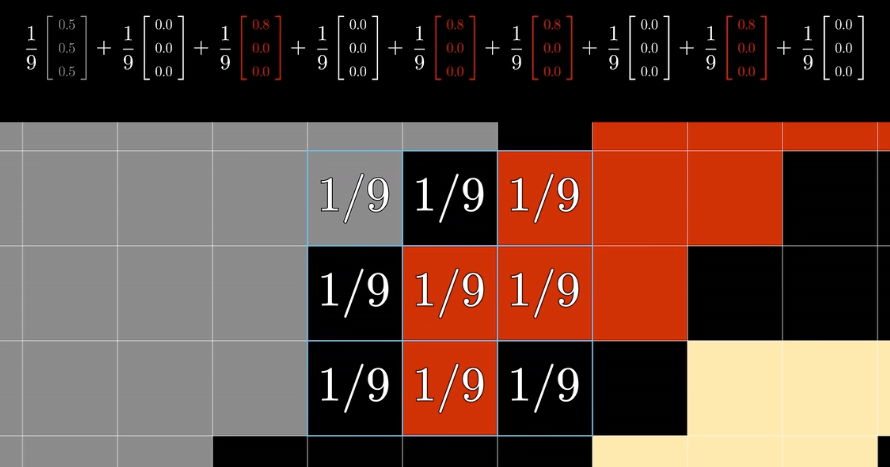

### 循环神经网络

在普通神经网络和 CNN 中，每层神经元的信号只能向上层传播，但这样对时间序列上的变化进行建模会比较困难，循环神经网络（RNN）就是为了适应这种需求出现的。
RNN 中的神经元的输出可以在下一个时间戳中直接作用到自身，也就是每个神经元的输入，出了上一层的输入外，还结合了神经元自身的上一次输入，用图表示如下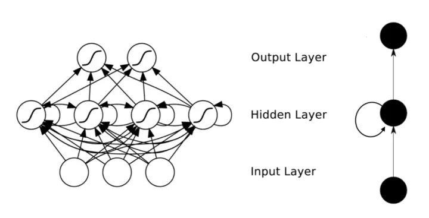

### 生成对抗网络

生成对抗网络（GAN）属于生成模型的一种，由一个生成网络和一个判别网络组成。
生成网络模仿真实样本生成假数据来给判别网络识别，判别网络则识别输入数据为真实样本还是生成网络生成的假数据。两个网络之间通过相互对抗和参数调整，最终使得判别网络无法判断生成网络的输出是否为真实数据。
GAN 是非监督式学习的一种，但实际上在半监督、强化学习中也有效果。
GAN 还有一个变体 DCGAN，由于 CNN 中卷积核对图片特征的提取具有非常好的效果，因此 DCGAN 中使用了反卷积来对特征进行反推，来对特征进行更好转换输出。

## 参考

1. [机器学习算法（一）：逻辑回归模型（Logistic Regression, LR）_意念回复的博客-CSDN博客](https://blog.csdn.net/weixin_39910711/article/details/81607386)
2. [神经网络与深度学习](https://nndl.github.io/nndl-book.pdf)
3. [The Number of Hidden Layers](https://www.heatonresearch.com/2017/06/01/hidden-layers.html)
4. [深度学习笔记：如何理解激活函数？（附常用激活函数）](https://zhuanlan.zhihu.com/p/364620596)
5. [机器学习之Logistic回归激活函数为什么是Sigmoid？_logistic回归的激活函数_MuBaicao的博客-CSDN博客](https://blog.csdn.net/woshicao11/article/details/81458972)
6. [常见的几种最优化方法（梯度下降法、牛顿法、拟牛顿法、共轭梯度法等） - 蓝鲸王子 - 博客园](https://www.cnblogs.com/shixiangwan/p/7532830.html)
7. [卷积神经网络中二维卷积核与三维卷积核有什么区别？_3d卷积和2d卷积区别_意念回复的博客-CSDN博客](https://blog.csdn.net/weixin_39910711/article/details/124310557)
8. [生成模型（Generative）和判别模型（Discriminative）_生成模型和判别模型_意念回复的博客-CSDN博客](https://blog.csdn.net/weixin_39910711/article/details/89483662)
9. [CNN（卷积神经网络）、RNN（循环神经网络）、DNN（深度神经网络）的内部网络结构有什么区别？ - 知乎](https://www.zhihu.com/question/34681168/answer/84061846)