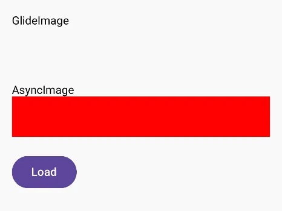
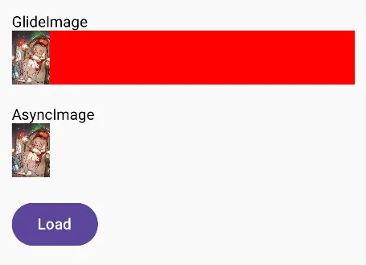
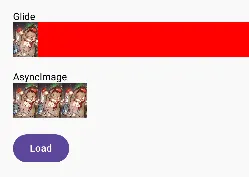
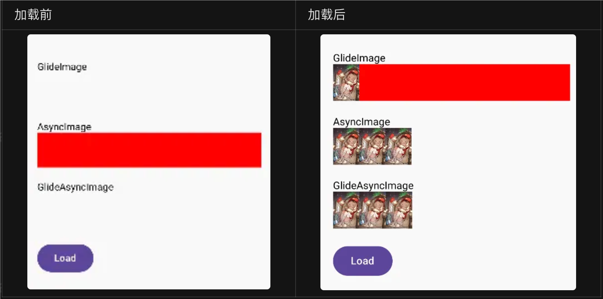

在公司业务引入 Compose 到现在也有一年了，图片加载这一块一直是 UI 基础设施的常聊话题，这期聊一下这段时间我们在 Compose 加载图片上的一些方案尝试，以及这个过程遇到的一些问题。

## Compose 基础图片加载

首先我们要先认识一下 Compose 基础库加载图片的方式，以及 Painter。

Painter 是 Compose 中一个可绘制内容的抽象类型，它可以通过一些机制去配置绘制内容的透明度、颜色过滤器、绘制内容的测量大小、以及绘制方向等。

常见的 Painter 类型有：
- ColorPainter 绘制纯颜色
- BrushPainter 绘制渐变色
- BitmapPainter 绘制 Bitmap
- VectorPainter 绘制矢量图

Compose 中绘制图片大多也是依靠 Painter（但不是强依赖），通过 `painterResource` 方法就可以将本地的资源 id 加载成 Painter 给 Image 控件绘制。例如下面的代码就可以在 Content 这个控件中显示一个 App 内的资源图片。

```Kotlin
@Composable
fun Content() {
    
    Column(
        modifier = Modifier.fillMaxSize(),
        verticalArrangement = Arrangement.Center,
        horizontalAlignment = Alignment.CenterHorizontally
    ) {
        Text("Image Compare")
    
        Image(
            painter = painterResource(R.drawable.compose),
            modifier = Modifier.size(50.dp),
            contentScale = ContentScale.Crop,
            alignment = Alignment.Center,
            contentDescription = null
        )
    }
}
```

这里可以看出两个问题：
1. 首先 Image 的 painter 参数是必传的，大部分情况下我们需要同步构造 Painter，对于一些较大的本地图片会影响组合函数的执行性能。
2. Compose 提供的 painter 方法只能获取 App 内部资源的图片，没办法加载网络或者文件系统的图片，因此我们需要自己去写网络图片的异步加载，再转换为 Painter 给 Image 控件。

### 业务使用与方案实现的隔离

目前在 Compose 中异步加载图片的方案有好几种，由于我们早期在项目中引入 Compose 时，不清楚哪一个方案才是适合我们业务的，并且由于当时的时间限制，只是做了一些简单的对比。为了处理后续可能更换图片加载的实现，在业务上使用异步图片加载控件时，是提供了一个 NetImage 控件给外部使用，而内部根据不同 EngineType 选择不同的图片加载实现。

```Kotlin
@Composable
fun NetImage(
    model: Any?,
    modifier: Modifier = Modifier,
    engine: EngineType = EngineType.Default,
    ...
)

enum EngineType {
    Coil, // coil-compose: AsyncImage
    Glide, // glide-compose: GlideImage
    ... // and so on.
}
```

## 三方库 Coil 和 Glide 的支持与问题

Coil 和 Glide 作为 Android 常用的图片加载库，本身都已经开始了 Compose 的支持。

Coil 的 AsyncImage 在许多场景下图片加载效果都比较稳定，并且它是跨端实现，如果是 CMP 项目应当作为首选。但由于当时 AGP 版本问题降低了某些库版本后，导致 AsyncImage 完全不可用。

另一方面我们许多的基础图片工具重度依赖 Glide，由于 Coil 的图片缓存本身和我们大范围使用的 Glide 并不相通，要打通这两个框架的缓存并不容易，因此也没有专门对 Coil 的版本兼容去做处理。

因此在三方库的选择上，我们更偏向于使用 Glide 官方提供的 Compose 库。

但 glide-compose 最后一个版本（2024-10-31 的时候） 1.0.0-beta01 已经和 Glide 5.0.0-rc1 一起从 2023 年 9 月发布后，就一直没有新的版本更新了（写的这句话日期 2024.10.28）。因此从它上次大改后还有很多 bug 没有被修复。

例如 GlideImage 在一些情况下 url 发生变更，触发了控件重组，但没有更新 UI（触摸了控件后就会更新），这应该和 GlideImage 内部为了减少一些性能损耗，做了绘制缓存有关联。

> 实际上这两个控件其实也没有解决我们后续开发中在业务遇到的其它问题，三方库的自带的 Compose 实现在当时并不是我们的最优选。

## 使用 AndroidView 套现有网络图片控件

一个最简单粗暴的方案，就是在 Compose 中使用 AndroidView 套原生已经实现的图片加载控件。

这是我们早期使用过的一个方案，从实现效率上它是最优选，但随着使用场景越多，需要开放的 View 属性和加载过程也越来越多，导致控件容易多出一些不必要的参数。

另外 AndroidView 会直接消耗外部 Box 手势，导致下层的手势事件丢失，这个问题需要针对场景处理，而图片加载又是项目中需要大范围使用的，一次性解决比较麻烦。

View 系统与 Compose 系统的交互较为麻烦，还需要将 Compose 侧参数（例如 ContentScale 和 Alignment）映射到 View 系统对应的组合配置项，所以倒不如直接使用纯 Compose 实现，减少和 View 系统交互的中间消耗。

最后从性能与互交互等方面的考虑上，后面我们放弃了这个方案。

## 通过有状态的 Painter 值给 Image 绘制

### 状态驱动组合重建

我们弃用 AndroidView 后的另外一个快速实现方案。就是通过在 `@Composable` 方法中用多个状态去控制 Painter 的加载状态，调整控件的显示逻辑。

默认情况下提供一个空的 Painter State，默认情况下使用一个 Spacer 占位，并在 LaunchedEffect 中使用 Glide 加载 Drawable，再转换成 Painter 更新状态，这时候再替换为 Image 去渲染

```Kotlin
val context = LocalContext.current

val state = remember(model) { mutableStateOf<Painter?>(null) }
val asyncSize = remember { AsyncGlideSize() }

val sizeModifier = modifier.onSizeChanged { asyncSize.putSize(it) }

val painter = state.value // current painter

if (painter == null) Spacer(modifier = sizeModifier)
else Image(painter = painter, modifier = sizeModifier, ...)

LaunchedEffect(model) {
    val size = asyncSize.awaitSize()
    Glide.with(context)
        .asDrawable()
        .overload(size.width, size.height)
        .load(model)
        .into(painterTarget)
}
```

这个方案实现起来简单，只要需要处理好 model 更新和复用以及异步加载的问题，就能利用 Compose 自带的 Image 控件去显示图片，但该方案依赖于状态变更.

其中一个问题是 Glide 图片的加载尺寸的获取，通常我们需要根据控件大小去调整 Glide 加载图片时的尺寸，防止直接将原图加载到内存中进行绘制，因此我们需要通过 Modifer 回调控件尺寸作为状态在 LaunchedEffect 中获取，但 overload 可能会在获得控件大小之前就调用，因此我们还需要使用一个 Size 等待器去等控件大小获取完成，再进行加载，例如下面的 ResolvableGlideSize。

```Kotlin
internal data class GlideSize(val width: Int, val height: Int)

/**
 * implements:
 * - ImmediateGlideSize
 * - AsyncGlideSize
 **/
internal sealed interface ResolvableGlideSize {
    suspend fun awaitSize(): GlideSize
    fun sizeReady(): Boolean
    fun putSize(size: Size)
    fun readySize(): GlideSize?
}
```

虽然这样看上去业务通过 Image 控件已经实现了一个相对不错的 NetImage，但实际在业务使用过程中我们发现这种实现的一些性能和延迟问题。

1. 在 RecyclerView 列表中的 Item 混用 Compose 的情况下，由于 Glide 的加载尺寸和加载始终是通过异步回调获取，状态变更后再触发重组，会滑动滑动过程 Compose 侧图片的绘制更新总是比同 Item 下的其它 View 慢一拍。

2. 外部控件执行动画过程，同时一时间加载较多大尺寸图片可能会因为 Bitmap 进行 resize 阻塞了动画导致卡顿感。

### 异步 Painter 方案

对于上面提到的性能问题，我们发现使用 Coil 的 AsyncPainter 进行异步加载并没有出现这么明显的性能问题，因此我按照 Coil 在 Painter 内部异步加载的思路，使用 glide-compose 中的 FlowTarget 实现了一个 Glide 版本的 GlideAsyncPainter，发现将实际的 Painter 状态放到自定义的 GlideAsyncPainter 里面进行代理时，没有外层的重组，直接由内部状态变化导致重绘，性能要好很多。

```Kotlin
@Stable
private class GlideAsyncPainter(
    val request: Context.() -> RequestBuilder<Drawable>,
    // ...
) : Painter() {

    private var painter by mutableStateOf(loading)

    override val intrinsicSize: Size
        get() = painter?.intrinsicSize ?: Size.Unspecified

    private val glideSize = AsyncGlideSize()

    override fun DrawScope.onDraw() {
        glideSize.putSize(size)
        (painter)?.apply { draw(size, alpha, colorFilter) }
    }

    fun startRequest(scope: CoroutineScope, context: Context, model: Any?) {
        painter = loading
        rememberJob = (scope + Dispatchers.Main.immediate).launch {
            request().load(model).flow(glideSize).collectLatest {
                painter = it
            }
        }
    }
}

internal fun RequestBuilder<Drawable>.flow(
    size: ResolvableGlideSize,
): Flow<GlideLoadResult> {
    return callbackFlow {
        val target = FlowTarget(this, size)
        listener(target).into(target)
        awaitClose { manager.clear(target) }
    }
}
```

自定义 Painter 需要提供一个时机用于取消 Glide 的加载任务，防止内存泄漏，由于 Painter 通常在 `@Composable` 函数中构建，因此实现 `RememberObserver` 接口来提供生命周期是个首选。

- onRemebered 在组合中被记录
- onForgotten 在组合中被取消记录
- onAbandoned 在组合中已经被 remember 方法返回，但没有成功被组合记录

我们只需要在 onForgotten 和 onAbandoned 这两个回调中取消任务和停止 AsyncGlideSize 的等待即可。

```Kotlin
@Stable
private class GlideAsyncPainter(
    val scale: ContentScale,
    val request: Context.() -> RequestBuilder<Drawable>,
) : Painter(), RememberObserver { 

    private var remembered = false

    override fun onRemembered() {
        (painter as? RememberObserver)?.onRemembered()
        remembered = true
    }

    override fun onForgotten() {
        stopRequest()
        (painter as? RememberObserver)?.onForgotten()
    }

    override fun onAbandoned() {
        stopRequest()
        (painter as? RememberObserver)?.onAbandoned()
    }

    private fun stopRequest() {
        remembered = false
        rememberJob?.cancel()
        rememberJob = null
        // finish all flow target
        glideSize.putSize(Size.Unspecified)
    }
}
```

用法也很简单，直接提供一个函数，在 remember 中创建 GlideAsyncPainter 并返回给外部的 Image 使用。

```Kotlin
@Composable
fun rememberGlideAsyncImagePainter(
    model: Any?,
    scale: ContentScale,
    request: (Context) -> RequestBuilder<Drawable> = { Glide.with(it).asDrawable() },
): Painter {
    val context = LocalContext.current
    val painter = remember {
        GlideAsyncImagePainter(
            loading = loading,
            failure = failure,
            scale = scale,
            listener = listener,
            request = request
        )
    }
    LaunchedEffect(model) {
        painter.startRequest(this, context, model)
    }
    return painter
}
```

到这里，较明显的性能问题就已经解决的差不多了

## 自适应宽高杀穿了3个官方实现

后来我们在一次性能测试的场景中看到了一个现象，列表快速滑动的时候，有几个图标加载时宽度会从占满到正常，这个现象会带来很明显的闪烁感，会给用户很不好的体验。

首先出现问题控件加载图片时比较特殊，它通过下面两个组合进行图片宽度自适应：

- 指定了高度，宽度使用 wrapContentWidth 进行自适应
- 指定 ContentScale.FillHeight 来按照指定高度进行绘制

```Kotlin
Image(
    painter = rememberGlideAsyncImagePainter(model),
    contentDescription = null,
    contentScale = ContentScale.FillHeight,
    alignment = Alignment.CenterStart,
    modifier = Modifier.height(25.dp).wrapContentWidth()
)
```

按照预期效果，图片没有加载出来时，控件宽度应该是 0，高度为指定值，图片加载出来后，高度按照指定值绘制，宽度根据高度进行自适应调整。

由于自适应宽度在测量时代表宽度不受限制，而图片加载未完成的情况下，我们自定义 Painter 的测量 Size 是 Unspecified，因此控件测量时会使用当前的可用的最大宽度，而高度则用了预期尺寸加载，导致使用 onDraw 得到的尺寸调用 overload 会得到一个变形的图片，导致加载完第一次显示的宽度有问题。

虽然通过 ContentScale 去调整 Glide 的加载模式就可以解决图片的比例问题，但由于 Painter 没办法直接干涉控件的测量，加载后还是会在控件旧的问题宽度上绘制出变形的图片，在下一次重新测量才能正常绘制。如果在列表滑动过程中，就能比较明显看到宽度变化导致的闪烁。

从设计的角度上看 AsyncPainter + Image 出现该问题的原因，主要是 Image 底层的 PainterNode 定位就是用于绘制内容明确的 Painter，对于这种异步加载的 Painter 并没有做过多的适配。

而 GlideImage 和 AsyncImage 虽然有对这个场景做了一些处理，但似乎越处理越糟糕，而且比 Image 的问题更严重。

我们使用一个简单的例子来做对比。

```Kotlin
// 初始化 url 是 null，点击按钮后修改为线上图片地址
private var url by mutableStateOf<String?>(null)

// Glide 的控件，提供一个红色的背景颜色
GlideImage(
    model = url,
    modifier = Modifier
        .height(50.dp)
        .wrapContentWidth()
        .background(Color.Red),
    contentScale = ContentScale.FillHeight,
    alignment = Alignment.CenterStart,
    contentDescription = null
)

// Coil 的控件，同样提供一个红色的背景颜色
AsyncImage(
    model = url,
    modifier = Modifier
        .height(50.dp)
        .wrapContentWidth()
        .background(Color.Red)
    ,
    contentScale = ContentScale.FillHeight,
    alignment = Alignment.CenterStart,
    contentDescription = null
)

Button(
    modifier = Modifier.padding(top = 20.dp),
    onClick = { url = Stores.urls.first() }
) { 
    Text("Load")
}
```

这个时候对比一下两个控件加载前后的状态。

| 加载前 | 加载后 |
| :-: | :-: |
|  |  |

可以看到，加载前 GlideImage 控件的宽度是 0，这其实符合我们的业务预期，因为自适应的情况下，没有图片时控件就不应该占据空间，而 coil 的 AsyncImage 在加载前则占满了所有可用空间。

在加载图片后，AsyncImage 的宽度按照正常图片宽度测量，达到了预期的显示效果，反而是 GlideImage 的宽度异常占满。

从上面的例子来看，相比我们的 AsyncGlidePainter 出现的瞬态宽度问题，GlideImage 和 AsyncImage 在这种自适应场景下显示问题更明显，尤其是在一些 Row 中有多个这类图片，这将会是很大的 UI 问题。



例如上面的例子，同样在 Row 中加载完成 3 个自适应宽度的图片后，由于 GlideImage 加载的第一张图片把宽度占满了，导致后面两张图片没办法显示出来。而 AsyncImage 虽然最终结果显示正常，但图片还没加载完成之前，会导致后面已经加载完成的图片没能及时在屏幕中显示，或者出现位置闪动。

> 对比时的 coil-compose 还是 aplha-03 的版本，在 coil3 的 release 中，这个问题已经被修复了。

## 自定义 Modifier 节点

要处理这个问题，我们就需要自定义 Modifier 节点接管控件的测量，自己写空 Painter 时控件的测量逻辑，以及调整加载时 Glide 图片的加载策略，来让 Glide 正确加载图片尺寸。

Modifier.Node 类似于 Android 中的一个 View 节点，可以同时通过实现 `LayoutModifierNode` 和 `DrawModifierNode` 得到节点的测量和绘制的接管能力。

实际上 Image、GlideImage 和 AsyncImage 底层也都是自定义 Modifier 节点，它们核心的测量逻辑都在 `modifyConstrains` 方法中。

```Kotlin
private fun modifyConstraints(constraints: Constraints): Constraints {

    // 控件本身已经有明确的尺寸
    if (constraints.hasFixedWidth && constraints.hasFixedHeight) return constraints

    // 控件本身有约束尺寸
    val hasBoundedDimens = constraints.hasBoundedWidth && constraints.hasBoundedHeight

    // Painter 还没有尺寸，控件有约束尺寸，用约束尺寸
    if (!painterIntrinsicSizeSpecified && hasBoundedDimens) {
        return constraints
    }

    // 控件没有明确尺寸，也没有约束尺寸
    // 获取 Painter 的合法宽高，如果获取不到则用最小宽高。
    // 在控件宽/高使用 wrap 的情况下会得到 0
    val intrinsicSize = painter.intrinsicSize
    val intrinsicWidth =
        if (intrinsicSize.hasSpecifiedAndFiniteWidth()) {
            intrinsicSize.width.roundToInt()
        } else {
            constraints.minWidth
        }

    val intrinsicHeight =
        if (intrinsicSize.hasSpecifiedAndFiniteHeight()) {
            intrinsicSize.height.roundToInt()
        } else {
            constraints.minHeight
        }

    val constrainedWidth = constraints.constrainWidth(intrinsicWidth)
    val constrainedHeight = constraints.constrainHeight(intrinsicHeight)
    // 根据 ContentScale 重新计算 Painter 的尺寸
    val scaledSize = calculateScaledSize(
        Size(constrainedWidth.toFloat(), constrainedHeight.toFloat())
    )
    val minWidth = constraints.constrainWidth(scaledSize.width.roundToInt())
    val minHeight = constraints.constrainHeight(scaledSize.height.roundToInt())
    return constraints.copy(minWidth = minWidth, minHeight = minHeight)
}
```

上面的约束修改方法逻辑更改完，通过 `ContentScale.FillHeight` 和 `Modifier.wrapContentWidth` 进行自适应宽度的时候，在完成加载前我们就会得到一个 0 的宽度，高度也同理。

接下来处理第二个问题，让 Glide 在这种宽度为 0 的情况下按照正常的宽高比加载图片。

首先我们肯定不能使用经过修改的测量尺寸给 Glide 了，因为这样会直接加载出一个宽度为 0 的图片，因此我们要对的得到的 Constraints 做下转换，如果有宽/高则提供宽/高，如果没有原大小加载标记。

```Kotlin
protected fun Constraints.inferredGlideSize(): Size {
    val width = if (hasBoundedWidth) {
        maxWidth
    } else {
        com.bumptech.glide.request.target.Target.SIZE_ORIGINAL
    }
    val height =
        if (hasBoundedHeight) {
            maxHeight
        } else {
            com.bumptech.glide.request.target.Target.SIZE_ORIGINAL
        }
    return Size(width.toFloat(), height.toFloat())
}

override fun MeasureScope.measure(
    measurable: Measurable,
    constraints: Constraints
): MeasureResult = trace("$TRACE_SECTION_NAME.measure") {
    val modified = modifyConstraints(constraints)

    // 提供推断后的尺寸给 Glide
    val inferredGlideSize = modified.inferredGlideSize()
    glideSize.putSize(inferredGlideSize)

    // 其它测量逻辑不变
    ...
}
```

这个时候我们可能得到了一个和原图比例不匹配的尺寸，这个时候我们需要根据控件指定的 ContentScale 去调整 Glide 的 scaleTransform，让 Glide 按照在指定宽/高的情况根据预期的比例去加载图片。

> 该映射抄的 glide-compose 官方实现的映射方案

```Kotlin
private fun RequestBuilder<Drawable>.setupScaleTransform(): RequestBuilder<Drawable> {
    return when (contentScale) {
        ContentScale.Crop -> optionalCenterCrop()

        // Outside compose, glide would use fitCenter() for FIT. But that's probably not a good
        // decision given how unimportant Bitmap re-use is relative to minimizing texture sizes now.
        // So instead we'll do something different and prefer not to upscale, which means using
        // centerInside(). The UI can still scale the view even if the Bitmap is smaller.
        ContentScale.Fit,
        ContentScale.FillHeight,
        ContentScale.FillWidth,
        ContentScale.FillBounds -> optionalCenterInside()

        ContentScale.Inside -> optionalCenterInside()

        // NONE
        else -> this
    }
}
```

在 Glide 完成 Painter 加载后，主动调用 `invalidateMeasurement` 和 `invalidateDraw` 触发节点重新测量和绘制，之后就可以使用正确比例的 Painter 尺寸根据 ContentScale 和 Alignment 计算得到正确控件尺寸和位置

最后我们再根据 Modifier Node 去编写一个 Compose 控件。

```Kotlin
@Composable
fun GlideAsyncImage(
    model: Any?,
    contentDescription: String?,
    modifier: Modifier,
    contentScale: ContentScale = GlideDefaults.DefaultContentScale,
    alignment: Alignment = GlideDefaults.DefaultAlignment,
    alpha: Float = GlideDefaults.DefaultAlpha,
    colorFilter: ColorFilter? = GlideDefaults.DefaultColorFilter,
    // ... other params
) = trace("GlideAsyncImage") {

    val nodeModel = remember(model) {
        // case internal model
    }

    Layout(
        modifier = modifier
            .glidePainterNode(
                nodeModel = nodeModel,
                contentDescription,
                alignment,
                contentScale,
                alpha,
                colorFilter,
                // ... other params
            ),
        measurePolicy = { _, constraints ->
            layout(constraints.minWidth, constraints.minHeight) {}
        },
    )
}
```

这个时候我们就能完美解决自适应宽高的问题了，控件代码和效果图如下。



## 本地资源的加载与多语言处理

一开始说过，Image 在加载 App 内大图的情况下会较大的影响组合函数的执行性能。因此 Android 官方也推荐我们使用 coil 这类异步加载图片的方式去加载本地大图。
上面实现的 GlideAsyncImage 当然也可以支持这样的工作。如下：

```Kotlin
@Composable
fun ResImage(
    @DrawableRes id: Int,
    modifier: Modifier = Modifier,
    contentDescription: String? = null,
    alignment: Alignment = Alignment.Center,
    contentScale: ContentScale = ContentScale.Crop,
    alpha: Float = 1.0f,
) {
    GlideAsyncImage(
        model = id,
        alignment = alignment,
        contentScale = contentScale,
        alpha = alpha,
        contentDescription = contentDescription,
        modifier = modifier
    ) { GlideApp.with(it).asDrawable() }
}
```

只需要按照 model 做内部类型的转换和加载调整即可。

如果是 ResModel 类型通过 id 去加载的图片，我们需要通过 fallback 类型去加载。

这里之前有另外一个尝试，就是通过 `public RequestBuilder<TranscodeType> load(@RawRes @DrawableRes @Nullable Integer resourceId)` 方法去加载，但是在多语言环境下，发现这个方法加载出来的图片和当前 App 语言不匹配，但是通过 fallback 去加载就没有问题，然而 fallback 会通过失败回调返回，目前还不清楚什么原因导致 load res 加载的资源语言不匹配，只能先通过 fallback 的方式解决。

```Kotlin
private fun RequestBuilder<Drawable>.loadRequestModel(requestModel: GlideRequestModel): RequestBuilder<Drawable> {
    return when (val model = requestModel.model) {
        is Int -> fallback(model).load(null as Any?)
        is File -> load(model)
        is Uri -> load(model)
        is String -> load(model)
        else -> load(model)
    }
}
```

## 支持异步加载图片背景

Compose 的 `Modifer.background` 只能用于设置背景颜色，不支持设置图片，因为 Compose 中的图片基本由 Painter 去绘制，虽然这不是强绑定，但有 PainterNode 也就足够了。BackgroundNode 只实现了颜色绘制。

我们可以通过 `Modifier.paint` 方法来构建 PainterNode 绘制图片背景，但是这个方法命名很难让人联想到是设置背景，而且它和 Image 的加载问题一样。

我们可以上面实现过的 GlideAsyncPainter 去给 `Modifier.paint` 异步加载背景，不够我们已经实现了一个异步加载图片的 Modifer.Node 了，我们也可以对一些通用方法做一下抽离，构建一个异步加载背景的 Modifer.Node。

```Kotlin
// 通用的 Glide 异步加载节点
internal abstract class GlideRequestNode(
    private var nodeModel: GlideNodeModel,
    var contentScale: ContentScale,
    // ...
) : Modifier.Node()

// 异步加载背景修饰节点
internal class GlideBackgroundNode(
    // ...
) : GlideRequestNode(/* params */)

// 异步加载图片控件节点
internal class GlidePainterNode(
    // ...
) : GlideRequestNode(/* params */)


// 设置背景的 Modifier 扩展
fun Modifier.glideBackground(
    model: Any?,
    placeholder: Int? = null,
    alignment: Alignment = GlideDefaults.DefaultAlignment,
    contentScale: ContentScale = GlideDefaults.DefaultContentScale,
    alpha: Float = GlideDefaults.DefaultAlpha,
    colorFilter: ColorFilter? = GlideDefaults.DefaultColorFilter
    // ... other params
): Modifier = composed {

    val nodeModel = remember(model) {
        // case internal mode
    }

    this.glideBackground(
        nodeModel = nodeModel,
        alignment,
        contentScale,
        alpha,
        colorFilter,
        // ... other params
    )
}
```

## Kotlin 协程启动时带来的性能损耗

作为一个 Compose 中使用 Glide 加载的图片的探索实现，它还有很多细节没有处理，例如加载过渡效果，以及性能细节优化，其中性能问题比较明显的是Kotlin 协程启动时带来的损耗。

我们通过 trace 发现 Glide 除了下载图片，其它耗时操作基本都在主线程中，并且获取到 Drawable 后有些操作也比较耗时，所以 Compose 里的 Glide 初始化和执行我全都用协程调度到 IO 上执行，但是 Kotlin 协程每次启动时，大概需要花 160+us，而这个启动过程有可能会在一个完整的绘制阶段内由 Composition 初始化触发。

如果一个页面初始化时同时有多个图片加载请求，那会消耗不少启动时间，但目前还没找到有什么轻量启动 launch 的方案。目前想到的一个方案是只启动一个协程等待任务执行，用 Channel 去推请求任务给协程执行。

## 相关链接

- 源码地址： <https://github.com/szkug/akit>
