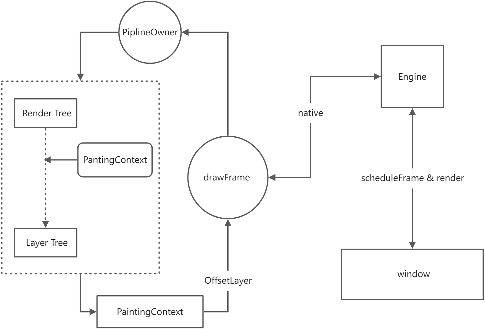
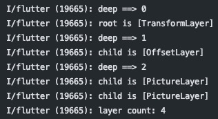

## Render Tree 的创建过程

### RenderObject 的类型

我们知道 Element 主要分为负责渲染的 **RenderObjectElement**  和负责组合的 **ComponentElement** 两大类，而创建 RenderObject 节点的是前者 `mount()` 方法中调用的 `RenderObjectWidget.createRenderObject()` 方法。

该方法是一个抽象方法，需要子类实现，对于不同的布局的 Widget 创建的 RenderObject 类型也不一样，在 Render Tree 中最主要的有两种 RenderObject：

- 首先是在 RenderObject 注释说明中大量提到了一个类 **RenderBox**，它是大部分的 RenderObjectWidget 所对应的 RenderObject 的抽象类

```dart
/// A render object in a 2D Cartesian coordinate system.
/// 一个在 2D 坐标系中的渲染对象
abstract class RenderBox extends RenderObject
```

- 以及 Render Tree 的根节点 **RenderView**

```dart
/// The root of the render tree.
/// Render Tree 的根节点，处理渲染管道的引导和渲染树的输出
/// 它有一个填充整个输出表面的 RenderBox 类型的唯一子节点
class RenderView extends RenderObject with RenderObjectWithChildMixin<RenderBox>
```

其他的类型的 RenderObject 基本是为了特定布局（如滑动、列表）的实现，但大部分都直接或间接集成自 RenderBox。

通常一个 RenderBox 只有一个子节点（因为它只有一个 child 属性），这使得它整体更像是链表。
Flutter 提供了 `ContainerRenderObjectMixin` 用来给那些需要存储多个子节点的 RenderBox 进行扩展，多个子节点的组织方式也是采用链表来连接存储，下面列出常见的两种：

- **RenderStack** 实现了堆栈布局算法
- **RenderFlex** 实现了 **Flex** 布局算法，Column 和 Row 都是属于 Flex 的变体

### RenderView 如何创建

既然 Render Tree 的根节点是 RenderView，那么我们看 RenderView 是在哪被创建的。

通过 IDE 的全局搜索我们可以找到对应的创建引用是在 `RendererBinding` 中。

```dart
/// Flutter 引擎和 Render Tree 之间的一个绑定器
mixin RendererBinding on BindingBase, ServicesBinding,
SchedulerBinding, GestureBinding, SemanticsBinding, HitTestable
```

这个类建立了 Flutter Engine 和 Render Tree 之间的关联，注释中介绍，当 Binding 被创建的时候就会执行
`initInstances()` 进行初始化并创建 RenderView。

```dart
/// RendererBinding

@override
void initInstances() {
  // ... 省略了 PipelineOwner 创建和 window 初始化代码
  // 创建 RenderView
  initRenderView();
}

/// Called automatically when the binding is created.
void initRenderView() {
  // ...
  renderView = RenderView(
    configuration: createViewConfiguration(),
    window: window);
  // 初始化 RenderView
  renderView.prepareInitialFrame();
}
```

我们回到 Flutter App 启动时调用的函数 runApp。

runApp 会创建 `WidgetsFlutterBinding`，并执行 `ensureInitialized()` 方法。

```dart
void runApp(Widget app) {
  WidgetsFlutterBinding.ensureInitialized() //初始化
    ..scheduleAttachRootWidget(app) // 创建其他两棵树的根节点
    ..scheduleWarmUpFrame();
}
```

而这个 `WidgetsFlutterBinding` 实际上由 7 个 mixin Binding 组合成，其中就包括了 `RendererBinding`，而调用这几个 mixin Binding 的 `initInstances()` 都是交给父类 BindingBase 在构造方法中执行。

这种采用 mixin 组合 Binding 的设计可以方便后续接入新的 Binding。

```dart
class WidgetsFlutterBinding extends BindingBase
  with GestureBinding, SchedulerBinding, ServicesBinding,
PaintingBinding, SemanticsBinding, RendererBinding, WidgetsBinding {

  static WidgetsBinding ensureInitialized() {
    if (WidgetsBinding.instance == null)
      WidgetsFlutterBinding();
    return WidgetsBinding.instance!;
  }
}

abstract class BindingBase {
  /// Default abstract constructor for bindings.
  ///
  /// First calls [initInstances] to have bindings initialize their
  /// instance pointers and other state, then calls
  /// [initServiceExtensions] to have bindings initialize their
  /// observatory service extensions, if any.
  BindingBase() {
    initInstances();
    initServiceExtensions();
    developer.postEvent('Flutter.FrameworkInitialization', <String, String>{});
    developer.Timeline.finishSync();
  }
}
```

### 三棵树的初始化关联

在`ensureInitialized()` 方法执行完成得到 Render Tree 根节点之后，就是调用 `scheduleAttachRootWidget()` 创建其他两棵树的根节点，然后和 Render Tree 进行关联。

```dart
@protected
void scheduleAttachRootWidget(Widget rootWidget) {
  Timer.run(() {
    attachRootWidget(rootWidget);
  });
}

void attachRootWidget(Widget rootWidget) {
  final bool isBootstrapFrame = renderViewElement == null;
  _readyToProduceFrames = true;
  _renderViewElement = RenderObjectToWidgetAdapter<RenderBox>(
    container: renderView,
    debugShortDescription: '[root]',
    child: rootWidget,
  ).attachToRenderTree(
    buildOwner!,
    renderViewElement as RenderObjectToWidgetElement<RenderBox>?
  );
  if (isBootstrapFrame) {
    SchedulerBinding.instance!.ensureVisualUpdate();
  }
}
```

在这里`attachRootWidget()` 创建了 RenderObjectToWidgetAdapter，它的本质其实是 RenderObjectWidget，我们可以看到它声明了对应的 Render Tree 的节点类型为 RenderBox，并且指定了该 RenderBox 的父节点是 RenderView。

最后调用 `attachToRenderTree()` 将 RenderObjectToWidgetAdapter 转化为 RootRenderObjectElement 并和 Render Tree 进行绑定。

---

## PipelineOwner 渲染管道管理

目前的 Render Tree 只是一个数据结构，并没有渲染操作。因此我们来研究一下从 Render Tree 到界面是一个什么样的过程。

刚刚提到了 RenderBinding 建立了 Flutter Engine 和 Render Tree 之间的关联，在创建 RenderView 的过程中，我们可以注意到它还创建了一个 **PipelineOwner** 的对象，并且在设置 renderView 时还将 RenderView 赋值给了它的 rootNode。

```dart
/// RendererBinding
@override
void initInstances() {
  _pipelineOwner = PipelineOwner(
    onNeedVisualUpdate: ensureVisualUpdate,
    onSemanticsOwnerCreated: _handleSemanticsOwnerCreated,
    onSemanticsOwnerDisposed: _handleSemanticsOwnerDisposed,
  );
}

set renderView(RenderView value) {
  _pipelineOwner.rootNode = value;
}
```

**PipelineOwner** 其实渲染管道的管理者，它在渲染流程中有 3 个主要的方法：

1. `flushLayout` 更新所有脏节点列表的布局信息
2. `flushCompositionBits` 对重新计算 needsCompositing 的节点进行更新
3. `flushPaint` 重绘所有脏节点

这 3 个方法通常是按顺序一起使用的，RenderBiding 会在 `drawFrame()` 方法中调用这 3 个方法

```dart
/// RenderBiding
@protected
void drawFrame() {
  assert(renderView != null);
  pipelineOwner.flushLayout();
  pipelineOwner.flushCompositingBits();
  pipelineOwner.flushPaint();
  if (sendFramesToEngine) {
    renderView.compositeFrame(); // this sends the bits to the GPU
    pipelineOwner.flushSemantics(); // this also sends the semantics to the OS.
    _firstFrameSent = true;
  }
}
```

那么接下来我们就来研究一下这 3 个方法分别做了什么。

### flushLayout

我们知道当 RenderObject 有两个标识：

- _needsLayout 用于标识是否需要重新 Layout
- _needsPaint 用于标识是否需要重新绘制

这两个属性是保证 Render Tree 局部重绘的关键属性。

当某个节点需要更新布局信息时，会调用 `markNeedsLayout()` 来重置 _needsLayout，但只这个过程还会将当前节点添加到 PipelineOwner 的 _nodesNeedingLayout 中（`markNeedsPaint` 则会添加到 _nodesNeedingPaint）。

```dart
// 仅保留主要代码
void markNeedsLayout() {
  _needsLayout = true;
  if (owner != null) {
    owner!._nodesNeedingLayout.add(this);
    owner!.requestVisualUpdate();
	}
}
```

`flushLayout()` 会将深度遍历这些节点，调用 RenderObject 的 `_layoutWithoutResize()` 方法来重新 Layout，最后将 _needsLayout 置为 false 并调用 `markNeedsPaint()` 让该节点需要重新绘制。

```dart
/// PipelineOwner
void flushLayout() {
  // 只保留主要逻辑
  while (_nodesNeedingLayout.isNotEmpty) {
    final List<RenderObject> dirtyNodes = _nodesNeedingLayout;
    _nodesNeedingLayout = <RenderObject>[];
    // 深度遍历
    for (RenderObject node in dirtyNodes..sort(
      (RenderObject a, RenderObject b) => a.depth - b.depth)
    ) {
      if (node._needsLayout && node.owner == this)
        node._layoutWithoutResize();
    }
  }
}

/// RenderObject
@pragma('vm:notify-debugger-on-exception')
void _layoutWithoutResize() {
  try {
    performLayout(); // 布局测量
    markNeedsSemanticsUpdate();
  } catch (e, stack) {
    _debugReportException('performLayout', e, stack);
  }
  _needsLayout = false;
  markNeedsPaint(); // 让节点需要重新绘制
}
```

Layout 是通过 `performLayout()` 方法完成的，这个方法是 RenderObject 预留给子类实现自身 Layout 逻辑的抽象方法，例如在 RenderView 中的实现如下

```dart
/// RenderView
@override
void performLayout() {
  // RenderView 需要占满整个屏幕
  // 使用 ViewConfiguration 的 size
  _size = configuration.size;

  if (child != null)
    // 让子节点在父节点的布局约束下进行 Layout
    child!.layout(BoxConstraints.tight(_size));
}
```

要注意的是，自定义的 RenderBox 如果要放在能包含多个子节点的 RenderBox 中，例如 RenderFlex 和 RenderStack，那么**需要重写 `performLayout()` 来确定布局大小，当然我们也可以利用另外一种方式，使用父节点的提供的约束来调整自己的大小：**

```dart
@override
bool get sizedByParent => true;

@override
Size computeDryLayout(BoxConstraints constraints) {
  return constraints.smallest;
}
```

*这个方式在我们下面的实验🧪会用到。*

### flushCompositingBits

在 `flushLayout()` 方法后紧接着会被调用的方法是 `flushCompositingBits()`。这个方法会进行深度遍历更新 _nodesNeedingCompositingBitsUpdate 列表中节点的 needsCompositing，它会调用节点的
 `_updateCompositingBits()` 方法对 RenderObject 节点的一些属性进行更新，包括：

- _needsCompositing 是否需要合成 layer
- _needsCompositingBitsUpdate 是否需要更新 _needsCompositing

```dart
/// PipelineOwner
void flushCompositingBits() {
  // 只保留主要逻辑
  _nodesNeedingCompositingBitsUpdate.sort(
    (RenderObject a, RenderObject b) => a.depth - b.depth);

  for (final RenderObject node in _nodesNeedingCompositingBitsUpdate) {
    if (node._needsCompositingBitsUpdate && node.owner == this)
      node._updateCompositingBits();
  }
  _nodesNeedingCompositingBitsUpdate.clear();
  if (!kReleaseMode) {
    Timeline.finishSync();
  }
}
```

### flushPaint

`flushPaint()` 是第 3 个调用的，对 _nodesNeedingPaint 中的节点进行深度遍历，然后调用节点的 **PaintingContext** 的静态方法 `repaintCompositedChild()` 重新绘制 RenderObject 的视图。

```dart
/// PipelineOwner
void flushPaint() {
  // 只保留主要逻辑
  final List<RenderObject> dirtyNodes = _nodesNeedingPaint;
  _nodesNeedingPaint = <RenderObject>[];
  // Sort the dirty nodes in reverse order (deepest first).
  for (final RenderObject node in dirtyNodes..sort(
    (RenderObject a, RenderObject b) => b.depth - a.depth)) {
    if (node._needsPaint && node.owner == this) {
      if (node._layerHandle.layer!.attached) {
        PaintingContext.repaintCompositedChild(node);
      } else {
        node._skippedPaintingOnLayer();
      }
    }
  }
}
```

该方法中通过层层调用最终会到达，传入节点的 `paint()` 方法。`paint()` 方法也是 RenderObject 提供给子类实现绘制逻辑的抽象方法。同样以 RenderView 为例子：

```dart
/// RenderView
@override
void paint(PaintingContext context, Offset offset) {
  if (child != null)
    context.paintChild(child!, offset);
}
```

由于 RenderView 是整颗树的根节点，因此没有什么绘制逻辑，但所有的 RenderObject 都一样，如果有子节点都会通过 PaintingContext 继续调用子节点的 `paint()` 方法并将 PaintingContext 传递下去，直到整颗树的节点都完成绘制。

---

## 场景合成与界面刷新渲染

我们知道 Widget 最终都是通过 Canvas 进行绘制的，因此我们以一个自定义 View 的例子来做分析。

在 《Flutter 实战·第二版》 这本书中，是使用 `CustomPainter` 来编写自定义 View，通过重写
`void paint(Canvas canvas, Size size);` 方法来获得一个 Canvas 对象，因此可以往这个方法的源码翻阅，查看这个 Canvas 对象的来源。

```dart
// custom_paint.dart
abstract class CustomPainter extends Listenable

/// Provides a canvas on which to draw during the paint phase.
/// 提供了在绘图阶段要进行绘制的 Canvas
class RenderCustomPaint extends RenderProxyBox {

  void _paintWithPainter(Canvas canvas, Offset offset, CustomPainter painter) {
  	// ...
    // 在这里调用 CustomPainter 的 paint，并提供一个 Canvas 对象
	painter.paint(canvas, size);
  }

  @override
  void paint(PaintingContext context, Offset offset) {
    if (_painter != null) {
      // 这里提供 canvas
      _paintWithPainter(context.canvas, offset, _painter!);
      _setRasterCacheHints(context);
    }
    super.paint(context, offset);
    if (_foregroundPainter != null)
      _paintWithPainter(context.canvas, offset, _foregroundPainter!);
      _setRasterCacheHints(context);
    }
  }
}
```

在这里我们可以看出，我们自定义 View 的绘制操作，是由 **RenderCustomPaint** 执行，它的本质其实是一个 **RenderBox**，而其中传入的 Canvas 对象是由它在 `paint()` 中的 PaintingContext 提供的。

### Canvas 与绘制存储

在 PaintingContext 中是采用懒加载的方式来创建 Canvas 对象，PaintingContext 一般创建于 Render Tree 的单独子树开始绘制时，创建时会附带创建另外两个对象：

- PictureLayer 图层
- PictureRecorder 图像记录者

```dart
// object.dart
class PaintingContext extends ClipContext {
  Canvas? _canvas;

  /// 获取 Canvas 对象，
  /// 当 _canvas 没有创建时调用 [_startRecording] 方法创建
  @override
  Canvas get canvas {
    if (_canvas == null)
      _startRecording();
    assert(_currentLayer != null);
    return _canvas!;
  }

  /// 创建 Canvas 对象
  /// - 创建 PictureLayer 图层对象
  /// - 创建 PictureRecorder 图像记录者
  /// - 创建 Canvas 对象
  /// - 将 PictureLayer 添加到 ContainerLayer 容器层
  void _startRecording() {
    assert(!_isRecording);
    _currentLayer = PictureLayer(estimatedBounds);
    _recorder = ui.PictureRecorder();
    _canvas = Canvas(_recorder!);
    _containerLayer.append(_currentLayer!);
  }
}
```

创建 Canvas 时必须传入一个 PictureRecorder 对象，这个对象会记录 Canvas 的绘制操作，当完成记录时，可通过调用 `PictureRecord.endRecording` 来结束记录，并得到一个 Picture 对象，由于 Canvas 的绘制是由 Engine 层中的 Skia 引擎提供，因此 Picture 对象也是存储在 Engine 层。

```dart
/// PictureRecorder
Picture endRecording() {
  if (_canvas == null)
    throw StateError('PictureRecorder did not start recording.');
  final Picture picture = Picture._();
  _endRecording(picture);
  _canvas!._recorder = null;
  _canvas = null;
  return picture;
}

void _endRecording(Picture outPicture) native 'PictureRecorder_endRecording';
```

### Layer Tree

`_startRecording()` 除了创建 Canvas 和 PictureRecorder 外，还创建了一个 PictureLayer 对象并将它加入到了 _containerLayer 中。这个 _containerLayer 其实是 RenderObject 中的一个 Layer。

Layer 是用于缓存绘图操作结果（Picture）的图层，图层可以按照规则进行排列得到图像。每个 RenderObject 中会都有一个 Layer，存储在 LayerHandle 中，**Render Tree 执行 flushPaint 完成绘制后，会形成一颗 Layer Tree，Layer Tree 的节点数量会比 Render Tree 少，几个 RenderObject 节点只对应一个 Layer 节点。**

Layer 节点也有多种，但用的最多的是以下两种：

- 使用 PictureRecorder 记录绘图操作的节点使用 PictureLayer，PictureLayer 不具有子节点，这是最常用的叶子节点类型
- 当需要和 Layer 子节点进行叠加来得到图像时，可使用 ContainerLayer，它提供了 append 方法来连接 Layer，以形成一颗 Layer Tree。

 ContainerLayer 可以有多个子节点，它们以链表的方式连接在一起，一般不会直接使用 ContainerLayer，而是使用它的子类 OffsetLayer。

> 使用 `prepareInitialFrame()` 方法初始化 RenderView 创建的 Layer 类型是 **TransformLayer** ，它也是 OffsetLayer 的子类。

当创建 PaintingContext 时提供的 Layer 节点不属于 OffsetLayer 时 ，会创建一个 OffsetLayer 来代替原本的 Layer，作为当前子树的根节点。 PaintingContext 创建新的 PictureLayer 时将会使用 append 方法将新的 Layer 节点添加到这个 OffsetLayer 中。

```dart
/// PaintingContext
static void _repaintCompositedChild(
  RenderObject child, {
    bool debugAlsoPaintedParent = false,
    PaintingContext? childContext,
  }) {
  OffsetLayer? childLayer = child._layerHandle.layer as OffsetLayer?;
  if (childLayer == null) {
    final OffsetLayer layer = OffsetLayer();
    child._layerHandle.layer = childLayer = layer;
  } else {
    childLayer.removeAllChildren();
  }
  // 在这里创建 PaintingContext
  childContext ??= PaintingContext(childLayer, child.paintBounds);
  child._paintWithContext(childContext, Offset.zero);
  // 完成绘制结束记录
  childContext.stopRecordingIfNeeded();
}
```

上面提到如果节点有孩子，会通过 `context.paintChild()`  让子节点也调用 `_paintWithContext()` 方法将 PaintingContext 向下传递，继续执行子节点的 `paint()` 方法进行绘制。

当目前的图层绘制完成时，绘制完成时会调用 `stopRecordingIfNeeded()` 来结束记录绘制，并将 PictureRecord 生成的 Picture 对象缓存到 PictureLayer 中。

```dart
/// PaintingContext
@protected
@mustCallSuper
void stopRecordingIfNeeded() {
  if (!_isRecording)
    return;
  _currentLayer!.picture = _recorder!.endRecording();
  _currentLayer = null;
  _recorder = null;
  _canvas = null;
}

/// PictureLayer
set picture(ui.Picture? picture) {
  markNeedsAddToScene();
  _picture?.dispose();
  _picture = picture;
}
```

### 节点的绘制分离

Render Tree 的绘制是采用深度遍历自顶向下绘制的，即当前节点绘制完调用子节点的绘制方法。

RenderObject 提供了 **isRepaintBoundary** 属性来判断当前子树是否需要与父节点分开绘制，该属性默认为 false，并且没有 setter 来进行修改，因此默认情况下一颗 Render Tree 可能只会生成 2 个 Layer 节点（根节点的 TransformLayer 和存储绘制结果的 PictureLayout）。

但其实我们可以在 RenderBox 的子类重写该属性，或者使用 RenderRepaintBoundary（它的 isRepaintBoundary** **被重写为 true），来分离父子节点的绘制，从达到分开绘制生成不同 Layer 节点形成一颗 Layer Tree。

该属性在 `markNeedsPaint()`方法中也有使用，相关源码如下：

```dart
void markNeedsPaint() {
  if (_needsPaint)
    return;
  _needsPaint = true;
  markNeedsPaintCout++;
  if (isRepaintBoundary) {
    if (owner != null) {
      owner!._nodesNeedingPaint.add(this);
      owner!.requestVisualUpdate();
    }
  } else if (parent is RenderObject) {
    final RenderObject parent = this.parent! as RenderObject;
    parent.markNeedsPaint();
  }
}
```

- 如果 isRepaintBoundary 为 true 则表示和父节点分开绘制，将自己添加到 _nodesNeedingPaint 列表中，在下一次更新时就只会重绘当前子树，不会污染到父节点。
- 如果 isRepaintBoundary 为 false 则调用父节点的 `markNeedsPaint()`来让父节点处理，下一次更新由父节点重绘时执行自己的绘制方法进行重绘。

而在绘制流程中，如果子节点的 isRepaintBoundary 为 true，代表需要分开绘制，会结束当前 PictureRecorder 的记录并将生成的 Picture 存到 Layer 中，然后开始子节点的绘制。

子节点绘制时由于 PaintingContext 的 Layer 已经被设置为 null 了，所以会创建新的 PictureLayer 并添加到根 Layer 的子节点列表，如果子节点不需要重新绘制，就直接将子节点的 Layer 添加到根 Layer 的子节点列表。

这里添加时使用的 `appendLayer()` 会先将当前的 Layer 节点从原本的父节点中移除，再进行添加，因此不用当心会出现重复添加的情况，由于子节点列表的本质是链表，而且创建后添加与再添加之间通常不会有其它 Layer 节点介入，因此也不需要当心该方法添加时的移动和查找效率。

```dart
/// PaintingContext
void paintChild(RenderObject child, Offset offset) {
  if (child.isRepaintBoundary) {
    stopRecordingIfNeeded(); // 结束当前树的绘制
    _compositeChild(child, offset);
  } else {
    child._paintWithContext(this, offset);
  }
}

/// 省略了很多代码
void _compositeChild(RenderObject child, Offset offset) {
    // Create a layer for our child, and paint the child into it.
    if (child._needsPaint) {
      repaintCompositedChild(child, debugAlsoPaintedParent: true);
    }

    final OffsetLayer childOffsetLayer = child._layerHandle.layer! as OffsetLayer;
    childOffsetLayer.offset = offset;
    appendLayer(childOffsetLayer);
}

@protected
void appendLayer(Layer layer) {
  layer.remove(); // 从父节点中移除当前节点
  _containerLayer.append(layer);
}
```

### 场景渲染

我们回到 RenderBinding 的 `drawFrame()` 方法中，看一下 Render Tree 完成绘制后，是如何渲染到界面的。

```dart
/// RenderBiding
@protected
void drawFrame() {
  pipelineOwner.flushLayout();
  pipelineOwner.flushCompositingBits();
  pipelineOwner.flushPaint();
  if (sendFramesToEngine) {
    renderView.compositeFrame(); // this sends the bits to the GPU
    pipelineOwner.flushSemantics(); // this also sends the semantics to the OS.
    _firstFrameSent = true;
  }
}

/// RenderView
void compositeFrame() {
  final ui.SceneBuilder builder = ui.SceneBuilder();
  // 将图层添加到 scene
  final ui.Scene scene = layer!.buildScene(builder);
  // 发送 scene 给 GPU 进行渲染
  _window.render(scene);
  scene.dispose();
}

/// Layer
ui.Scene buildScene(ui.SceneBuilder builder) {
  updateSubtreeNeedsAddToScene();
  addToScene(builder); // 抽象方法，由子类实现
  _needsAddToScene = false;
  final ui.Scene scene = builder.build();
  return scene;
}
```

当需要发送帧图像给 GPU 时，会调用 `compositeFrame()` 方法，在这个方法中会构建一个 SceneBuilder，然后通过 `ContainerLayer.buildScene()` 将 Layer Tree 的 Picture 合成一个 Scene。

Scene 可理解为场景，是存储 GPU 绘制的像素信息的图像对象，当添加的是 OffsetLayer 会设置图层的偏移量，当添加的是 ContanierLayer 时会遍历子节点进行添加，当添加的是 PictureLayer 会调用 native 方法在 Engine 添加 Picture 到图像中，当我们调用 build 方法时也是从 Engine 得到 Scene 对象。

```dart
void _addPicture(double dx, double dy, Picture picture, int hints)
  native 'SceneBuilder_addPicture';

void _build(Scene outScene) native 'SceneBuilder_build';
```

Layer 中有两个属性 _needsAddToScene 和 _subtreeNeedsAddToScene 来表示自己和子树是否需要被添加到 Scene 中，当 Layer 被脏了则需要合成到 Scene，一个 Layer 或者其子树被合成到 Scene 后，对应的属性会被设置为 false。

Scene 合成完成后，接着调用 **render** 方法将 Scene 发送给 GUP 渲染到界面上。

```dart
/// FlutterView
void render(Scene scene) => _render(scene, this);
void _render(Scene scene, FlutterView view) native 'PlatformConfiguration_render';
```

### 界面刷新

现在我们知道 Flutter 是调用 `drawFrame()` 方法，来做 Render Tree 的绘制，那么 `drawFrame()`  什么时候执行呢？我们阅读一下这个方法的注释。

```dart
/// This method is called by [handleDrawFrame], which itself is called
/// automatically by the engine when it is time to lay out and paint a frame.
```

注释中说明 `drawFrame()` 会在 Engine 需要提供一帧新图像时，自动被 `handleDrawFrame()` 方法调用，实际上在 RenderBinding 初始化的时候，会把这个方法添加到 persistentCallbacks 回调列表中。

```dart
/// RenderBinding
void initInstances() {
  // window 的初始化时会设置一些状态改变的回调
  window
      ..onMetricsChanged = handleMetricsChanged
      ..onTextScaleFactorChanged = handleTextScaleFactorChanged
      ..onPlatformBrightnessChanged = handlePlatformBrightnessChanged
      ..onSemanticsEnabledChanged = _handleSemanticsEnabledChanged
      ..onSemanticsAction = _handleSemanticsAction;
  // RenderView 初始化创建
  initRenderView();
  // 在这里添加了一个回调
  addPersistentFrameCallback(_handlePersistentFrameCallback);
}

void _handlePersistentFrameCallback(Duration timeStamp) {
  drawFrame(); // 在这个回调里调用帧绘制
  _scheduleMouseTrackerUpdate();
}

/// SchedulerBinding

/// 该列表中的回调方法会被 handleDrawFrame 依次拿出来执行
final List<FrameCallback> _persistentCallbacks = <FrameCallback>[];

/// 将回调添加到 _persistentCallbacks 中
void addPersistentFrameCallback(FrameCallback callback) {
  _persistentCallbacks.add(callback);
}
```

`handleDrawFrame()`  被执行时，会从回调列表里面取出这个回调，从而屏幕刷新的时候都会调用
`drawFrame()` 将 Render Tree 绘制到界面上。

```dart
/// Engine 调用这个方法来提供新的一帧图像
void handleDrawFrame() {
  // PERSISTENT FRAME CALLBACKS
  _schedulerPhase = SchedulerPhase.persistentCallbacks;
  for (final FrameCallback callback in _persistentCallbacks)
    _invokeFrameCallback(callback, _currentFrameTimeStamp!);
  // ... 只保留关键代码
}
```

也就是说，我们界面刷新时，相关的回调工作会交给 `handleDrawFrame()` 去执行，而这个方法除了在 APP 启动的时候，会先在 `scheduleWarmUpFrame()` 的定时器中执行一次进行首次展示外，在 `scheduleAttachRootWidget()` 方法执行的时候，就会被注册到 `window.onDrawFrame`了作为界面刷新的回调了。
我们采用断点调试的方式，可以看到 APP 启动的时候这个方法的注册调用链如下：


```dart
void runApp(Widget app) {
  WidgetsFlutterBinding.ensureInitialized()
    ..scheduleAttachRootWidget(app) // 提前注册回调
    ..scheduleWarmUpFrame();
}

void attachRootWidget(Widget rootWidget) {
  // 如果是引导帧，则进行视觉更新
  if (isBootstrapFrame) {
    SchedulerBinding.instance!.ensureVisualUpdate();
  }
}

void ensureVisualUpdate() {
  switch (schedulerPhase) {
    case SchedulerPhase.idle:
    case SchedulerPhase.postFrameCallbacks:
      scheduleFrame(); // <- 帧任务
      return;
    case SchedulerPhase.transientCallbacks:
    case SchedulerPhase.midFrameMicrotasks:
    case SchedulerPhase.persistentCallbacks:
      return;
  }
}

/// 以下都是 SchedulerBinding 中的方法
void scheduleFrame() {
  ensureFrameCallbacksRegistered(); // <- 确定回调的注册
  window.scheduleFrame(); // 请求回调的执行，进行界面更新
  _hasScheduledFrame = true;
}

@protected
void ensureFrameCallbacksRegistered() {
  window.onBeginFrame ??= _handleBeginFrame;
  window.onDrawFrame ??= _handleDrawFrame; // <- 注册回调
}
```

注册的这个回调其实就是对 handleDrawFrame 包了一层壳。

```dart
void _handleDrawFrame() {
  if (_rescheduleAfterWarmUpFrame) {
    _rescheduleAfterWarmUpFrame = false;
    addPostFrameCallback((Duration timeStamp) {
      _hasScheduledFrame = false;
      scheduleFrame();
    });
    return;
  }
  handleDrawFrame();
}
```

`window.scheduleFrame()` 会向 Engine 层发起一个请求，在下一次合适的时机调用`window.onDrawFrame`和 `window.onBeginFrame`注册的回调，从而刷新界面。

最后我们采用断点调试的方式，看界面刷新时 drawFrame 的完整调用链是什么样，绿框中的就是我们刚刚所讲到的那些方法了。


到这里，知识就串起来了～

---

## 整理图

我们画张图整理一下，为了让图更加简单易看，我们省略掉亿点点细节🤏。



---

## Framework 项目代码实验

当然了解完相关流程，我们直接在 Flutter Framework 的项目中进行实验，按照流程自己写一遍从 Render Tree 到界面刷新的代码，证明、也是熟悉这个流程。

首先根据官方说明配置一个 Framework 开发环境，然后进入到 hello_world 项目中：
<https://github.com/flutter/flutter/wiki/Setting-up-the-Framework-development-environment>

实验项目和平时开发一样依旧采用 Flutter APP 的方式启动，但不同的是我们不调用 `runApp()` 方法，而是直接创建一颗 Render Tree 和使用 Canvas，采用上面讲的流程来执行我们的 APP。

我们先尝试使用 Canvas 绘制一条直线，然后生成 Picture 添加到 Sence 中，然后发送给 GPU 进行渲染。

```dart
import 'dart:ui';
import 'package:flutter/material.dart';

void main() {

  final PictureRecorder pictureRecorder = PictureRecorder();
  drawLine(pictureRecorder);
  final Picture picture = pictureRecorder.endRecording();

  final SceneBuilder sceneBuilder = SceneBuilder();
  sceneBuilder.addPicture(Offset.zero, picture);
  final Scene scene = sceneBuilder.build();
  window.render(scene);
}

void drawLine(PictureRecorder recorder) {
  final Canvas canvas = Canvas(recorder);

  final Paint paint = Paint()
    ..color = Colors.white
    ..strokeWidth = 10;

  canvas.drawLine(Offset(300, 300), Offset(800, 300), paint);
}
```


上面的代码会在界面绘制一条白线，由于这里只 render 了一次，因此在绘制完这条白线后，界面就不会有任何变化了。
现在我们尝试让线条动起来，通过上面的讲解，我们知道 Flutter 是使用 `window.scheduleFrame()`来请求屏幕的刷新，因此我们将渲染放到 `window.onDrawFrame`中，并不断改变线条位置。

```dart
import 'dart:ui';
import 'package:flutter/material.dart';

void main() {
  double dy = 300.0;

  window.onDrawFrame = () {
    final PictureRecorder pictureRecorder = PictureRecorder();
    drawLine(pictureRecorder, dy);
    if (dy < 800)
      dy++;

    final Picture picture = pictureRecorder.endRecording();

    final SceneBuilder sceneBuilder = SceneBuilder();
    sceneBuilder.addPicture(Offset.zero, picture);
    final Scene scene = sceneBuilder.build();

    // 不断刷新界面
    window.render(scene);
    window.scheduleFrame();
  };

  window.scheduleFrame();
}

void drawLine(PictureRecorder recorder, double dy) {
  final Canvas canvas = Canvas(recorder);

  final Paint paint = Paint()
    ..color = Colors.white
    ..strokeWidth = 10;

  canvas.drawLine(Offset(300, dy), Offset(800, dy), paint);
}
```

这样就得到了一条会移动的直线。


接下来我们将上面的直线封装为一个自定义的 RenderObject，然后自己创建一颗 Render Tree，并使用 `drawFrame()` 方法中的流程：使用 **PipelineOwner** 来重新绘制被污染的节点。

```dart
void main() {
  // 构建根节点
  final PipelineOwner pipelineOwner = PipelineOwner();
  final RenderView renderView =
      RenderView(configuration: const ViewConfiguration(), window: window);
  pipelineOwner.rootNode = renderView;
  // 初始化
  renderView.prepareInitialFrame();

  renderView.child = MyRenderNode();

  window.onDrawFrame = () {
    callFlush(pipelineOwner);
    renderView.compositeFrame();
    window.scheduleFrame();
  };
  window.scheduleFrame();
}

void callFlush(PipelineOwner pipelineOwner) {
  pipelineOwner.flushLayout();
  pipelineOwner.flushCompositingBits();
  pipelineOwner.flushPaint();
}

class MyRenderNode extends RenderBox {

  double _dy = 300;

  final Paint _paint = Paint()
    ..color = Colors.white
    ..strokeWidth = 10;

  void _drawLines(Canvas canvas, double dy) {
    canvas.drawLine(Offset(300, dy), Offset(800, dy), _paint);
  }

  @override
  void paint(PaintingContext context, Offset offset) {
    _drawLines(context.canvas, _dy);
    _dy++;
    markNeedsLayout();
  }
}
```

这份代码运行的效果和上面的是一样的，但只有一个节点并不能看出转化为 Layer Tree 的优势，我们来构建一颗多个节点的 Render Tree。我们采用 **RenderFlex** 来存储多个节点，并和上面讲解 `flushLayout()`时所说的一样交由父节点来决定布局大小。

```dart
void main() {
  // 构建根节点
  final PipelineOwner pipelineOwner = PipelineOwner();
  final RenderView renderView =
      RenderView(configuration: const ViewConfiguration(), window: window);
  pipelineOwner.rootNode = renderView;
  // 初始化
  renderView.prepareInitialFrame();

  final RenderFlex flex = RenderFlex(textDirection: TextDirection.ltr);
  
  // 从 301 开始移动到 500 一共绘制了 200 次
  double dy = 301;
  
  // 创建两个叶子节点
  final MyRenderNode node1 = MyRenderNode(dy, Colors.white);
  final MyRenderNode node2 = MyRenderNode(dy, Colors.blue);

  renderView.child = flex;
  // 注意这里是往前插入
  flex.insert(node1);
  flex.insert(node2);

  window.onDrawFrame = () {
    callFlush(pipelineOwner);
    renderView.compositeFrame();
    if (dy < 500) {
      node1.dy = ++dy;
      window.scheduleFrame();
    } else {
      print('node1 paint count: ${node1.paintCount}');
      print('node2 paint count: ${node2.paintCount}');
    }
  };

  window.scheduleFrame();
}

void callFlush(PipelineOwner pipelineOwner) {
  pipelineOwner.flushLayout();
  pipelineOwner.flushCompositingBits();
  pipelineOwner.flushPaint();
}

class MyRenderNode extends RenderBox {
  MyRenderNode(this._dy, Color color) {
    _paint = Paint()
      ..color = color
      ..strokeWidth = 10;
  }

  double _dy;
  int paintCount = 0;

  set dy(double dy) {
    _dy = dy;
    markNeedsLayout();
  }

  double get dy => _dy;

  late Paint _paint;

  void _drawLines(Canvas canvas, double dy) {
    canvas.drawLine(Offset(300, dy), Offset(800, dy), _paint);
  }

  @override
  void paint(PaintingContext context, Offset offset) {
    _drawLines(context.canvas, dy);
    paintCount++;
  }

  @override
  bool get sizedByParent => true;

  @override
  Size computeDryLayout(BoxConstraints constraints) {
    return constraints.smallest;
  }
}

```

这份代码比较长，对于 `MyRenderNode`的修改：

- 首先我们重写了 `sizedByParent`和 `computeDryLayout()`，用于在布局测量时决定大小
- `_dy` 属性添加了 setter 方法，在每次修改 `_dy` 的值时调用 `markNeedsLayout()` 来让下一次界面刷新时重新绘制节点
- 另外我们还添加了一个 `piantCount` 属性来记录节点绘制了几次

接着是 main 方法中：

- 使用 RenderFlex 作为 RenderView 的子节点
- 创建了两个子节点插入到 RenderFlex 中
- 每次渲染时，都会修改 node1 的 dy，让他进行重绘，node2 则不做修改
- 当 dy 的值达到了 500 的时候停止界面刷新并打印两个节点的绘制次数


效果如上，会有一根不动的蓝线，和一根移动的白线。
我们再看看控制台打印的信息。


我们发现两个节点的绘制次数都是 200，这意味着每次渲染两个节点都进行了重新绘制，根据上面我们讲到的 PaintingContext 和 Layer 的特点，我们可以很快判断出，这是由于 node1 和 node2 没有分开绘制，使用同一个 Layer 节点所造成的。

由于 node1 被污染后也会调用父节点 flex 的 `markNeedsPaint()`，因此绘制操作时由父节点向下绘制的，而 node2 也是 flex 的子节点，整棵子树都会重新绘制，这就是 node2 污染时 node1 也跟着重绘的原因。
​

我们在自定义的 RenderBox 里重写 **isRepaintBoundary** 属性，并在 framework 层为 **ContainerLayer** 添加一个节点计数方法。

```dart
/// ContainerLayer

int layerCount() {
  int count = 1; // 算上当前节点
  Layer? child = firstChild;
  while (child != null) {
    if(child is OffsetLayer)
      count += child.layerCount();
    else
      count += 1;
    child = child.nextSibling;
  }
  return count;
}
```

```dart
void main() {
  window.onDrawFrame = () {
    if (dy < 500) {
      node1.dy = ++dy;
      window.scheduleFrame();
    } else {
      print('node1 paint count: ${node1.paintCount}');
      print('node2 paint count: ${node2.paintCount}');
      // 在结束时打印 Layer 的数量
      print('layer count: ${renderView.layer?.layerCount()}');
    }
  };
}

class MyRenderNode extends RenderBox {
  bool _isRepaintBoundary = false;

  @override
  bool get isRepaintBoundary => _isRepaintBoundary;

  /// 添加设置方法
  set isRepaintBoundary(bool v) {
    _isRepaintBoundary = v;
  }
}
```

我们先来演示两种情况：

1. 不对两个叶子节点的 isRepaintBoundary 进行修改


1. 将 node1 单独绘制：`node1.isRepaintBoundary = false;`


可以看到 node1 的 isRepaintBoundary 设置为 true 时， node2 只绘制了 1 次，现在 node2 的污染就不会导致 node1 重绘制了。

另外我们看到第二种情况的 Layer 节点数量分是 4，为什么会是 4 呢？

回想一下介绍 PaintingContext 创建时提供 Layout 的要求：

> 当提供给 PaintingContext 的 Layer 节点不属于 OffsetLayer 时 ，会创建一个 OffsetLayer 来代替原本的 Layer，作为当前子树的根节点。

如果我们对程序进行调试，就可以发现，虽然是以 node1、node2 的顺序插入，但实际 `insert()`  方法是往前插入，在 flex 中 node2 是处于 node1 的前面，因此 node2 会先进行绘制。

由于 node2 并没有设置单独绘制，因此会按照正常流程和 flex 绘制在同一个 PictureRecorder 中生成一个 PictureLayer 并添加到 TransformLayer 中。

node2 绘制完成之后开始绘制 node1。由于我们将 node1 设置为单独绘制，那么绘制 node1 的时候将会作为一个子树重新开始绘制，这时会重新调用 `_repaintCompositedChild()`方法，创建一个**新的 PaintingContext** 来传递，此时由于 node1 是一个叶子结点，本身并不附带 OffsetLayer 节点，**因此会创建一个新的 OffsetLayer 给 PaintingConext**，再进行绘制。

**绘制 node 1 时生成的 PictureLayer 添加到这个 OffsetLayout 中，完成绘制之后再将 OffsetLayout 添加到 RenderView 的 TransformLayer 中。**

因此第 2 种情况会得到 4 个 Layer 节点，对应的 Layer 图示如下：


我们修改一下计数方法，让它打印当前遍历的层次和节点类型。

```dart
int layerCount() {
  int deep = 0;
  print('deep ==> $deep');
  print('root is [${this.runtimeType}]');
  return _layerCount(deep + 1);
}

int _layerCount(int deep) {
  int count = 1; // 算上当前节点
  Layer? child = firstChild;
  print('deep ==> $deep}');
  while (child != null) {
    print('child is [${child.runtimeType}]');
    if(child is OffsetLayer)
      count += child._layerCount(deep + 1);
    else
      count += 1;
    child = child.nextSibling;
  }
  return count;
}
```


可以看到和我们画的转化图是一样的。如果我们将 node1 和 node2 交换一下，先添加 node2 再添加 node1，使 node1 先进行绘制，那么结果会是什么样呢？

```dart
flex.insert(node2);
flex.insert(node1);
```



可以看到依旧是 4 个 Layer 节点，但是 node1 和 node2 生成的 PictureLayer 都存在同一个 OffsetLayer 中。

这个 OffsetLayer 并不是 RenderFlex 所生成的，而是和上面一样在绘制 node1 的时候生成的，因为 RenderFlex 并没有和父节点分开绘制，因此不会生成 OffsetLayer。那么为什么 node2 的 PictureLayer 会和 node1 存在同一个 OffsetLayer 中呢？

我们看一下 RenderFlex 是如何绘制子节点的，我们通过调试进入 RenderFlex 的 `paint()`方法，可以看到它调用的是 `paintDefault()`，也就是进行遍历依次调用 PaintingContext 的 `paintChild()`。

```dart
void defaultPaint(PaintingContext context, Offset offset) {
  ChildType? child = firstChild;
  // 遍历子节点进行绘制
  while (child != null) {
    final ParentDataType childParentData = child.parentData! as ParentDataType;
    context.paintChild(child, childParentData.offset + offset);
    child = childParentData.nextSibling;
  }
}
```

RenderFlex 循环绘制时，子节点用的都是**同一个 PaintingContex**。由于 node1 绘制完只是调用  PaintingContext 的 `stopRecordingIfNeeded()`来移除当前的 Canvas、PictureRecorder、PictureLayer 对象 ，PaintingContext 本身和存储的 OffsetLayer 并没有销毁，因此轮到 node2 绘制时就只是依照 Canvas 的创建流程将新创建的 PictureLayer 添加到绘制 node1 时创建的 OffsetLayer。

```dart
void _startRecording() {
  // 开始绘制 node1 创建的
  _currentLayer = PictureLayer(estimatedBounds);
  _recorder = ui.PictureRecorder();
  _canvas = Canvas(_recorder!);
  // _containerLayer 还是绘制 node2 时创建的 OffsetLayer
  _containerLayer.append(_currentLayer!);
}
```

因此我们就会得到这样一颗 Layer Tree。


## 结语

本文到这里就结束了，我们现在可以看到，Flutter 性能高的一个很重要的原因，就是它在资源复用和避免不必要计算等方面，做了很多思考。

之所以研究这部分，是因为这部分是 Flutter Framework 层最贴近 Engine 层的内容，对以后研究 Flutter 和 Android 两者在 Engine 层的异同点会有很大帮助。

由于涉及到的东西特别多，因此并没办法讲的很全面，本文所要介绍的内容也可能存在遗漏，但按照本文讲解的流程去阅读源码进行扩展，并不难弄懂，有问题可在评论区留言。
