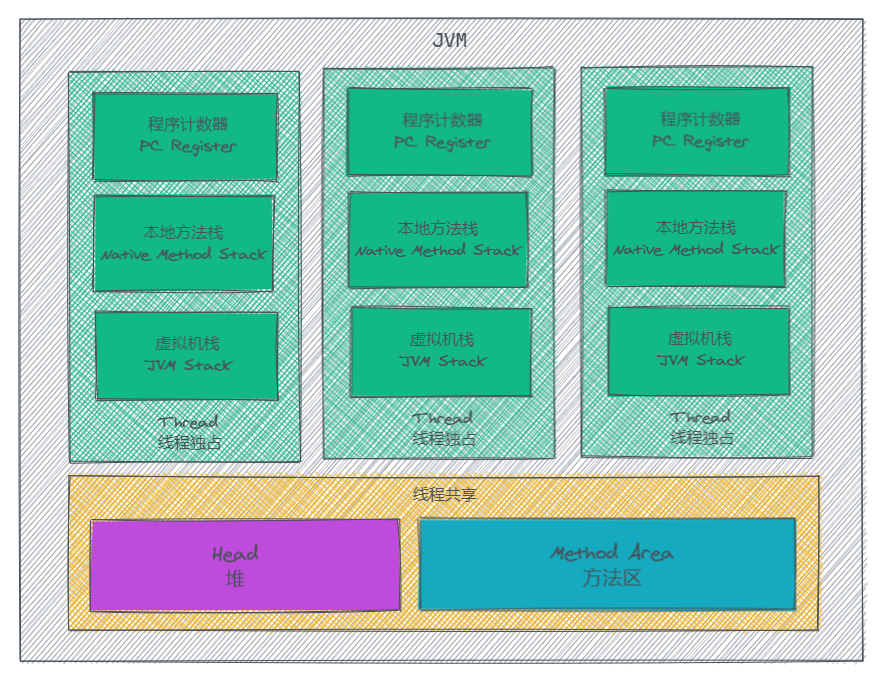
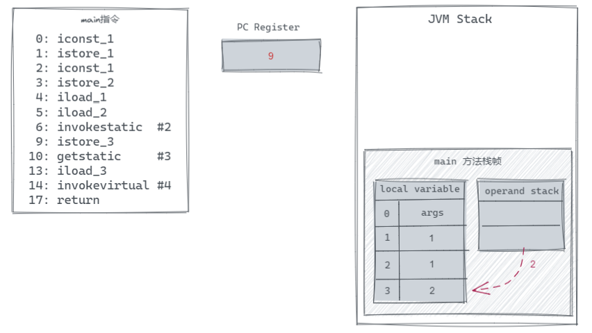
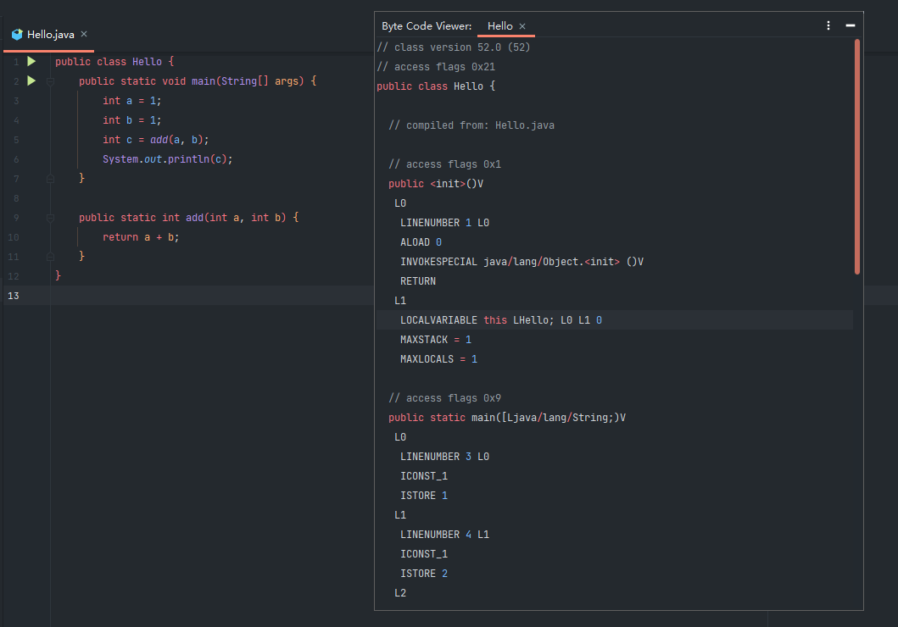

## 字节码（Byte Code）

学习 Java 的都知道，我们所编写的 `.java` 代码文件通过编译将会生成 `.class` 文件，最初的方式就是通过 JDK 的 `javac` 指令来编译，再通过 `java` 命令执行 main 方法所在的类，从而执行我们的 Java 程序。而在这中间所生成的 .class 文件中的内容，就是 JVM 可以处理运行的字节码（Byte Code），它由 JVM 解释为对应系统可运行的机器指令，这也是我们的 Java 程序能够做到一处编译处处执行的原理。

对于 Java 开发人员来说，平时需要阅读 Byte Code 的场景比较少，但和阅读框架源码能够了解到框架的设计思路一样，阅读 Java Byte Code 也有利于我们理解 Java 一些深层的东西，提高我们解决问题的能力。能够阅读 Byte Code 也有利于我们去理解 Kotlin 或其它运行在 JVM 上的语言，是如何扩展 Java 所没有的特性或语法糖。

## 字节码文件结构

```Java
public class Hello {
    public static void main(String[] args) {
        int a = 1;
        int b = 1;
        int c = add(a, b);
        System.out.println(c);
    }

    public static int add(int a, int b) {
        return a + b;
    }
}
```

首先我们先编写一个简单的 Java 代码作为演示例子，然后编译这个 Hello.java 文件得到 Hello.class 文件。我们知道 .class 是二进制文件，它无法被直接查看，当然我们可以通过一些二进制文件查看工具来阅读里面的内容。


一个符合标准的 `.class` 文件是以 `CA FE BA BE` 开头，这个四个字节均为魔数，JVM 根据这个开头来判断一个文件是否可能为 `.class` 文件，如果是才会继续执行。

魔数后面四个字节  `00 00 00 34`  是版本号，前两个字节为次版本号，后两个字节为主版本号，在对主版本号进行转换可以得到 52，该序号对应的 Java 版本为 1.8。

如果需要查阅最新的 Java 版本对应的版本号，可以在官方查看 Java SE 最新版本的文档

> Oracle Java SE Specifications：https://docs.oracle.com/javase/specs/index.html

在版本号后面则是常量池，它包含常量池计数器（constant_pool_count）和常量池数据区两个部分。前面两个字节 00 28 是计数器，用于表示常量池的容量计数值，代表常量池数据区有 `constant_pool_count - 1` 个常量。


在常量池后面还有访问标志，很显然这个文件对于我们来说阅读起来并不方便，但是我们可以转换为助记符来帮助我们阅读。

### 使用 javap 命令

当我们拥有一个 `.class` 文件时，我们可以通过 `javap` 来将字节码指令转换为助记符，这个命令有一些参数，你可以通过 `javap -help` 来查看所有参数的说明，这里为了显示尽量详细的内容，使用 `javap -verbose Hello`，其效果如下，但由于内容太长，我们不一次性展示所有内容，而是分区域来进行阅读。

```
Classfile /F:/project/java/JavaMain/out/production/JavaMain/Hello.class
  Last modified 2021-3-26; size 645 bytes
  MD5 checksum ca1b2193159aece89c05c7f9d3b54c7b
  Compiled from "Hello.java"
public class Hello
  minor version: 0
  major version: 52
  flags: ACC_PUBLIC, ACC_SUPER
```

最开始几行是关于这个文件的基本信息，之后是类的信息，我们的关注点从类这里开始。

在类里面，它包含了主版本号（major version），次版本号（minor version），访问标志（flags）。

对于版本号，和我们上面所讲的一样，因此这里不再重复。而 flags 是关于这个类的相关修饰符，根据官方文档，它可能拥有的值如下：


### 常量池

在类信息的下面，则是常量池，它类似一个表，每个常量由编号、类型、值，这 3 个部分组成。我们列出一小部分来了解它的结构。

```
Constant pool:
   #1 = Methodref          #6.#26         // java/lang/Object."<init>":()V
   #2 = Methodref          #5.#27         // Hello.add:(II)I
   #3 = Fieldref           #28.#29        // java/lang/System.out:Ljava/io/PrintStream;
   #4 = Methodref          #30.#31        // java/io/PrintStream.println:(I)V
   #5 = Class              #32            // Hello
   #6 = Class              #33            // java/lang/Object
   #7 = Utf8               <init>
   #8 = Utf8               ()V
   #9 = Utf8               Code
  #10 = Utf8               LineNumberTable
  #11 = Utf8               LocalVariableTable
  #12 = Utf8               this
  #13 = Utf8               LHello;
  #14 = Utf8               main
  #15 = Utf8               ([Ljava/lang/String;)V
```

在这里列出了前 15 个常量，每个常量都有一个编号，编号以符号 `#` 开头，编号后面是 `=` 加上该常量的类型，具体类型说明请参考官方 jvms 文档的 The Constant Pool 的解释。这里我们从中挑选几个常量来进行说明。

由于我们使用的命令是 `javap -verbose` 因此它会给我们加上一些注释说明，我们可以看到 `#2` 常量后面的注释是 `Hello.add:(II)I`，那么我们可以猜测它应该是我们代码中所编写的 `add()` 方法，由于这个方法是静态，因此它被加入到这个类中的常量区。那么这个常量的值呢？

对于 Methodref 类型，它的值是该方法的名称，对于一个方法而言，它的名称是一个字符串，因此构成方法名称的字符串也会被添加到常量池中，`#2` 这个方法，它的名称引用了常量池中其它的两个常量，也就是 `#5` 和 `#27`，而这两个常量以及与它们相关的其它常量在常量池中的值如下：

```
   #2 = Methodref          #5.#27         // Hello.add:(II)I
   #5 = Class              #32            // Hello
  #22 = Utf8               add
  #23 = Utf8               (II)I
  #27 = NameAndType        #22:#23        // add:(II)I
  #32 = Utf8               Hello
```

在常量池中我们可以看到，`#5` 是一个类，它的值和方法一样都是名称，因此它引用了常量 #32，对于 `Utf8` 类型的常量，其值则是一个字符串，也就是常量 `#32` 的值就是字符串 *Hello*。因此 `#5` 的值就是 *Hello*。同样的 `#27` 的值是 `add:(II)I`，将它们组合起来 `#2` 的值就是 `Hello.add:(II)I` 了。

### 包含的方法

与 Java 代码一样，我们所定义的方法在类里面，而在字节码中我们定义在类中的方法也放在大括号里面，而这个大括号就在常量池下方。

对于每个方法，都包含首行的声明，以及紧接在后面的 descriptor（描述符号），flags（访问标识），Code（代码），我们把 Code 部分的内容先省略，先看一下类中所拥有的所有方法。

```
{
  public Hello();
    descriptor: ()V
    flags: ACC_PUBLIC
    Code:
      // 省略

  public static void main(java.lang.String[]);
    descriptor: ([Ljava/lang/String;)V
    flags: ACC_PUBLIC, ACC_STATIC
    Code:
      // 省略

  public static int add(int, int);
    descriptor: (II)I
    flags: ACC_PUBLIC, ACC_STATIC
    Code:
      // 省略
}
```

可以看到，我们并没有给类写构造方法，但这里却生成了 `public Hello();`，这也说明了为什么我们在 Java 中不给类写构造方法，默认会有一个无参的构造方法。

另外我们可以看到到 `add(int, int)` 方法的 descriptor 为 `(II)I`，这与我们上面观察常量池时 `Hello.add:(II)I`  冒号后面带的字符是一样的，这其实是这个方法的参数以及返回值的缩写。当我们在 Java 中编写重载方法时，由于方法名一样，JVM 可以通过 descriptor 来区分所调用的方法是哪一个。

而 flags 与 Class 的 flags 类似，用于声明方法所拥有的修饰符。而最后的 Code 中包含的则是该方法的代码所执行的指令。

### Code 的结构

```
  public static void main(java.lang.String[]);
    descriptor: ([Ljava/lang/String;)V
    flags: ACC_PUBLIC, ACC_STATIC
    Code:
      stack=2, locals=4, args_size=1
         0: iconst_1
         1: istore_1
         2: iconst_1
         3: istore_2
         4: iload_1
         5: iload_2
         6: invokestatic  #2                  // Method add:(II)I
         9: istore_3
        10: getstatic     #3                  // Field java/lang/System.out:Ljava/io/PrintStream;
        13: iload_3
        14: invokevirtual #4                  // Method java/io/PrintStream.println:(I)V
        17: return
      LineNumberTable:
        line 3: 0
        line 4: 2
        line 5: 4
        line 6: 10
        line 7: 17
      LocalVariableTable:
        Start  Length  Slot  Name   Signature
            0      18     0  args   [Ljava/lang/String;
            2      16     1     a   I
            4      14     2     b   I
           10       8     3     c   I
```

以 main 方法为例子，在 Code 中可以分为 3 个部分，第一个部分是代码的指令表，该部分第一行是该方法的指令以及执行过程的相关信息，这一行信息包括：

- args_size 是参数数量，在主函数中，因为有 args 这个参数，所以在这里 args_size 为 1；
- locals 是该方法中的本地变量有多少个，在我们的主函数里面有定义了 3 个变量，加上一个参数，因此有 4 个变量；
- stack 是方法在执行过程中，操作数栈中最大深度，这个在之后讲解指令执行过程时可以看出。

在这一行信息之后是字节码指令，一条指令包括偏移量以及执行的指令码，PC Register 利用偏移量来判断指令执行位置。

第二部分是 LineNumberTable，它是一个代码行对照表，用于标识我们 Java 代码中对应的行数的代码在 Code 中从哪个位置开始。

```
LineNumberTable:
  line 3: 0
  line 4: 2
  line 5: 4
  line 6: 10
  line 7: 17
```

`line 3: 0` 代表 Java 源码文件中的第三行代码从偏移量为 0 的位置开始，而继续往下看可以看到第四行代码从偏移量为 2 的位置开始，也就是说第三行代码所对应的字节码指令有 `iconst_1` 和 `istore_1` 两条。这也可以让 JVM 执行指令出现错误时，帮助我们定位到对应的源码位置。

第三部分为 LocalVariableTable，调试器可以使用它在方法执行的过程中确定局部变量的值，它是一个可选的属性，在程序执行的时候并不需要它。

- 第一个属性 start 为这个变量可见的起始偏移位置，它的值必须是在 Code 中存在的偏移量值。
- 第二个属性 length 为该变量的有效长度，在这个例子中，我们的变量直到方法末尾都有效，因此你会发现 `start + lenth` 的值都是 18 （方法中执行的指令数）。当我们在一个局部的代码块里面声明一个变量，那么它的有效期长度将会更短。
- Slot 为变量在 local variable 中的位置，这可以帮助我们在指令中确定对应的变量，而 Name 则是变量名，Signature 为该变量的类型。

当我们初步了解了 Code 属性的格式后，我们就可以对其中的指令执行进行分析了，但在此之前，我们需要先有一点 JVM 内存布局的基础知识，这对于我们之后了解指令的执行过程非常重要。

## JVM 内存结构

我们的 Java 程序在运行时是通过 `main()` 方法启动，它是程序的入口，我们的进程在启动时会为该方法创建一个主线程来执行代码。当我们使用多线程时，那么程序的进程将会拥有多个线程。每个线程的资源都拥有独自的资源，当然它们也可以共享进程的资源，那么在 JVM 中，根据资源的可用范围，可将内存区域分为线程独占和线程共享两个类别。



对于每一个线程，都可将其拥有的内存空间分为 PC Register、Native Method Stack、JVM Stack 这 3 个区域，这 3 个区域对于线程来说都是独占的，其它线程无法进行访问。

- **PC Register** 用于记录当前线程指令的执行位置。由于一个进程可能有多个线程，而 CPU 会在不同线程之间切换，为了能够记录各个线程的当前执行的指令，每个线程都需要有一个 PC Register，来保证各个线程都可以进行独立运算。
- **JVM Stack** 用于存放调用方法时压入栈的栈帧。相信学过数据结构的对栈应该不陌生，JVM Stack 压入的单位为栈帧（Frame），用于存储数据、动态链接、方法返回值和调度异常等。每次调用一个方法都会创建一个新的栈帧压入 JVM Stack 来存储该方法的信息，当该方法调用完成时，对应的栈帧也会跟着被销毁。一个栈帧都有自己的局部变量数组、操作数栈、对当前方法类的运行常量池的引用。
- **Native Method Stack** 则是用于调用操作系统本地方法时使用的栈空间。


每个线程都可用访问的内存空间为线程共享区域，它包含 Head 和 Method Area 两个部分，Head 用于存放实例对象，也是 GC 回收的主要区域，而 Method Area 用于存放类结构与静态变量。

现在我们初步了解了 JVM 内存的布局，那么接下来可以继续看指令的执行过程了。

## 指令的执行过程

由于 Java 程序从 `main()` 方法开始，我们也是从这个方法的指令开始进行分析。

假设程序运行 0 号指令前的状态如下，在 mian 方法栈帧里面，有着 operand stack（操作数栈），它的最大长度为 2（与 Code 下的 stack 的值一致），此外还有一个 local variable（本地变量表）来存放变量的值，其中下标为 0 的变量为主方法的参数 args，我们直接用这个字符串填充在那里来做一个标识（实际的值可能是一个空数组）。


接下来我们一步步执行方法中的指令，在这里我们先对出现的几个指令做一个简单的介绍：

- `iconst_<i>` 放一个 int 常量（-1, 0, 1, 2, 3, 4 or 5) 到 operand stack 中
- `istore_<n>` 从 operand stack 中获取一个 int 到 local variable 的 n 中
- `iload_<n>`  从 local variable 中读取 int 变量 n 的值到操作数栈中
- `invokestatic` 调用一个 class 的 static 方法
- `getstatic` 从 class 中获取一个 static 字段
- `invokevirtual` 调用一个实例方法，基于类的调度
- `return` 从方法中返回一个 void，`ireturn` 从方法中返回 operand stack 栈顶的 int

*更多的指令与详细的说明请查看文章最后参考中的官方指令文档*

现在我们开始分析指令的执行，我们在上面知道了，我们的 Java 代码所对应的指令分别是偏移量为 0 和 1 的两个，最开始执行的是 `0: iconst_1`，该指令会把 int 常量 1 放置到 operand stack 中，之后执行的是 `1: istore_1`，把 operand stack 栈顶的 int 常量取出放到 local variable 下标为 1 的变量中，该过程图示如下。


我们可以通过查看 LocalVariableTable 得知下标为 1 的变量在我们的 Java 程序中是 int 变量 a，因此上面这两条指令常量 1 赋值给变量 a。同样的，后面两条指令则是将常量 1 赋值给变量 b。这里要注意，操作数栈的数是被取出操作，被取出的数将不会继续在 operand stack 里面。

执行完 0~3 这 4 条指令后，就来到了本例中最为关键的方法调用了。在执行 `iload_1` 和 `iload_2` 后，operand stack 中将会存放着变量 a 和 b 的值，作为 `invokestatic` 调用函数时传入的参数。

而执行到 `invokestatic #2` 这个指令的时候，该指令为调用一个 class 的 static 方法，也就是调用常量池中 `#2` 的方法，该方法为 `Hello.add:(II)I`。

当执行 invokestatic 时会依次读取 operand stack 的数据作为方法的参数，并创建一个新的栈帧来执行方法，将数据放到 local variable 对应变量位置。


之后开始执行 `add()` 方法中的指令，首先执行的是两个 `iload` 指令，将 loca variable 对应下标的变量的值放到 operand stack 中，之后执行 `iadd` 取出 operand stack 中的值并进行加法运算，再把结果放到，最后执行 ireturn 取出 operand stack 顶部的 int 值进行返回。




当执行完 `ireturn` 后，add 方法也就执行完成了，对应的栈帧也会跟着销毁。之后回到 main 方法中继续往下执行，到 `istore_3` 指令，该指令将栈顶的 int 值取出放到了 local variable 中 Solt 为 3 的地方，这样执行完 4~9 这几条指令后就完成了我们代码中的 `int c = add(a, b);` 这一行代码。那么接下来就是执行 `System.out.println(c);` 对应的指令将 2 打印到控制台了。

到这里其实我们就已经知道如何去阅读我们代码生成的 Byte Code 了，这里我就不继续往下分析本文例子的代码了，阅读过程中如果遇到了没见过的指令，我们可以在 Oracle 官方指令文档里面查阅对应的说明。

那可能有人会觉得，如果每次查看一个类都需要去 command line 执行 `javap` 来查看对应的助记符，这样非常麻烦呀。那么接下来我们讲一下如何在 IntelliJ IDEA 里面直接阅读 Byte Code。

## 在 IntelliJ IDEA 阅读

如果你希望在 IntelliJ IDEA 里阅读 Byte Code，那么可以按照 **Bytecode Viewer** 这一个插件，只需要在 Plugins 里面查找就能找到。


安装完这个插件，在顶部菜单栏的 View 中将会多出一个 Show Bytecode 按钮选项，我们可以在对应的 `.java` 文件中点击 View -> Show Bytecode，展示出该文件的 Byte Code。




在这里所展示的 Byte Code 格式与我们上面使用 `javap` 显示出来的不一样。首先在这里我们看不到常量池，因此在指令里也不会用引用的方式来表示常量池的内容。

在这里它会将每一行 Java 代码的指令都区分开。例如 main 方法中的第一行指令对应的就是 L0 那一块，第一行的 LINENUMBER 对应上面 `javap` 中的 LineNumberTable，直接在这里描述当前 L0 这一块的指令对应的代码在文件中的位置。也因此我们不会在生成的这个 Byte Code 里面看到 LineNumberTable，因为它直接分布在各个指令块中了。


在方法的最后，会多出一块内容来描述方法的信息，在这里会将 LocalVariableTable 里的变量都列出来，但格式与 javap 的 LocalVariableTable 中的描述格式不一样，每一行 LOCALVARIABLE 代表一个变量，描述格式从左到右依次为变量名、类型、开始可见时的指令块、最后有效的位置、Solt。除了描述方法中出现的变量外，操作数栈最大深度和本地变量个数也在放在这里。

由于该插件主要是为了阅读 Byte Code 中的指令，因此是以一种更加方便阅读指令的方式展示 Byte Code，例如对指令根据源码做分块，并把对应代码行数放在指令块的第一行，这样我们就不需要去对照 LineNumberTable 寻找当前指令的代码所在的位置了，反过来由于进行了分块查询对应代码的指令也很方便。但这个插件显示的内容也少了很多东西，如果需要查看初始常量池的内容，那就需要使用 `javap` 了。

## 参考

> 字节码增强技术探索：https://tech.meituan.com/2019/09/05/java-bytecode-enhancement.html
> 
> 一文看懂 JVM 内存布局及 GC 原理：https://www.infoq.cn/article/3wyretkqrhivtw4frmr3
> 
> Oracle 官方说明文档：https://docs.oracle.com/javase/specs/jvms/se16/html/jvms-4.html#jvms-4.10
> 
> Oracle 官方指令文档：https://docs.oracle.com/javase/specs/jvms/se16/html/jvms-6.html
