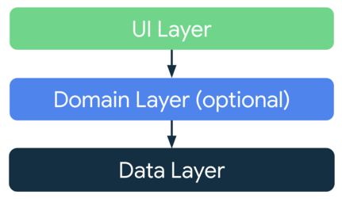
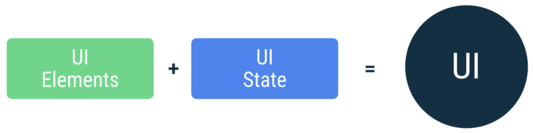
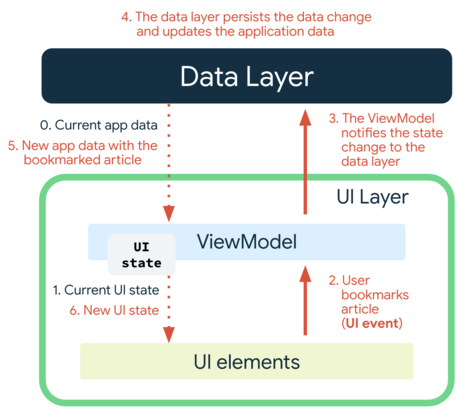
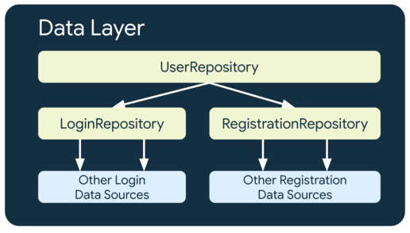
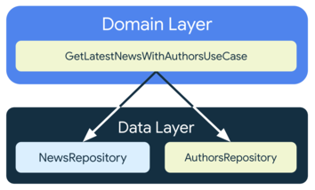
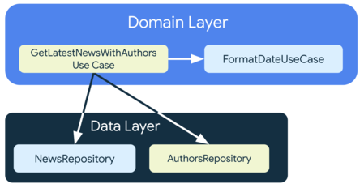

*本文的客户端指的是 Android*

## 应用架构介绍

2022 年 Android 官方推荐的应用架构已经从 MVVM 转变为 MVI 了，虽然现有项目还不着急做架构转变，但对于 MVI 的架构设计理念还是要先了解一下。

Android 架构的两个设计原则主要有两个：**关注点分离** 和 **数据模型驱动界面**。

### 关注点分离

个人认为一个 Android APP 包含的代码类型主要有以下几部分（当然可能不止这些）：
- UI 构建代码，这些代码用于构建用户所看到的界面
- 状态处理逻辑，包含向 UI 提供数据、用户行为处理、状态改变逻辑
- 数据模型定义，定义界面数据格式和从数据源获取的数据格式
- 数据源代码，用于从本地 / 网络获取数据和提交新数据
- 特定领域代码，应用独特的功能代码

官方最佳做法的建议中提到要**在应用的各个模块之间设定明确定义的职责界限**，实际上就是让不同模块有特定的关注点，来对上面提到的代码类型进行区分，避免不同类型代码都放在同一个区域中，而**应用架构设计**就是在做这样的事情。

**遵循关注点分离有几个好处：**
1. 不同模块可单独测试
2. 提高可维护性和可扩展性
3. 有利于团队的合作开发

### 数据模型驱动界面

数据模型代表的是应用的数据，数据模型独立于应用中的界面元素和其他组件，和界面元素的生命周期解耦，方便复用和测试，因此我们应该采用数据模型驱动界面，这对于应用来说会更稳定可靠、更便于测试。

而持久性模型是理想的数据模型，原因如下：
- 如果 Android 操作系统销毁应用以释放资源，用户不会丢失数据
- 当网络连接不稳定或不可用时，应用会继续工作

### MVI 架构介绍

MVI 是 **Model-View-Intent** 的缩写，它也是一种响应式 + 流式处理思想的架构。

MVI 的 Model 代表一种可订阅的状态模型的概念，添加了 Intent 概念来代表用户行为，采用单向数据流来控制数据流动和各层依赖关系。


在代码的层面上它分为三层：
- **UI Layer（界面层）**：在屏幕上展示应用界面和数据
- **Domian Layer（网域层）**：封装复杂或可复用的业务逻辑
- **Data Layer（数据层）**：获取可公开应用数据和完成业务逻辑

每个应用最少需要有两层（UI Layer 和 Data Layer），而 Domian Layer 在应用中是可选的。



MVI 的分层命名并不像 MVC、MVP、MVVM 那样直接，而是根据职责去划分命名。

MVVM 代码分层的 View 和 ViewModel 在 MVI 中统一称为 UI Layer，而 Model 层在 MVI 中变成了 Data Layer。

MVI 概念中的 Model 作为状态模型，在 UI Layer 的 ViewModel 和 Data Layer 的 Repository 中分别体现为 UI State 和 Data Flow。

MVI 中的单项数据流工作流程如下：
1. 用户操作以 Intent 的形式通知 Model
2. Model 基于 Intent 更新 State
3. View 接收到 State 变化刷新 UI

## UI Layer（界面层）

[界面层 | Android 开发者](https://developer.android.com/jetpack/guide/ui-laye)

界面层指的是用于显示 Activity 和 Fragment 界面元素，例如 UI 构建和用户交互逻辑，都属于界面层，这在 MVVM 或者 MVI 中都一样。



MVI 的概念中 UI 由 UI Element 和 UI State 两部分组成，因此 UI Layer 包含两部分：
- UI Element：在屏幕上呈现 UI 布局和数据的界面元素（可用 View 或者 Jetpack Compose 构建这些界面）
- State Holder：用于存储临时状态数据（UI State）、向界面提供数据和处理逻辑的状态容器（如 ViewModel）


### 状态定义与使用

MVVM 和 MVI 中的状态表现为一个 LiveData 或 Flow 对应一个 State，不同的是 MVI 中的 State 表现为集中管理的 Data Class 作为状态数据。

```Kotlin
data class NewsUiState(
    val isSignedIn: Boolean = false,
    val isPremium: Boolean = false,
    val newsItems: List<NewsItemUiState> = listOf(),
    val userMessages: List<Message> = listOf()
)

data class NewsItemUiState(
    val title: String,
    val body: String,
    val bookmarked: Boolean = false,
    ...
)
```

我们可以在 ViewModel 中使用 LiveData 或者 Kotlin Flow 来向 UI Element 提供一个可订阅状态。

官方以 Flow 为例

```Kotlin
class NewsViewModel(...) : ViewModel() {

    val uiState: StateFlow<NewsUiState> = …
}
```

在界面使用状态时，对于 LiveData 可以使用 `observe()` 方法来订阅状态变化，而对于 Kotlin Flow 可以使用 `collect()` 方法。

```Kotlin
class NewsActivity : AppCompatActivity() {

    private val viewModel: NewsViewModel by viewModels()

    override fun onCreate(savedInstanceState: Bundle?) {
        ...

        lifecycleScope.launch {
            repeatOnLifecycle(Lifecycle.State.STARTED) {
                viewModel.uiState.collect {
                    // Update UI elements
                }
            }
        }
    }
}
```

> 推荐阅读 [UI State 集中管理的优缺点分析](https://juejin.cn/post/7048980213811642382#heading-8)

### 单向数据流（UDF）

当 UI Element 需要使用 State 的数据时，要采用单向数据流来管理 State。

单向数据流的使用代表 ViewModel 可以公开 UI State 向 UI Element 提供数据，但 UI Element 不能直接修改 UI State。

采用单向数据流响应用户输入更新 UI State 的步骤如下：

1. ViewModel 存储并公开 UI State（提供数据）
2. UI Element 订阅 UI State 呈现界面（UI 构建）
3. ViewModel 处理用户操作更新 UI State（业务逻辑处理）
4. UI State 通知 UI Element 获取新数据重新呈现

除了用户操作产生的 UI Event 外，其他更新 UI State 的行为也会触发界面更新（如 UI State 初始化），系统会对导致状态改变的所有事件重复上面的操作。



单向数据流是关注点分离原则的一个实现，让 UI Element 只发挥布局构建和数据解析的作用，而不直接进行业务处理，这点和 MVVM 的状态访问是相同的。

单向数据流有多种常用的实现，其中一种实现方式是在 ViewModel 中定义一个私有的可变数据流在内部进行更新，再定义一个公开的不可变数据流提供给 UI Element。

```Kotlin
class NewsViewModel(...) : ViewModel() {

    private val _uiState = MutableStateFlow(NewsUiState())
    val uiState: StateFlow<NewsUiState> = _uiState.asStateFlow()

    // 定义一些处理用户行为的业务方法
    // 在业务方法中更新 _uiState
}
```

对于使用 Jetpack Compose 构建 UI 的应用，可以将 MutableState 的 setter 声明为 private，以保证 ViewModel 外部无法修改 State。

```Kotlin
class NewsViewModel(...) : ViewModel() {

    var uiState by mutableStateOf(NewsUiState())
        private set

    ...
}
```

## Data Layer（数据层）

[数据层 | Android 开发者](https://developer.android.com/jetpack/guide/data-layer)

由于 Domain Layer 是可选层，因此这里先介绍 Data Layer。

Data Layer 和 MVVM 架构下的数据层其实区别不大，但因为以前没积累过 MVVM 的相关文章，因此在这里做一下介绍。

在 MVI 中 UI Layer 可直接访问 Data Layer，但需要注意的是我们要避免在 UI 代码中直接访问，而是在 ViewModel 中访问 Data Layer，这和 MVVM 中的做法一样，因为这样有利于 Data Layer 做单独测试和维护，而不影响到其他层。

Data Layer 分为**提供业务处理的 Repositories** 和 **提供数据的 Data Resource**。


### Data Resource 数据源

数据源可以是文件、网络、本地数据库，数据源类是负责为应用和负责数据操作的系统搭建一个桥梁，每个数据源类应当只处理一个数据源。

除了 Repository 外，其他层不能直接访问数据源，UI Layer 和 Domain Layer 也不能将数据源作为依赖项，而是将 Repository 作为访问入口，以便不同层次可以独立扩展。

通常对于同类型的数据源可能存在不同访问方式，我们可以采用策略模式来让数据访问算法变得可切换，以便系统的扩展和更新维护。

例如对于官方提供的网络请求案例我们可以将发起网络的响应算法抽象为 interface，而具体提供请求算法的实现类中，我们可以自由地选择采用 OkHttp 还是 Retrofit，或者将来准备引入 Ktor Client，那么只需要添加相应的实现类即可。

```Kotlin
class NewsRemoteDataSource(
  private val newsApi: NewsApi,
  private val ioDispatcher: CoroutineDispatcher
) {
    /**
     * Fetches the latest news from the network and returns the result.
     * This executes on an IO-optimized thread pool, the function is main-safe.
     */
    suspend fun fetchLatestNews(): List<ArticleHeadline> =
        // Move the execution to an IO-optimized thread since the ApiService
        // doesn't support coroutines and makes synchronous requests.
        withContext(ioDispatcher) {
            newsApi.fetchLatestNews()
        }
    }
}

// Makes news-related network synchronous requests.
interface NewsApi {
    fun fetchLatestNews(): List<ArticleHeadline>
}
```

而对于本地数据源也是如此，因为我们也可能会在 SharePreference、DataStore 或者 MMKV 之间做切换。

### Repository 存储库

Repository 类负责以下任务：
- 向应用的其余部分公开数据
- 集中处理数据变化
- 解决多个数据源之间的冲突
- 对应用其余部分的数据源进行抽象化处理
- 包含数据处理的业务逻辑

Repository 可从多个数据源获取数据，并提供公开 API 提供**一次性操作（如 Kotlin 的 suspend 函数）** 和 **接收关于数据随时间变化的通知**。为了保护数据一致性，该层公开的数据应该是不可变的，这样也可以在多线程中安全处理。

```Kotlin
class ExampleRepository(
    private val exampleRemoteDataSource: ExampleRemoteDataSource, // network
    private val exampleLocalDataSource: ExampleLocalDataSource // database
) {

    val data: Flow<Example> = ...

    suspend fun modifyData(example: Example) { ... }
}
```

Repository 可根据业务范围或者接口范围进行划分，但要遵循单一职责原则。对于复杂业务如果需要依赖其他存储库，可以采用多层存储库设计。



### 操作类型与错误处理

Data Layer 的操作类型分为 3 种：

- **面向界面的操作**：仅在用户位于特定屏幕上时才相关，当用户离开相应屏幕时便会被取消，面向界面的操作通常由界面层触发，并且遵循调用方的生命周期
- **面向应用的操作**：只要应用处于打开状态，面向应用的操作就一直相关。如果应用关闭或进程终止，这些操作将会被取消。例如，缓存网络请求结果，以便在以后需要时使用。由于 Repository 的设计，这些操作通常遵循 Application 类或数据层的生命周期
- **面向业务的操作**：面向业务的操作无法取消。它们应该会在进程终止后继续执行。对于面向业务的操作，官方建议使用 WorkManager

Repository 和数据源的交互可能出现异常（网络错误、存储空间不足等），我们可以利用 Kotlin 的内错误处理机制，也可以适当使用 `try/catch` 块来捕获异常。

当在数据流中使用 `catch` 运算符，那么 UI Layer 应该负责处理在调用数据层出现的错误。

当需要由 UI Layer 来处理异常时，由于 Data Layer 和 UI Layer 可理解和处理的异常类型不同，因此我们可以自定义异常来将 Data Layer 出现的异常转换为 UI Layer 可理解的异常。

值得注意的是当采用 Kotlin 协程进行**面向界面的操作**，当用户离开屏幕时由于任务取消会得到一个 `CancellationException`，此时如果在 UI Layer 中捕获了该异常更新 UI Element，由于此时 UI Element 上的部分元素可能为 null，这会使程序崩溃。

> 可以看看 bennyhuo 大佬关于 Kotlin 异常捕获的视频。

<iframe src="//player.bilibili.com/player.html?aid=893571728&bvid=BV1pP4y1N7GJ&cid=496854412&page=1" scrolling="no" border="0" frameborder="no" framespacing="0" allowfullscreen="true" class="bilibili"> </iframe>

## Domain Layer（网域层）

[网域层 | Android 开发者](https://developer.android.com/jetpack/guide/domain-layer)

Domain Layer 负责封装复杂的业务逻辑，或者由多个 ViewModel 重复使用的简单业务逻辑。

Domain Layer 的出现由以下优势：
- 避免代码重复
- 改善使用网域层类的类的可读性
- 改善应用的可测试性
- 能够划分好职责，从而避免出现大型类

Domain Layer 封装逻辑的类称为用例，官方指南中用例类的命名为：**一般现在时动词 + 名词/内容（可选）+ 用例（UseCase）**

UseCase 体现为逻辑聚合类，可封装 ViewModel 中的逻辑和 Repository 的逻辑。它没有自己的生命周期，而是受限于使用它们的类。

当 ViewModel 的业务逻辑或者 Repository 分层后最上层的逻辑仍然过于复杂，那么可以考虑将逻辑提取出来提高可读性，同时可以让该逻辑变得更加容易单独测试，并且可以在不同部分进行复用。



当我们在抽离 UseCase 的时候也要注意职责的划分。Domain Layer 中的 UseCase 也可以依赖其他 UseCase，使用其他 UseCase 封装好的逻辑。

```Kotlin
class GetLatestNewsWithAuthorsUseCase(
  private val newsRepository: NewsRepository,
  private val authorsRepository: AuthorsRepository,
  private val formatDateUseCase: FormatDateUseCase
) { /* ... */ }
```



### 其他使用方

Domain Layer 除了可以给 UI Layer 使用外，也可以提供给 Service 或者 Application 类使用，这并不违法架构设计原则，因为它本身就是封装可复用逻辑的存在。

除了项目中 Android 的 UI Layer 外，如果与其他平台使用共享的逻辑代码（例如采用 KMM 开发跨平台移动端 APP），那么他们的界面层也可以使用 Domain Layer 的 UseCase。

## 参考

- [Google 推荐使用 MVI 架构？卷起来了~](https://juejin.cn/post/7048980213811642382)
- [MVVM 进阶版：MVI 架构了解一下~](https://juejin.cn/post/7022624191723601928)
- [应用架构指南 | Android 开发者](https://developer.android.com/jetpack/guide)