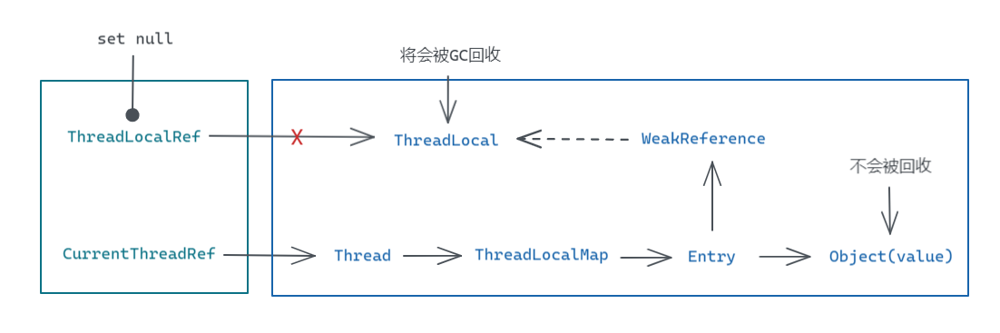

Java 中的创建的对象存放在堆内存，这一块空间是线程共享的，通常我们定义的变量所持有的是对象的引用存，即每个线程访问该变量时都将获取到堆内存中的同一个对象，因此在使用多线程的时候如果需要操作同一资源，那么需要思考线程安全的问题。

```Java
// ThreadDemo.java

static int v = 0;

static void autoAdd(){
    for (int i = 0; i < 10000; i++) {
        v++;
    }
}

public static void main(String[] args) throws Exception {
    new Thread(ThreadLocalDemo::autoAdd).start();
    autoAdd();
    Thread.sleep(1000);
    System.out.println(v);
}
```

上面代码变量 `v` 的打印结果可能会小于 20000，随着 `v` 自增次数的增加，例如循环次数增加到 100000，这个问题将会更加明显。

要解决线程安全的问题可以用同步或加锁的方式来处理，但有时候我们希望的该变量对于每个线程来说是独享的，也就是对于同一个变量，它的值对于不同线程都应该有一份单独的副本。

局部变量对于 Java 开发者而言应该是再熟悉不过的了。不同线程操作一个共享的变量时，我们可以创建一个新的局部变量来复制该变量的值，再进行操作，这样就不会污染到该共享变量的值。但对于复杂的对象而言，复制起来比较麻烦，而且这种方式也不能将操作完的值写回共享的变量。

虽然我们有办法解决这些问题，但没必要，因为 Java 提供了 ThreadLocal 来帮助我们创建一个线程局部的变量。

## ThreadLocal 的使用

ThreadLocal 的使用利用了泛型，我们可以将期望的值放到 ThreadLocal 中，使用 ThreadLocal 时通过指定泛型类型来决定该 ThreadLocal 存放的数据的类型，这是集合类一样。

```Java
ThreadLocal<Integer> threadLocal = new ThreadLocal<>();
System.out.println(threadLocal.get());
```

我们使用 new 创建的 ThreadLocal 本身是一个对象，如果要获取数据的话，需要调用 `get()` 方法，上面的代码会得到一个 `null`，正确的使用方法应当重写 `initialValue()` 方法，来创建我们需要的初始化值。

```Java
static ThreadLocal<Integer> threadLocal = new ThreadLocal<Integer>() {
    @Override
    protected Integer initialValue() {
        return 0;
    }
};

static void autoAdd() {
    for (int i = 0; i < 10000; i++) {
        int v = threadLocal.get();
        threadLocal.set(v + 1);
    }
    System.out.println(Thread.currentThread().getName() + " --> " + threadLocal.get());
}

public static void main(String[] args) throws Exception {
    new Thread(ThreadLocalDemo::autoAdd).start();
    autoAdd();
    Thread.sleep(1000);
}
```

上面的代码执行结果将会如下

```
Thread-0 --> 10000
main --> 10000
```

可以看到两个线程获取到的值都是独享的，彼此间不会相互干扰，因为破坏了同一资源这一要素，因此也不需要考虑线程安全的问题。

## ThreadLocal 如何存储各个线程独享的数据

我们知道，变量所存储的是引用，那么简单地通过变量来实现线程独占是比较困难的，如果我们能理解在 ThreadLocal 是用什么结构来存储这些数据，那么就能理解它是怎么做到线程独享的。

```Java
public T get() {
    Thread t = Thread.currentThread();
    ThreadLocalMap map = getMap(t);
    if (map != null) {
        ThreadLocalMap.Entry e = map.getEntry(this);
        if (e != null) {
            @SuppressWarnings("unchecked")
            T result = (T)e.value;
            return result;
        }
    }
    return setInitialValue();
}
```

我们使用 ThreadLocal 是通过 `get()` 方法来获取独享的值的，这个方法会先获取当前线程的 Thread 对象，再根据当前线程去获取一个 ThreadLocalMap，这是一个结构类似于 Java Map 的类，但它并没有实现 Map 接口。

利用 IDEA 整理一下相关的类可以得到下面的类图


Java 中每个 Thread 都有一个 ThreadLocalMap 类型的成员变量 `threadLocals`，这个变量默认为 `null`。当 ThreadLocal 调用 `getMap(Thread t)` 的时候，其实只是获取对应 Thread 中的这个 `threadLocals`，并没有什么复杂的操作。

```Java
// Thread.java
ThreadLocal.ThreadLocalMap threadLocals = null;

// ThreadLocal.java
ThreadLocalMap getMap(Thread t) {
    return t.threadLocals;
}
```

而 ThreadLocalMap 和 HashMap 类似，都用一个 Entry 数组作为哈希表来存储元素，每一个 Entry 代表一个键值对元素，其中 Entry 的成员变量 value 就是各个线程独享的值，而对应的 key，是一个 ThreadLocal 对象，它使用 WeakReference 来存储。

按照注释说明，之所以使用 WeakReference 来引用键，是因为方便处理比较大又需要长时间使用的空间。

```Java
/**
 * To help deal with very large and long-lived usages, 
 * the hash table entries use WeakReferences for keys.
 */
static class ThreadLocalMap {

        static class Entry extends WeakReference<ThreadLocal<?>> {
            /** The value associated with this ThreadLocal. */
            Object value;

            Entry(ThreadLocal<?> k, Object v) {
                super(k);
                value = v;
            }
        }

        private Entry[] table;

        // ...
}
```

到这里可以整理出一个关系链，Thread 中有一个 ThreadLocalMap 成员 `threadLocals`，它存储各个 ThreadLocal 对应的值，由于不同的线程的 `threadLocals` 不同，因此相同的 ThreadLocal 在不同线程中获取到的值是不同的，这就是 ThreadLocal 中的值线程独享的原理。


## ThreadLocal 的初始化

前面提到 ThreadLocal 的使用需要重写 `initialValue()` 方法，这是因为并没有办法在创建 ThreadLocal 变量时直接为它赋值一个初始值。

当调用 `get()` 方法时，当前线程的 `threadLocals` 为 `null`，或者在 `threadLocals` 中获取不到当前 ThreadLocal 对应的值时，则会调用 `setInitialValue()` 方法来设置初始值存储到 `threadLocals` 中，而这个初始值就是通过 `initialValue()` 方法生成的，如果不重写该方法，默认得到的初始值将会是 `null`。

```Java
private T setInitialValue() {
    T value = initialValue();
    Thread t = Thread.currentThread();
    ThreadLocalMap map = getMap(t);
    if (map != null)
        map.set(this, value);
    else
        createMap(t, value);
    return value;
}

// 初始化值
protected T initialValue() {
    return null;
}
```

由于线程中的 `threadLocals` 默认为 `null`，因此这一步如果得到的 ThreadLocalMap 为 `null` 的话则会调用 `createMap()` 方法来创建一个 ThreadLocalMap 对象，并提供第一个元素的 key 和 value 给 ThreadLocalMap。

```Java
void createMap(Thread t, T firstValue) {
    t.threadLocals = new ThreadLocalMap(this, firstValue);
}

ThreadLocalMap(ThreadLocal<?> firstKey, Object firstValue) {
    table = new Entry[INITIAL_CAPACITY];
    int i = firstKey.threadLocalHashCode & (INITIAL_CAPACITY - 1);
    table[i] = new Entry(firstKey, firstValue);
    size = 1;
    setThreshold(INITIAL_CAPACITY);
}
```

## ThreadLocal 修改数据

修改 ThreadLocal 中的值可以像上面的例子一样使用 `set(T value)` 方法，当调用 `set()` 方法时，如果 `threadLocals` 还没创建则调用 `createMap()` 创建并存储新值，否则调用 `ThreadLocalMap.set(ThreadLocal<?> key, Object value)`。

```Java
public void set(T value) {
    Thread t = Thread.currentThread();
    ThreadLocalMap map = getMap(t);
    if (map != null)
        map.set(this, value);
    else
        createMap(t, value);
}
```

需要注意的是，`set()` 方法并不能用来代替 `initialValue()` 来对 ThreadLocal 的值进行初始化。因为这需要在每个线程的第一次使用 ThreadLocal 之前都调用一次 set，这会很麻烦。

另外即便使用了 ThreadLocal，对应的值依旧是一个对象，存放在堆内存中。也就是任何线程其实都有访问该对象的权限。当我们在不同线程调用 `set()` 存放一个相同的对象时，那么 ThreadLocal 将失去线程独享的副本。

```Java
static class Demo {
    int v = 0;
}

static ThreadLocal<Demo> threadLocal = new ThreadLocal<Demo>() {
    @Override
    protected Demo initialValue() {
        return new Demo();
    }
};

public static void main(String[] args) throws Exception {
    Demo demo = threadLocal.get();

    new Thread(() -> {
        threadLocal.set(demo);
        threadLocal.get().v = 100;
    }).start();

    Thread.sleep(100);
    System.out.println(threadLocal.get().v); // 100
}
```

执行上面代码的输出结果将会是 100。这很好理解，因为两个线程中 ThreadLocal 对应的 value 是同一个对象，因此其中一个线程的修改操作将会影响到其它线程。

## ThreadLocalMap 的一些细节

ThreadLocalMap 和 HashMap 不同，获取 Entry 下标使用的不是 ThreadLocal 对象的 `hashCode`，而是 `threadLocalHashCode`。

```Java
// ThreadLocalMap 中获取对应 Entry 下标
// key 是一个 ThreadLocal 对象
int i = key.threadLocalHashCode & (table.length - 1);
```

这个值由 ThreadLocal 一个 AtomicInteger 类型的静态成员 `nextHashCode` 的 `getAndAdd()` 方法生成。

```Java
// ThreadLocal
private final int threadLocalHashCode = nextHashCode();

private static AtomicInteger nextHashCode = new AtomicInteger();

private static final int HASH_INCREMENT = 0x61c88647;

private static int nextHashCode() {
    return nextHashCode.getAndAdd(HASH_INCREMENT);
}
```

另外，哈希表可能会发生哈希冲突，ThreadLocalMap 处理哈希冲突采用的是闭散列，没有采用哈希桶可能是我们代码中的 ThreadLocal 并不会很多，发生冲突的概率比较小。

```Java
private void set(ThreadLocal<?> key, Object value) {

    Entry[] tab = table;
    int len = tab.length;
    int i = key.threadLocalHashCode & (len-1);

    for (Entry e = tab[i];
            e != null;
            e = tab[i = nextIndex(i, len)]) {
        ThreadLocal<?> k = e.get();

        if (k == key) {
            e.value = value;
            return;
        }

        if (k == null) {
            replaceStaleEntry(key, value, i);
            return;
        }
    }

    tab[i] = new Entry(key, value);
    int sz = ++size;
    if (!cleanSomeSlots(i, sz) && sz >= threshold)
        rehash();
}
```

## 内存溢出问题

```Java
static class Entry extends WeakReference<ThreadLocal<?>> {
    /** The value associated with this ThreadLocal. */
    Object value;

    Entry(ThreadLocal<?> k, Object v) {
        super(k);
        value = v;
    }
}
```

内存溢出是使用 ThreadLocal 需要注意的一个问题，但使用 ThreadLocal 时发生内存泄露的不是 ThreadLocal 对象，而是存储在 Entry 中对应的 value。

ThreadLocal 对象并不会发生内存泄露，当我们将 ThreadLocal 引用置为 `null` 时，由于在 Thread 中的 ThreadLocalMap 中的 Entry，对 ThreadLocal 是一个弱引用，因此发生 GC 时就会被回收。

所以在 ThreadLocalMap 中可能存在 key 为 `null` 的 Entry，但由于这个 Entry 以及存储的 value 本身是一个强引用，因此不会被回收，这才发生了内存泄露。



其实 ThreadLocalMap 的生命周期线程相同，当线程运行结束，线程将会被销毁，那么 ThreadLocalMap 对象、存储的 Entry 对象以及 value 引用的对象也会被回收。

但如果使用的是线程池，线程执行完任务并不会被销毁，而是放回线程池，那么对应的 value 会一直存在，这才发生了内存泄露。

ThreadLocal 提供了 `remove()` 方法，可将当前线程对应 ThreadLocal 的 Entry 中 WeakReference 对 ThreadLocal 的引用和 value 对 Object 的引用都设置为 `null`，同时移除该 Entry 对象。

当 ThreadLocal 使用完后，在将引用设置为 null 前，应当调用 `remove()` 来防止内存泄露。

```Java
// ThreadLocal
public void remove() {
    ThreadLocalMap m = getMap(Thread.currentThread());
    if (m != null)
        m.remove(this);
}

// ThreadLocalMap
private void remove(ThreadLocal<?> key) {
    Entry[] tab = table;
    int len = tab.length;
    int i = key.threadLocalHashCode & (len-1);
    for (Entry e = tab[i];
            e != null;
            e = tab[i = nextIndex(i, len)]) {
        if (e.get() == key) {
            e.clear();
            expungeStaleEntry(i);
            return;
        }
    }
}

private int expungeStaleEntry(int staleSlot) {
    Entry[] tab = table;
    int len = tab.length;

    // expunge entry at staleSlot
    tab[staleSlot].value = null;
    tab[staleSlot] = null;
    size--;

    // ...
}

// WeakReference --> Reference
public void clear() {
    this.referent = null;
}
```

## ThreadLocal 使用小技巧

#### ThreadLocal 尽量声明为静态

对于一个 ThreadLocal 变量而言应当声明为静态的，因为每个线程访问该变量时应该是同一个 ThreadLocal 对象，如果不声明为静态的话，需要创建对应 ThreadLocal 所在类的对象来使用它，如果我们创建多个对象将会拥有多个相同作用的 ThreadLocal，这只是在增加内存的消耗。

#### withInitial() 配合 Lambda 表达式

定义 ThreadLocal 初始化也可以通过调用 `withInitial()` 方法传入 Supplier 对象来实现，Supplier 是一个接口，需要重写的方法只有 `get()`，因此我们可以配合 Lambda 表达式或者 Method Reference 来使用。

```Java
static ThreadLocal<Integer> threadLocal1 = ThreadLocal.withInitial(() -> 0);
static ThreadLocal<Demo> threadLocal2 = ThreadLocal.withInitial(Demo::new);
```

`withInitial()` 方法会返回一个 SuppliedThreadLocal 对象，SuppliedThreadLocal 的大部分功能继承自 ThreadLocal，但它帮我们重写了 `initialValue()` 方法，通过调用传入的 Supplier 对象的 `get()` 方法来获取初始化值。

```Java
public static <S> ThreadLocal<S> withInitial(Supplier<? extends S> supplier) {
    return new SuppliedThreadLocal<>(supplier);
}

static final class SuppliedThreadLocal<T> extends ThreadLocal<T> {

    private final Supplier<? extends T> supplier;

    SuppliedThreadLocal(Supplier<? extends T> supplier) {
        this.supplier = Objects.requireNonNull(supplier);
    }

    @Override
    protected T initialValue() {
        return supplier.get();
    }
}
```

## 参考

- [理解Java中的ThreadLocal](https://www.cnblogs.com/tkzL/p/12926797.html)
- [Red Rose - ThreadLocal 内存泄漏问题深入分析](https://droidyue.com/blog/2016/03/13/learning-threadlocal-in-java/)
