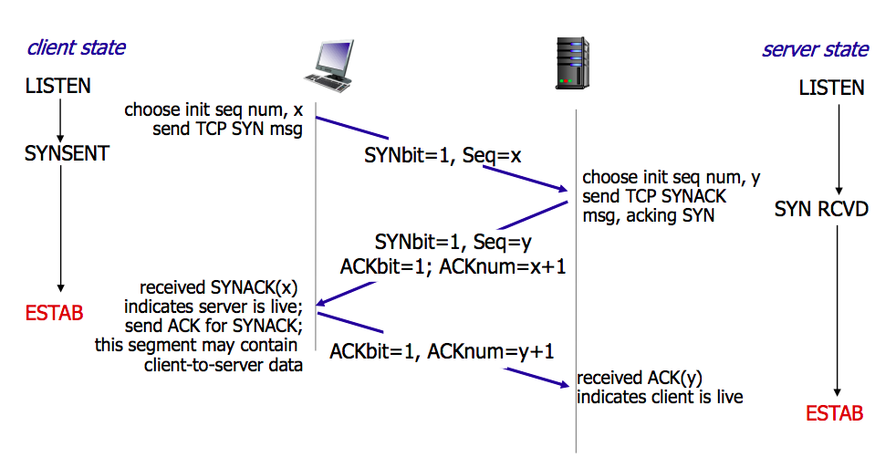
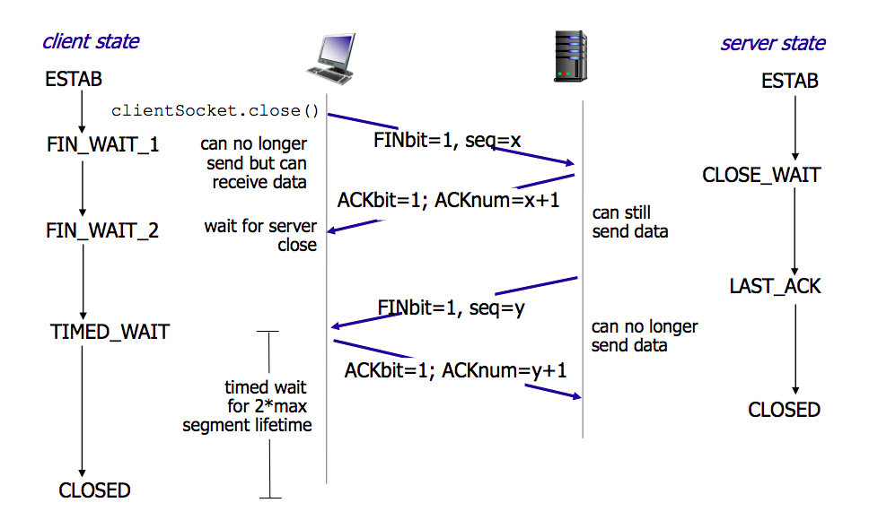

**TCP（Transmission Control Protocol）** 是一个提供可靠连接服务的传输控制协议。采用三次握手确认一个连接和四次挥手关闭连接。

**三次握手（Three-way Handshake）** 指的是建立一个 TCP 连接时，客户端和服务端总共需要发送 3 个包。当客户端执行`connect()`时触发三次握手建立 TCP 连接。

**四次挥手（Four-way Handshake）** 指的是断开一个 TCP 连接需要发送 4 个包，客户端和服务器都可以执行`close()`来发起四次挥手操作。

<!-- more -->

在了解 TCP 三次握手前需要先了解 TCP 的报文头部中的几个标志位：
- SYN（synchronous）：建立连接
- ACK（acknowledgment）：确认
- PSH（push）：传送
- FIN（finish）：结束
- RST（reset）：重置
- URG（urgent）：紧急
- SEQ（Sequence number）：序列号（Seq）
- ACKnum（Acknowledgment number）：确认号

另外，ISN（Initial Sequence Number）指的是初始化 SEQ 标志位的序列号，每次初始化都是随机生成不同的序号，来区分相同客户端建立的不同 TCP 连接，避免数据错乱和恶意攻击。

## 三次握手流程

- **第一次握手（SYN=1，SEQ=x）**：客户端发送一个 SYN 连接包给服务端指明需要连接的端口。客户端将自己的 ISN（用 x 表示）放到 SEQ 中，之后客户端进入 **SYN_SEND** 状态，表示已发送连接包
- **第二次握手（SYN=1，ACK=1，SEQ=y，ACKnum=x+1）**：服务端发送 ACK 确认包给客户端。服务端将自己的 ISN（用 y 表示） 放到 SEQ 中，同时将 ACKnum 设置为客户端的 ISN 加 1，即 x+1，发送确认包后服务端进入 **SYN_RCVD** 表示已接受连接包并发回确认包
- **第三次握手（ACK=1，ACKnum=y+1）**：客户端发送 ACK 确认包给服务端。客户端接收到确认包后，把服务端发来的 ACK 包中的 SEQ（服务端的 ISN）加 1，即 y+1 放到 ACKnum 发回给服务端，之后客户端进入 `ESTABLISHED`状态
- 当服务端接收到这个确认包时，也进入 `ESTABLISHED`状态，TCP 三次握手结束

## 四次挥手流程

*（以客户端关闭连接为例）*

- **第一次挥手（FIN=1，SEQ=x）**：客户端发送一个 FIN 标志位为 1 的包。表示自己没有数据可以发送了，但依旧可以接收数据，之后进入`FIN_WAIT_1`状态
- **第二次挥手（ACK=1，ACKnum=x+1）**：如果服务端接收到客户端的 FIN 包，但还有数据需要发送，则发送一个 ACK 确认包告知客户端，已经接收到关闭连接的请求，但还没准备好关闭连接，之后服务端进入`CLOSE_WAIT`状态。客户端接收到这个 ACK 包后进入`FIN_WAIT_2`状态，等待服务端关闭连接
- **第三次挥手（FIN=1，SEQ=y）**：当服务端发送完数据准备好关闭连接时，向客户端发送 FIN 包，之后服务端进入（LAST_ACK）状态，表示等待客户端最后的确认。
- **第四次挥手（ACK=1，ACKnum=y+1）**：当客户端接收到服务端的关闭请求，发送一个 ACK 包，并进入`TIME_WAIT`状态，等待可能出来的要求重传的 ACK 包。
- 当服务端接收到这个 ACK 包后，关闭连接，进入`CLOSED`状态。客户端等待了 2MSL 时间（两个最大段的生命周期，2 Maximum Segment Liftime）之后，如果没有接收到服务端的 ACK 包，则认为服务端已经正常关闭连接，于是客户端也关闭连接，进入`CLOSED`状态。

## ACK 包中的 ACKnum

从三次握手和四次挥手的流程中可以看出，每次发送的 ACK 包中 ACKnum 的值都是接收到的 SYN 或 FIN 包中的 SEQ+1（客户端或服务端的 INS）。

当接收到 ACK 包时，可以通过检查 ACK 包中 ACKnum 的值是否与原本发送 SYN 或 FIN 包时的 ISN 相匹配，来判断该 ACK 包是否有效。

## 短连接和长连接

**长连接**：客户端和服务端建立连接后不进行断开，之后客户端再次访问这个服务器上的内容时，继续使用这一条连接通道。

**短连接**：客户端和服务端建立连接，发送完数据后立马断开连接。下次要取数据，需要再次建立连接。

短连接可能会出现客户端或服务端 `TIME_WAIT` 状态过多的问题，优化方法：
- 尽量复用`TIME_WAIT` 状态的 TCP 连接。出现 `TIME_WAIT` 状态的连接，一定出现在主动关闭连接的一方，当主动方在 `TIME_WAIT` 状态下需要重新进行连接，则可以复用该连接。
- 当 `TIME_WAIT` 状态的 TCP 连接过多，抛弃 / 重置所有 `TIME_WAIT` 连接（这个不知道会不会造成什么问题哦）。

## SYN Flood

SYN 攻击是一种 Dos/DDos 攻击。

服务器发送 SYN-ACK 后，进入 `SYN_RCVD` 状态，在收到客户端的 ACK 之后服务端才能进入`ESTABLISHED`状态，在这之前的 TCP 连接称为半连接（half-open connect），在短时间内收到大量不存在的 IP 地址发送的 SYN 包时，这些为找的 SYN 包将会长时间占用未连接队列，正常的 SYN 请求被丢弃，导致系统缓慢甚至是网络堵塞和系统瘫痪。

在 Linux 上可以使用`netstats`命令来检测 SYN 攻击（存在大量半连接状态的 TCP），可以采用下面几种方法来减轻 SYN 攻击的危害：
- 缩短 SYN 超时（SYN Timeout）的时间
- 增加最大半连接数
- 过滤网关防护
- SYN cookies 技术

## 参考资料

- [Transmission Control Protocol - Wiki](https://en.wikipedia.org/wiki/Transmission_Control_Protocol)
- [“三次握手，四次挥手”你真的懂吗？ - 知乎](https://zhuanlan.zhihu.com/p/53374516)
- [TCP三次握手中SYN，ACK，Seq含义](https://blog.csdn.net/qq_25948717/article/details/80382766)
- [TCP 协议 - 笔记面试知识整理](https://hit-alibaba.github.io/interview/basic/network/TCP.html)
- [20-1-tcp连接——初始化序列号(ISN)](https://blog.csdn.net/qq_35733751/article/details/80552037)
- [TCP连接的TIME_WAIT和CLOSE_WAIT 状态解说](https://www.cnblogs.com/kevingrace/p/9988354.html)
