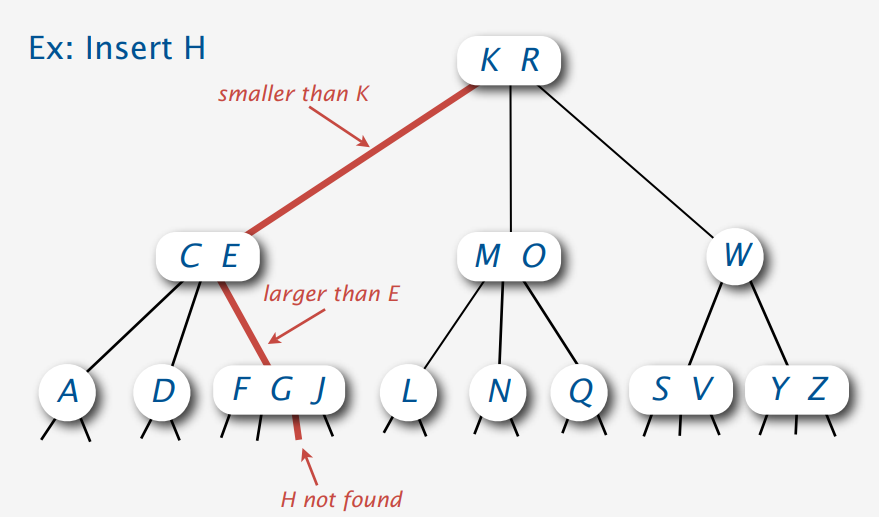
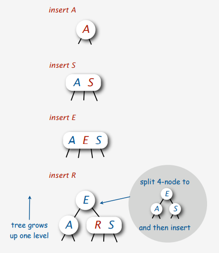
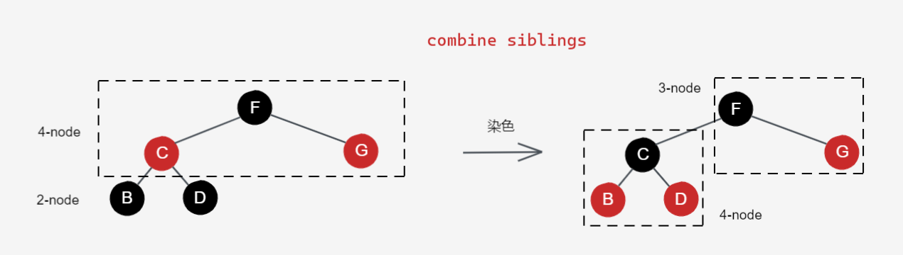
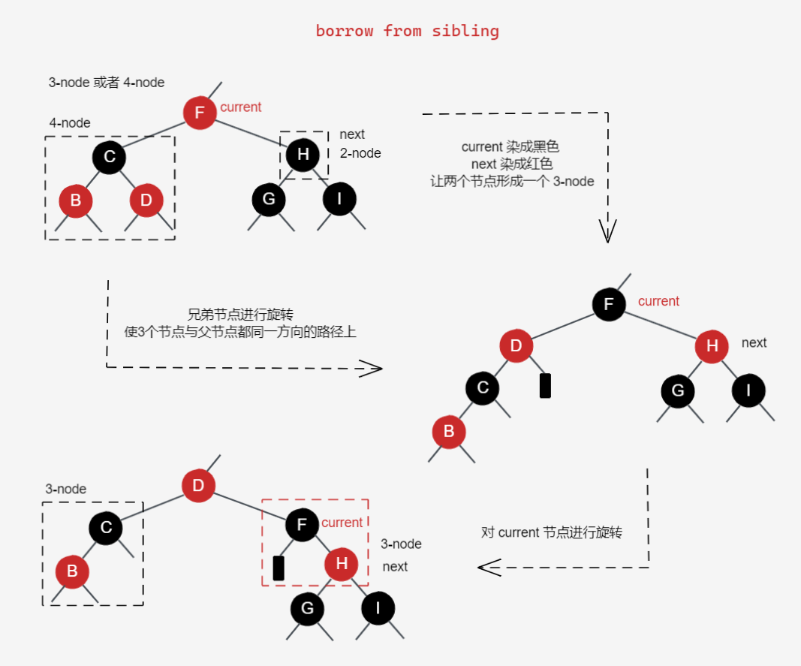
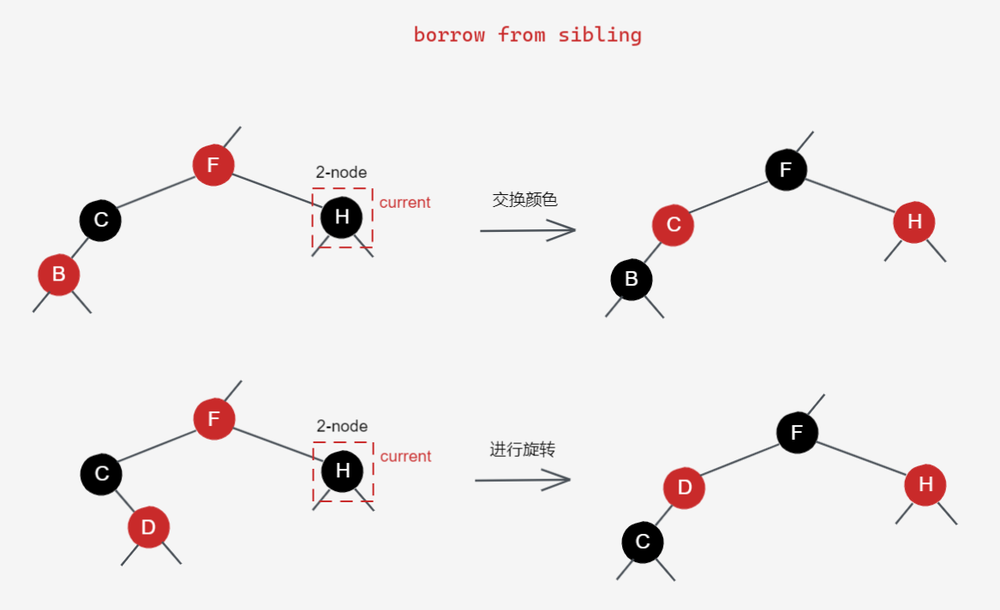
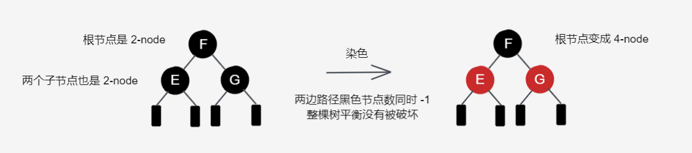
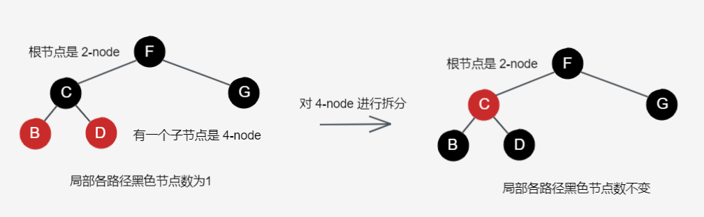

红黑树（Red-Black Tree）是一种自平衡的二叉查找树（Binary Search Tree, BST），由于基于二叉查找树（并不是基于 [AVL 树](https://zh.wikipedia.org/wiki/AVL%E6%A0%91)），因此它是有序的。它出现于 1978 年 Leo J. Guibas 和 Robert Sedgewick 的一篇论文。

红黑树和 AVL 树很像，都是为了让二叉查找树能保持平衡，不会退化成链表，让查找时间复杂度能够稳定在 `O(log(n))`。

相比 AVL 树，红黑树牺牲了部分平衡性来，来减少插入 / 删除操作的旋转次数。因此插入性能红黑树会比 AVL 树快，但由于平衡性不如 AVL 树，当拥有相同数量的节点时，树的层数可能会比 AVL 树高，查询效率也不如 AVL 树。

由于红黑树的结构比较复杂，因此它也比较难理解，但我们借助 2-3-4 树来理解它。

**往下阅读前，我有话要说：**

*实际上，在查阅关于红黑树的资料时，对这些资料的部分内容的讲解带有个人的一些疑惑，如删除的一些场景在红黑树中是否真的会出现，一些文章对于树的对称操作的讲解也比较少，因此本文的讲解基于本人对红黑树结构的理解，部分内容与其它文章的描述的并不一致。*

*我所阅读过的资料的链接均放在文章末尾，大家有兴趣可以访问这些资料进行阅读，并思考本文对红黑树的理解与其它文章描述的区别，如对本文的讲解带有疑惑或不同的见解，可在博客原文评论区提出。*

## Perfect Balance 的 2-3-4 树理解红黑树

*介绍 2-3-4 树的资料可能比较少，由于 2-3-4 树的图画起来比较麻烦，为了偷懒本文选取了 Sedgewick 介绍 LLRB Tree（左倾红黑树） 的 PPT 中的一些图来做说明，该 PPT 链接放在本文末尾参考部分。*

2-3-4 树也是一颗自平衡的树，但它的节点比较特殊，可以分为以下 3 种节点：
- 2-node：普通的树节点，可存放一个数据，最多有两个子节点
- 3-node：能存放两个数据的节点，最多能有三个子节点
- 4-node：能存放三个数据的节点，最多能有四个子节点

它们的结构图示如下（该图来自 Sedgewick 的 PPT 第 12 页）：

该图中对子节点的连接位置进行描述的只有 3 节点，不过 4 节点与子节点连接方式其实也是一样的，子节点的连接决定于子节点存放的数据的大小范围和父节点的存放的数据的大小。

**2-3-4 树的结构是 Perfect Balance（完美的平衡）的，不同分支的高度都是一样的。**。

在 2-3-4 树中，添加数据与普通的树不同，并不会在树根直接创建新的子节点进行插入，而是放入插入位置的父节点中，成为 3-node 或 4-node。

以上面图示的 2-3-4 树插入数据 B 为例子，插入位置如下图所示（该图来自 Sedgewick 的 PPT 第 15 页）：

可以看到，B 并不是直接插入到 `Node(A)` 的下面作为子节点，而是将 B 放进 `Node(A)`，使得该节点成为了 3-node `Node(A B)`，从而使得树的高度并没有变化。

如果该节点原本是 4-node，将无法放入新的数据时。在 Sedgewick 的 PPT 中也有该情景的介绍，这是一个插入数据是 H 的例子：

首先寻找插入位置，H 应该插入的地方是 `Node(F G J)` 的下面，由于 2-3-4 树并不会直接创建新节点进行插入，因此 H 应该添加到 `Node(F G J)` 的 G 和 J 之间，但此时的 Node 已经是一个 4-node，无法放入新的数据。因此，需要进行如下的 4-node 拆分操作：

1. 将中间的数据放到父节点中，父节点从 3-node `Node(C E)` 变成了 4-node `Node(C E G)`
2. 将其它两个数据拆分成两个节点 2-node `Node(F)` 和 `Node(J)`，并按照规则和 `Node(C E G)` 进行连接
3. 将 H 放到对应的节点 `Node(J)` 中，成为 3-node `Node(H J)`

这里有需要考虑的问题，如果父节点也是 4-node 怎么办？

如 PPT 所说明的一样，解决的方案有两种：
1. 自底向上的解决方案：使用相同的方法对父节点进行拆分操作，不断向上处理，直到拆分的节点的父节点不是 4-node 为止
2. 自顶向下的解决方案：先从上往下拆分 4-node，最后再进行添加操作

对于第一种方案，可能有这样一个问题，如果 4-node 是根节点，它没有父节点，应该怎么处理。

实际按照 2-3-4 树的插入流程，根节点将会创建一个新的节点作为根节点。

从这可以看出，2-3-4 树通过创建根节点来增加新的节点，这样就可以避免因为创建子节点造成某个分支的高度发生变化，而破坏树的平衡。2-3-4 树这种节点增加方式可以保证树的 **Perfect Balance**。

第二种方案由于是自顶向下，因此可以在对插入位置查找时顺便完成路径上 4-node 的拆分操作。

在从上往下时，首先要确保当前节点不是一个 4-node。当下一个节点是 4-node 的时候，进行拆分操作。由于当前节点不是 4-node，因此当前节点不会出现溢出，只会变成 3-node 或 4-node，而下一个节点将会变成 2-node。

这样就可以保证，路径上不会有两个连续的 4-node，并且到达底部时，一定是一个 2-node 或者 3-node（因为如果是 4-node 的话会被拆分成 2-node），此时进行插入操作时，就可以直接进行添加，不需要再进行拆分操作。

## 将 2-3-4 树转化成红黑树

其实红黑树是 2-3-4 树的一种抽象表示，由于 2-3-4 树的实现较为困难，因此一般可以直接使用红黑树来当作 2-3-4 树使用。

将 2-3-4 树转换成红黑树的关键点在与 3-node 和 4-node 的转换。我们现在已经知道了 2-3-4 树的节点有 3 种，而红黑树其实只有 2-node。

我们可以将 3-node 和 4-node 拆分成多个 2-node，为了表示它们原本是 3-node 或者 4-node，需要为它们建立一种特殊的关联，这种特殊的关联就是红黑树中的颜色。

在红黑树中有红、黑两种颜色（当然并不规定一定是红和黑，可以是其它颜色），两个节点之间是黑色的连接代表两个 2-node 节点的普通连接，两个节点之间是红色的连接代表一个 3-node，当一个节点与两个子节点都是红色连接，说明是一个 4-node。

从树的平衡角度思考，使用 4-node 中间的节点来作为父节点，其它两个节点作为子节点，那么在局部将会形成一个稳定的二叉树。如果从两侧开始建立父节点，用连续的红连接来代表 4-node，那么从局部上看将会退化成长度为 3 的链表，导致红黑树整体的平衡性非常差。

2-3-4 树节点之间原本连接使用黑连接，因此转换成红黑树后，一条路径上不存在两条连续的红连接，连续的两个红连接代表一个节点同时与其它节点构成两个 3-node 或 4-node，这是一个矛盾的存在。

我们实际编写代码的时候，在树这种结构中，只会定义节点，而连接是通过指向来完成的，因此并不存在连接这种抽象的东西。那么，如果希望两个节点的连接具有颜色，我们可以把颜色存放在节点上面。对于一个普通的 2-node，它可以有一个父节点和两个子节点。因此使用红色连接的两个父子节点，颜色应当存放在子节点，而父节点为黑色。

此时，我们可以定义红黑树去代表 2-3-4 树：
1. 使用黑色节点去表示 2-3-4 树的所有节点
2. 使用红色的子节点来让该节点代表 3-node 和 4-node

一个 2-3-4 树转换成红黑树的例子如下：

根据 2-3-4 树的性质，以及我们转换成红黑树时的规则，我们可以得到红黑树的以下 **5 条性质**：

1. 每个节点都有颜色，要么是黑的（代表一个 2-3-4 树节点），要么是红的（代表 2-3-4 树 3-node 或 4-node 的其它元素）；
2. 由于每个 2-3-4 树的节点都是黑色，而 3-node 或者 4-node 的其它元素使用红色节点表示，代表红色节点无法作为根节点，根节点只能是黑色；
3. 不能有连续的两个红色节点，也就是红色节点的两个子节点都是黑色的
4. 叶子节点为黑色（叶子节点为树尾端的节点，为空指针，由于性质 1 和 4，其颜色不能为红色）
5. 由于 2-3-4 树是一个 Perfect Balance 的树，因此每个节点下各个路径包含的节点数都相同，因此红黑树每个节点的各个路径到树尾包含的黑色节点数目也都相同

只要红黑树满足这 5 条性质，那么就可以保证其结构相对平衡。

**为什么不是 Perfect Balance？**

因为红黑树引入了红色节点来表示 2-3-4 树中的 3-node 和 4-node 的其它元素，因此红黑树的节点数会比原本 2-3-4 树的节点树要多，破坏了原本 2-3-4 树节点的 Perfect Balance。但根据性质 3 和 性质 4，最不平衡的情况为最长路径上的节点为全黑，最短路径上的节点为一半黑一半红，此时红黑树的各个路径的高度还是不会超过最短的路径的 2 倍。

## 红黑树的插入

红黑树与 AVL 树的区别就是它牺牲了一部分平衡性来换取插入 / 删除的性能，因此它的平衡判断条件要比 AVL 树宽松。对于红黑树和 AVL 树，两者的自平衡操作都是通过旋转操作完成，因此我们需要先了解树的旋转操作。

### 左旋和右旋

树的旋转操作分为左旋和右旋，两个其实是对称的操作，因此只需要理解一个就可以了。

我们先从右旋来开始理解，首先在进行旋转时，我们需要选取一个节点作为旋转点，下图旋转节点 E 作为旋转点。

进行右旋时，将左子节点 C 提升到旋转点的位置，选择点的节点 E 成为左子节点 C 的右子节点。由于节点 C 原本的父节点 E 成为了它的右子节点，因此节点 C 多出了一个右节点，此时需要将节点 C 原本的右子节点 D 变成节点 E 左子节点。

这就是右旋的过程，左旋的过程其实是右旋的过程的镜像操作，如下图。

### 节点插入情况

在红黑树中，所有新插入的节点颜色都是红色（因为它可能会成为 3-node 或者 4-node 的附属节点），因此在插入节点时，我们需要判断插入时是否会破坏红黑树的性质，如果破坏了红黑树的性质，代表需要进行调整。

我们可以把插入时情况根据父节点的颜色分为以下 3 类：

1. 父节点是空节点；
2. 父节点是黑色；
3. 父节点是红色，叔叔节点为黑色；
4. 父节点是红色，叔叔节点是红色。

### 父节点是黑色或为空

如果父节点是黑色，代表在对应的 2-3-4 树中，新节点插入前父节点代表的是一个 2-node 或者 3-node（4-node 的两个子节点都是红色），插入后父节点和其子节点可以变成 3-node 或者 4-node。

这种情况下新节点可以直接插入，不需要做调整。如果原本的树是空树，当前节点插入后将会成为根节点，此时只需要将该节点颜色变为黑色就可以了，由于只有一个节点，同意不需要做调整。

### 父节点是红色，叔叔节点是黑色

当父节点是红色时，代表父节点与祖父节点（祖父节点必然为黑色）构成 3-node 或者 4-node。当叔叔节点为空时，代表父节点与祖父节点构成的是一个 3-node。

**因为根据红黑树的性质 5，祖父节点下各个路径的黑色节点数都是相同的，因此对于新插入在树尾的情况，叔叔节点只能是空节点或红色节点，不能是实际存在的黑色节点。但在下方有一种情况需要往上继续判断树的平衡，这种时候向上转移的红色节点，其叔叔节点才有可能是一个存在的黑色节点，由于红黑树规定空节点也是黑树，因此我们可以把它们归为同一类情况。**

由于红黑树不允许同一路径上拥有两个连续的红色节点，因此需要对祖父节点下的局部子树进行调整。在 2-3-4 树中，当一个节点插入到 3-node 下方时，将会直接将该节点的值放到 3-node 中，形成 4-node。

我们可以通过上面所提到的旋转操作以及对节点适当的变色来完成局部的平衡调整。

**进行旋转时，我们需要将情况分为两种：**
1. 祖父节点和父节点和新节点在同一方向的路径上。
2. 祖父节点和父节点和新节点不处于同一方向的路径上。

当 3 个节点都在同一个方向的路径上，此时 3 个节点按顺序其实可以形成一个 4-node，而父节点代表对应 4-node 中间节点，因此我们的需要做的是将父节点变成代表 4-node 的黑色节点，祖父节点和新节点变成两个红色的附属节点。

以 3 个节点都在右斜线的方向上为例，我们可以将祖父节点的颜色变成红色，把父节点的颜色变成黑色，然后对祖父节点进行左旋操作，这样就可以得到一个符合规定的 4-node 了。当然，如果是在左斜线上，那么进行右旋就可以了。

当 3 个节点不在同一个方向的路径上时，我们可以对父节点进行旋转，让 3 个节点变成同一方向路径上的节点。进行旋转操作时，以祖父节点和父节点的方向为基准，将子节点旋转到该方向的路径上。

这样就可以转换成同一方向路径上的情况来解决了。

### 父节点是红色，叔叔节点也是红色

当父节点和叔叔节点都是红色时，代表祖父节点是一个 4-node，按照 2-3-4 树的插入操作，当一个新的节点需要插入到 4-node 下面时，由于 4-node 无法添加新的数据，需要进行拆分操作。

拆分时，4-node 的中间节点将会提升到父节点中，在红黑树中对应操作则是变成一个红色的节点，而其它两个节点则拆分成两个 2-node。

因此我们在红黑树中对应的操作应当是将祖父节点的颜色变成红色，两个子节点（父节点和叔叔节点）的颜色变成黑色，此时由于新节点的父亲节点是黑色，因此可以直接进行插入操作。

在 2-3-4 树讨论 4-node 拆分操作时讨论过一个问题：如果 4-node 的父节点也是 4-node 的话应该如何处理？

在红黑树中我们也需要考虑这个问题，因为祖父节点的父节点也可能是红色（黑色的话代表不是 4-node，红色代表可能是 3-node 或者 4-node），当我们完成对新节点的平衡操作后，需要将操作节点指向祖父节点，对祖父节点的父节点的颜色进行判断，并进行必要的平衡调整。这里使用的是上面讨论 2-3-4 树的 4-node 拆分时提到的自底向上的解决方案，它比自顶向下的解决方案要好理解，实际代码实现时也比较方便，并且大部分文章插入和删除使用的也是该方法，但该方法有个缺点，它需要在节点中维护一个父节点指针，并且在删除操作中会变得非常复杂。

## 节点删除

删除节点和添加节点一样可能会破坏红黑树的性质，因此根据情况在删除时也需要对红黑树进行必要的平衡调整。

在进行节点删除时，我们需要删除的节点可能是叶子节点，也可以是树某个路径上的其中一个节点，如果我们需要删除路径上的一个节点，那么为了保证树的结构，我们需要找其它节点来顶替删除的节点。

如果待删除的节点的子节点也有 2 个子节点，那么选取子节点来替换删除的节点显然不合适，因为会出现多余的分支无法插入到树中。因此最好的方式是选择最接近删除节点值的叶子节点，这通常是左子节点中序遍历最后一个节点或者右子节点中序遍历的第一个节点。

现在我们可以将删除节点的问题转变为删除叶子节点了，我们可以对删除的叶子节点的情况进行分类，我们知道在 2-3-4 树中，在树尾部删除一个存在于 3-node 或者 4-node 的数据并不会产生节点数量的变化，因此在红黑树中我们可以直接删除红色的叶子节点，因为这并不会破坏红黑树的性质。

### 自顶向下合并 2-node

实际上，我们可能会遇到需要删除黑色节点的情况，该操作对应 2-3-4 树中删除 2-node 的操作，这将会破坏树的平衡性，因此我们需要保证我们所删除的节点是红色的。

在讨论 2-3-4 树 4-node 拆分的解决方案时，除了自底向上的解决方案外（这方案已经被我们应用到了上面红黑树的插入中），我们还讲过自顶向下的解决方案，他在寻找新节点插入位置时，将下方路径上的 4-node 进行拆分，以便最后插入节点时不会遇到 4-node。

我们也可以将这一方法的思路应用到删除操作中，我们只要在寻找删除节点时，将节点下方路径的 2-node 逐个合并为 3-node 或者 4-node，就可以避免删除的节点是一个 2-node。

*这一方法与大部分文章所使用的方法并不同，该方法来自 Robert Sedgewick 在 Left-leaning Red-Black Trees 这一篇论文中，这里没有选择大部分文章所使用的自底向上的方案，而选择使用自顶向下的方案的原因，是因为它不需要去对各种情况产生的平衡问题进行分析，以及对不同场景的解决方案进行区分，并且也不会出现遗漏的修复或者为了实际不存在的情况而编写多余的代码。*

该方法的实现思路，在进行操作时，要确保当前搜索到的 current 节点不是一个 2-node 节点。根据下一个查找节点 next 的兄弟节点的情况，可分为 2 种操作：

1. **combine siblings**：next 节点的兄弟节点也是 2-node，那么需要将 current 节点中分离一个节点出来，和兄弟节点一起形成一个 4-node；
2. **borrow from sibling**：next 节点的兄弟节点是 3-node 或者 4-node，那么只需要向兄弟节点借一个节点形成 3-node。

完成合并操作后，将当前搜索到的节点 current 指向 next，相关图示如下（该图来自 Sedgewick 的 PPT 第 55 页）：

### 在红黑树中的实现方式

上面的 2 种操作对应到红黑树中，实现流程如下图所示：

borrow from sibling 的操作比较麻烦，因为兄弟节点中的数据整体都要比 current 节点的小 / 大，因此 next 节点并不是直接在兄弟节点中取一个进行合并，而是在 current 节点中取一个节点进行合并，父节点再从兄弟节点中拿一个进行补充。

对于兄弟节点是 4-node 的情况，需要将代表 4-node 的三个节点旋转到与父节点同一斜线上，并改变当前节点和父节点的颜色，让父节点成为一个 4-node，再对父节点进行旋转操作。

对于兄弟节点是 3-node 的情况，也是将 current 节点变成 3-node，再从兄弟节点拿一个上去顶替。当兄弟节点的红色子节点与兄弟节点和父节点（current）在同一斜线上时，只需要交换兄弟节点和红色子节点的颜色，如果不在同一斜线，就和 4-node 一样进行一次旋转操作。

当在寻找删除节点和替换节点的过程中往下不断对 2-node 完成上述操作，就可以保证在最后删除的叶子节点是一个红色的节点，此时直接删除就不会破坏树的平衡，该方法在**左倾红黑树 (Left-leaning Red-Black Trees, LLRB)** 中实现更加简单。

### 解决根节点是 2-node

由于是自顶向下进行查找和合并，因此除了根节点，current 节点一定是一个 3-node 或者 4-node，因此该方案才能正常使用。如果根节点是一个 2-node，根据情况我们需要考虑是否需要对根节点进行操作。

如果作为 2-node 的根节点的两个子节点也是 2-node，由于作为父节点的根节点不能转变成红色，没办法使用 combine siblings 操作，来让 next 节点变成 4-node，我们依旧可以让根节点和子节点合并成 4-node，由于该操作是根节点进行，因此不会破坏树整体的平衡。

如果根节点中有一个节点

## 代码实现（Kotlin）

在使用红黑树之前，我们应该了解一下，红黑树适合存放什么类型的数据，实际个人感觉二叉查找树应当是作为加速链表查询速度的一种替换方案，因此对于使用专门的字段来查找数据的场景，才更加适合使用红黑树这一类二叉查找树的结构。

## 参考

> [30张图带你彻底理解红黑树 - 安卓大叔 | 简书](https://www.jianshu.com/p/e136ec79235c)
>
> [算法 理解红黑树 - Ruby China @join](https://ruby-china.org/topics/22499)
>
> [Left-Leaning Red-Black Trees (PPT) - Robert Sedgewick | Princeton University](https://www.cs.princeton.edu/~rs/talks/LLRB/RedBlack.pdf)
>
> [Left-leaning Red-Black Trees (Paper) - Robert Sedgewick | Princeton University](https://www.cs.princeton.edu/~rs/talks/LLRB/LLRB.pdf)
>
> [红黑树深入剖析及Java实现 - 美团技术团队](https://tech.meituan.com/2016/12/02/redblack-tree.html)
>
> [The-Art-Of-Programming-By-July - github/julycoding](https://github.com/julycoding/The-Art-Of-Programming-By-July/blob/master/ebook/zh/03.01.md)
>
> [通俗易懂的红黑树图解(下) - 政采云前端团队 | SegmentFault ](https://segmentfault.com/a/1190000022278733)
