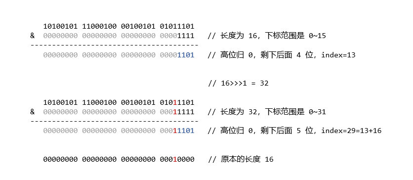

Java 的 HashMap 可以说是用的最多、问的最多的一个 Collection 了。HashMap 是非同步的，即线程不安全。HashMap 允许存放的 key 为 null，但并不保证映射的顺序，也不保证这个顺序随时间保持不变。

*本文对 HashMap 的代码分析基于 JDK 1.8*

```Java
public class HashMap<K,V> extends AbstractMap<K,V>
    implements Map<K,V>, Cloneable, Serializable
```


我们可以先从 HashMap 底层使用的数据结构了解 HashMap。


## 哈希表 + 链表 / 红黑树

```Java
static class Node<K,V> implements Map.Entry<K,V> {
    final int hash;
    final K key;
    V value;
    Node<K,V> next;
    // ...
}

/**
 * The table, initialized on first use, and resized as
 * necessary. When allocated, length is always a power of two.
 * (We also tolerate length zero in some operations to allow
 * bootstrapping mechanics that are currently not needed.)
 */
transient Node<K,V>[] table;

/**
 * The number of key-value mappings contained in this map.
 */
transient int size;
```

HashMap 最基本的数据结构是哈希表 table（一个 Node 数组）。在 HashMap 中，把数组每个下标对应的空间称为 bucket（哈希桶），bucket 的数量就是数组的长度。

HashMap 的 table 是懒加载的，当我们创建 HashMap 实例的时候并不会马上创建 table 数组实例，而是在第一次向 HashMap 实例添加元素的时候，才会进行初始化。

```Java
public V put(K key, V value) {
    return putVal(hash(key), key, value, false, true);
}

final V putVal(int hash, K key, V value, boolean onlyIfAbsent, boolean evict) {
    Node<K,V>[] tab; Node<K,V> p; int n, i;
    if ((tab = table) == null || (n = tab.length) == 0)
        n = (tab = resize()).length; // 初始化 table
    if ((p = tab[i = (n - 1) & hash]) == null)
        tab[i] = newNode(hash, key, value, null);
    else {
        /* 发生哈希碰撞时的处理 */
    }
    // ...
    return null;
}
```

HashMap 存放和获取数据时，都需要通过计算 key 的 hash 值来并映射为 bucket 的下标。不同的 key 得到的下标可能相同，在存放新数据时，计算出来的下标对应的 bucket 中如果已经存在其它节点，这种情况称为**哈希碰撞**。

在 HashMap 中采取的是闭散列的方式来处理哈希碰撞，当发生碰撞时，通过链表的方式，将新的节点连接在已有节点的后面，当链表长度超过规定的阈值时，将会把链表转换为红黑树来进行存储（红黑树是在 JDK 1.8 才引入的）。

```Java
static final int TREEIFY_THRESHOLD = 8;

for (int binCount = 0; ; ++binCount) {
    if ((e = p.next) == null) {
        p.next = newNode(hash, key, value, null);
        if (binCount >= TREEIFY_THRESHOLD - 1) // -1 for 1st
            treeifyBin(tab, hash);
        break;
    }
    if (e.hash == hash &&
        ((k = e.key) == key || (key != null && key.equals(k))))
        break;
    p = e;
}
```

链表转换为红黑树的阈值为 `TREEIFY_THRESHOLD`，该值固定是 8，当链表长度达到这个值时，会调用 `treeifyBin()` 方法尝试转换为红黑树，最终是否转换为树还要根据当前 table 容量决定。

```Java
static final int MIN_TREEIFY_CAPACITY = 64;

final void treeifyBin(Node<K,V>[] tab, int hash) {
    int n, index; Node<K,V> e;
    if (tab == null || (n = tab.length) < MIN_TREEIFY_CAPACITY)
        resize();
    else if ((e = tab[index = (n - 1) & hash]) != null) {
       // ...
    }
}
```

`MIN_TREEIFY_CAPACITY` 是 bucket 结构树形化 table 要求的最小容量，当 table 太小没有达到这个值时（固定是 64），HashMap 会采用扩容的方式来重新打散这些节点的分布。

从 HashMap 使用的数据结构，我们可以分析出它对应的查找时间复杂度：
- 当没有发生碰撞时，那么通过计算下标直接命中对应节点，时间复杂度为 O(1)
- 当下标位置是发生碰撞 bucket 时，如果起连接作用的数据结构是链表的话，那么时间复杂度为 O(n)，n 是链表长度
- 当链表过长转换为红黑树时，时间复杂度为 O(log(n))，n 是树的节点个数。

因此，HashMap 发生碰撞的次数越少，查找效率也会越高。

## hash 与 下标计算

添加节点所调用的 `putVal` 方法第一个参数就是 key 的 hash 值，hash 值通过 `(n - 1) & hash` 这一运算，映射为 table 中存放位置的下标。在 HashMap 中通过 `hash()` 方法来获得 key 对应的 hash 值。

```Java
static final int hash(Object key) {
    int h;
    return (key == null) ? 0 : (h = key.hashCode()) ^ (h >>> 16);
}
```

当 key 为 null 的时候，该方法直接返回的 hash 值是 0，因此在 HashMap 中，是允许 key 为 null 的，并且它只能拥有一个 null 的 key。

当 key 不为 null 的时候，那么获取 key 的 hashCode 赋值为 h，hashCode 是将对象的内部地址转换为 int 类型的整数（这是一个 native 方法，具体看 JVM 如何实现）。

计算下标使用的是将 hash 值和 table 数组下标的最大取值 `n - 1` 进行 & 运算（与运算），这个过程是将 hash 值高位归 0，保留 `n - 1` 取值范围内的低位，从而转换为 table 数组可取的下标。


对于 32 位的 hashCode 而言，一般是不会发生碰撞的，但由于位运算会忽略高位的数值，实际参与运算的只有低位，这就增加了碰撞的概率，运气不好的话，出现高位不同而低位相同的情况，那么碰撞将会比较严重。

因此在 HashMap 中不直接拿 hashCode 来作为 hash 值进行下标运算，而是使用了一个将高位影响向下传播的变换方案，对 hashCode 的高 16 位和低 16 位进行一次异或操作，来将高位的特征混合到低位中，使得高位的影响也可以参与下标计算的 & 运算中。


HashMap 对这个扰乱操作是从实用性、速度、质量方面考虑的，关于这方面的说明，JDK 1.8 源码中一段注释我没完全看懂，这里贴在下面，或者可以自己去源码阅读完整的说明。

> There is a tradeoff between speed, utility, and quality of bit-spreading. Because many common sets of hashes are already reasonably distributed (so don't benefit from  spreading), and because we use trees to handle large sets of collisions in bins, we just XOR some shifted bits in the cheapest possible way to reduce systematic lossage, as well as  to incorporate impact of the highest bits that would otherwise never be used in index calculations because of table bounds.

此外，每个 Node 节点在创建时就会保存对应的 hash 值，后续扩容迁移节点时计算下标，不需要重新计算 key 的 hash 值。

## resize() 扩容机制

我们知道发生冲突时，会使用链表或者树来处理 bucket 的碰撞集，那么 table 将不会发生溢出的情况。当 table 大部分 bucket 存有节点的时候，那么此时碰撞率将会非常高，碰撞会降低 HashMap 的查找效率，因此需要给 table 设置一个容纳极限 `threshold`。

添加节点时，除了链表转换为红黑树时 table 容量没有达到 64 会进行扩容外，如果完成节点的添加后，当前 table 存储的节点超过了容纳极限 `threshold`，也会进行扩容操作，调整节点的分布情况。

```Java
static final float DEFAULT_LOAD_FACTOR = 0.75f;

int threshold;

final float loadFactor;

final V putVal(int hash, K key, V value, boolean onlyIfAbsent, boolean evict) {
    // ...
    if (++size > threshold)
        resize();
    afterNodeInsertion(evict);
    return null;
}

public HashMap() {
    this.loadFactor = DEFAULT_LOAD_FACTOR; // all other fields defaulted
}
```

当 table 存储的节点数量超过目前的 `threshold`，那么对 table 进行扩容操作，并重新分配已有的节点，通常 `threshold` 的值是 `table.length * loadFactor`。除非超出规定大小，否则初始化时和每一次扩容后 `threshold` 的值都会更新。

`loadFactor` 称为负载因子，默认是使用 `DEFAULT_LOAD_FACTOR` 的值 0.75，这代表在碰撞次数为 0 的情况下，有超过 75% 的 bucket 被使用就会进行扩容操作。0.75 是从时间和空间上进行权衡得出的值，当负载因子更大时，会减少空间的开销，因为扩容所要求的 `threshold` 会更高，但这也可能会增加查询的时间成本，因为每个 bucket 发生哈希冲突的次数和概率会变得更高。

```Java
/**
 * The default initial capacity - MUST be a power of two.
 */
static final int DEFAULT_INITIAL_CAPACITY = 1 << 4; // aka 16

final Node<K,V>[] resize() {
    Node<K,V>[] oldTab = table;
    int oldCap = (oldTab == null) ? 0 : oldTab.length;
    int oldThr = threshold;
    int newCap, newThr = 0;
    if (oldCap > 0) {
        if (oldCap >= MAXIMUM_CAPACITY) {
            threshold = Integer.MAX_VALUE;
            return oldTab;
        }
        else if ((newCap = oldCap << 1) < MAXIMUM_CAPACITY &&
                    oldCap >= DEFAULT_INITIAL_CAPACITY)
            newThr = oldThr << 1; // double threshold
    }
    else if (oldThr > 0) // initial capacity was placed in threshold
        newCap = oldThr;
    else {               // zero initial threshold signifies using defaults
        newCap = DEFAULT_INITIAL_CAPACITY;
        newThr = (int)(DEFAULT_LOAD_FACTOR * DEFAULT_INITIAL_CAPACITY);
    }
    if (newThr == 0) {
        float ft = (float)newCap * loadFactor;
        newThr = (newCap < MAXIMUM_CAPACITY && ft < (float)MAXIMUM_CAPACITY ?
                    (int)ft : Integer.MAX_VALUE);
    }
    threshold = newThr;
    @SuppressWarnings({"rawtypes","unchecked"})
    Node<K,V>[] newTab = (Node<K,V>[])new Node[newCap];
    table = newTab;
    if (oldTab != null) {
        /* 扩容后迁移节点 */
    }
    return newTab;
}
```

### 初始化与自定义

在 resize() 中会根据 table 原本的容量大小 `oldCap` 是否为空来判断进行初始化还是扩容，如果进行初试化，则根据原本的容纳极限 `oldThr` 来决定初始化容量。

当我们使用无参数构造方法创建 HashMap 对象时，`threshold` 默认为 0，也就是 `oldThr == 0`，此时使用 `DEFAULT_INITIAL_CAPACITY` 来作为初始化容量，其大小为 16，初始化后 `threshold` 的新值为 `DEFAULT_LOAD_FACTOR * DEFAULT_INITIAL_CAPACITY`。

```Java
public HashMap(int initialCapacity, float loadFactor) {
    if (initialCapacity < 0)
        throw new IllegalArgumentException("Illegal initial capacity: " +
                                            initialCapacity);
    if (initialCapacity > MAXIMUM_CAPACITY)
        initialCapacity = MAXIMUM_CAPACITY;
    if (loadFactor <= 0 || Float.isNaN(loadFactor))
        throw new IllegalArgumentException("Illegal load factor: " +
                                            loadFactor);
    this.loadFactor = loadFactor;
    this.threshold = tableSizeFor(initialCapacity);
}

public HashMap(int initialCapacity) {
    this(initialCapacity, DEFAULT_LOAD_FACTOR);
}
```

我们可以使用 HashMap 的有参构造方法指定 `initialCapacity` 来自定义初始化容量，也可以通过有参构造方法指定 `loadFactor` 的值。

在 HashMap 中规定初始化容量必须时 2 的幂，并且规定 table 最大长度为 `MAXIMUM_CAPACITY`，因此会调用 `tableSizeFor()` 方法来获得符合要求的目标容量，并赋值给 `threshold`。

`tableSizeFor()` 通过一系列右移和或运算的结合，来保证得到的值是一个 2 的幂，并且保证该值不会超过 HashMap 限制的最大容量 `MAXIMUM_CAPACITY`。

```Java
/**
 * The maximum capacity, used if a higher value is implicitly specified
 * by either of the constructors with arguments.
 * MUST be a power of two <= 1<<30.
 */
static final int MAXIMUM_CAPACITY = 1 << 30;

static final int tableSizeFor(int cap) {
    int n = cap - 1;
    n |= n >>> 1;
    n |= n >>> 2;
    n |= n >>> 4;
    n |= n >>> 8;
    n |= n >>> 16;
    return (n < 0) ? 1 : (n >= MAXIMUM_CAPACITY) ? MAXIMUM_CAPACITY : n + 1;
}
```


当初始化 table 时原本 `threshold` 的值 `oldThr` 不为 0，则用该值作为初始化容量进行初始化，`newThr` 为负载因子（创建对象时可能指定了 loadFactor）和新容量的积 `newCap * loadFactor`。

在 HashMap 中有规定 table 的最大容量 `MAXIMUM_CAPACITY`，我们自己指定的容量可能达到这一大小，当新容量的大小或新容纳极限达到或超过这个限制时，将会使用 int 类型的最大值 `Integer.MAX_VALUE` 作为新的容纳极限。

### 扩容与节点迁移

HashMap 扩容时，新容量为旧容量的两倍，如果扩充出来的新容量比限制的最大容量 `MAXIMUM_CAPACITY` 大，那么将会使用最大容量作为新容量，如果原本的容量就已经达到限制的最大容量，那么不进行扩容，直接将原本的 table 返回，而 table 的容纳极限 `threshold` 变为 int 类型的最大值。

在扩容后，需要将节点迁移到新的 table 里面，迁移时需要根据节点的 hash 值重新计算下标。

```Java
if (oldTab != null) {
    for (int j = 0; j < oldCap; ++j) {
        Node<K,V> e;
        if ((e = oldTab[j]) != null) {
            oldTab[j] = null;
            if (e.next == null)
                newTab[e.hash & (newCap - 1)] = e;
            else if (e instanceof TreeNode)
                ((TreeNode<K,V>)e).split(this, newTab, j, oldCap);
            else { // preserve order
                Node<K,V> loHead = null, loTail = null;
                Node<K,V> hiHead = null, hiTail = null;
                Node<K,V> next;
                do {
                    next = e.next;
                    if ((e.hash & oldCap) == 0) {
                        if (loTail == null)
                            loHead = e;
                        else
                            loTail.next = e;
                        loTail = e;
                    }
                    else {
                        if (hiTail == null)
                            hiHead = e;
                        else
                            hiTail.next = e;
                        hiTail = e;
                    }
                } while ((e = next) != null);
                if (loTail != null) {
                    loTail.next = null;
                    newTab[j] = loHead;
                }
                if (hiTail != null) {
                    hiTail.next = null;
                    newTab[j + oldCap] = hiHead;
                }
            }
        }
    }
}
```

- 对于只有单个节点的 bucket，直接计算这个节点在新 table 的位置并插入
- 对于链表和树，则是通过查看新增加的一位二进制来决定在新 table 的位置，再和已经存在的节点组合起来

我们知道下标的计算采用 & 运算，而新的容量是旧容量的 2 倍，也就是对应的二进制左移了一位，那么下标的取值范围相比原本，从二进制数上看，就是增加了一位，因此我们只需要看新增加的那一位二进制数是 0 还是 1，就能确定节点的新位置。



实际上增加的那一位在数值上大小就是原本 table 的容量大小，如果新增加的那一位是 1，那么代表新的下标为当前的下标加上原本的容量大小 `j + oldCap`，这也是为什么 HashMap 规定 table 的长度必须是 2 的幂。

## 参考

> JDK 1.8 源码
>
> [不按套路出牌，HashMap负载因子超过1会怎样？](https://juejin.cn/post/6844903993265618951)
>
