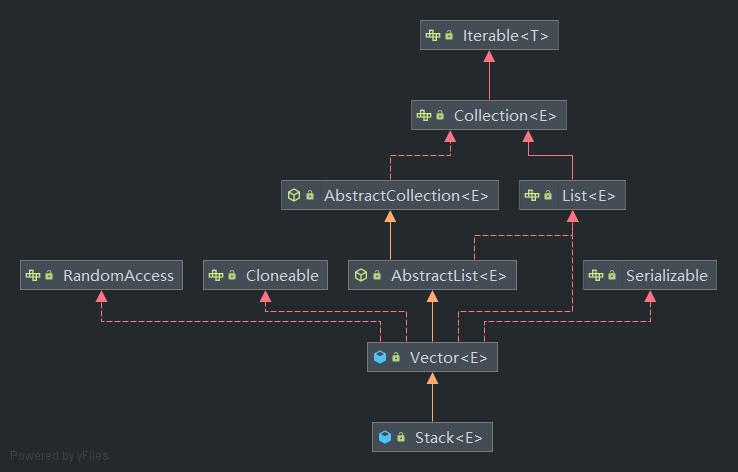

在 **Java Collections Framework** 中有两个被遗弃的 List 实现类 —— **Vector** 和 **Stack**。

Vector 通过实现 `AbstractList<E>` 接口来成为 Java Collections Framework List 接口的一员，而 Stack 直接继承于 Vector。

```Java
public class Vector<E>
    extends AbstractList<E>
    implements List<E>, RandomAccess, Cloneable, java.io.Serializable
```

```Java
public class Stack<E> extends Vector<E>
```



## 与 ArrayList 类似的 Vector

*如果希望了解 ArrayList 的底层结构可阅读另一篇文章 [ArrayList 与 LinkedList 底层结构](https://korilin.com/blog/Java/arraylist-and-linkedlist-principle/)*

与 ArrayList 一样，Vector 的底层结构也是 Object 数组 `elementData`，通过 `elementCount` 来表示 Vector 存储的元素个数，但与 ArrayList 不同的是，ArrayList 创建时不指定容器个数时，elementData 是一个长度为 0 的数组，只有在第一次添加元素的时候才会创建一个长度为 10 的数组，而 Vector 则是在构造方法中调用另一个构造方法直接为 elementData 创建一个长度为 10 的数组。

```Java
protected Object[] elementData;

protected int elementCount;

protected int capacityIncrement;

public Vector() {
    this(10);
}

public Vector(int initialCapacity) {
    this(initialCapacity, 0);
}

public Vector(int initialCapacity, int capacityIncrement) {
    super();
    if (initialCapacity < 0)
        throw new IllegalArgumentException("Illegal Capacity: "+
                                            initialCapacity);
    this.elementData = new Object[initialCapacity];
    this.capacityIncrement = capacityIncrement;
}
```

最终为 elementData 创建数组对象的构造函数为 `Vector(int initialCapacity, int capacityIncrement)`，这里传入的第二个参数是容量增值，当我们不直接调用该构造方法去指定它的值时，默认为 0。

Vector 也有与 ArrayList 类似的扩容机制来增加 `elementData` 的容量，但 Vector 扩容时增加的大小与 ArrayList 不同，它所增加的大小与 Vector 中的容量增值 `capacityIncrement` 与当前容量有关。

```Java
public synchronized boolean add(E e) {
    modCount++;
    ensureCapacityHelper(elementCount + 1);
    elementData[elementCount++] = e;
    return true;
}

private void ensureCapacityHelper(int minCapacity) {
    // overflow-conscious code
    if (minCapacity - elementData.length > 0)
        grow(minCapacity);
}

private static final int MAX_ARRAY_SIZE = Integer.MAX_VALUE - 8;

private void grow(int minCapacity) {
    // overflow-conscious code
    int oldCapacity = elementData.length;
    int newCapacity = oldCapacity + ((capacityIncrement > 0) ?
                                        capacityIncrement : oldCapacity);
    if (newCapacity - minCapacity < 0)
        newCapacity = minCapacity;
    if (newCapacity - MAX_ARRAY_SIZE > 0)
        newCapacity = hugeCapacity(minCapacity);
    elementData = Arrays.copyOf(elementData, newCapacity);
}
```

当我们创建 Vector 指定了 capacityIncrement 的值时（capacityIncrement > 0），将会直接以该值作为容量的增加值，否则直接使用当前 elementData 的大小作为容量增值，相当于新容量为旧容量的两倍，因此 Vector 每一次扩容容量的增幅比 ArrayList 的增幅要大。

```Java
public synchronized void ensureCapacity(int minCapacity) {
    if (minCapacity > 0) {
        modCount++;
        ensureCapacityHelper(minCapacity);
    }
}
```

对于 Vector，其对外提供的方法都是同步的，因此我们可以说 Vector 是线程安全的。Vector 中的同步方法可以调用 `ensureCapacityHelper` 不产生额外的同步成本来确保容量。但也可能有需要外部进行容量确认的情况，因此在 Vector 中提供了同步的 `ensureCapacity` 方法来间接执行 `ensureCapacityHelper` 方法。

## 通过 Vector 实现的 Stack

Stack 在 List 接口中算一个特别的类型，它在数据结构上代表的是 last-in-first-out (LIFO) 的栈结构。

由于 Vector 提供了一系列元素的操作方法，Stack 元素的进出操作的实现基本上都是使用父类 Vector 的方法来完成，因此 Stack 的源码相比其它 Collection 十分简短。..

因为需要确认每个元素的进出顺序，因此 Stack 只提供了一个无参构造方法来获得一个空栈。

Stack 提供了栈操作的 3 个基本操作，入栈、出栈、查看栈顶元素。

```Java
// 源码就长这个样子...

public E push(E item) {
    addElement(item);

    return item;
}

public synchronized E pop() {
    E       obj;
    int     len = size();

    obj = peek();
    removeElementAt(len - 1);

    return obj;
}

public synchronized E peek() {
    int     len = size();

    if (len == 0)
        throw new EmptyStackException();
    return elementAt(len - 1);
}
```

由于 Vector 底层是一个 Object 数组，因此入栈的元素会被添加到末尾，栈顶元素为数组最后一个元素，栈底元素为数组第一个元素。

因此 Stack 入栈操作调用了 Vector 的 `addElement(E obj)` 方法（该方法与 `add(E e)` 方法作用一致，add 方法为 List 接口的一部分）来添加元素。

相应的，出栈调用 `peek()` 来获取栈顶元素，之后通过 `removeElementAt(int index)` 来移除栈顶元素，再将 `peek()` 获取到的元素放回。当栈为空时会抛出异常 `EmptyStackException`。

## 被遗弃

Vector 与 Java Collections Framework 中的新成员相比，它的 public 方法都使用了 synchronized 关键字修饰，也就是说相比其它 Collection 类，它的效率比较低，因此在不需要同步的场景，JDK 更加推荐使用 ArrayList，当有多个线程修改 ArrayList 时，我们可以在同步代码块中完成操作，或者通过 Collections 工具类提供的方法来生成一个同步的 List。

```Java
List list = Collections.synchronizedList(new ArrayList(...));
```

对于 Stack 由于继承与 Vector，因此它也产生了额外的同步成本，Java Collections Framework 的 Deque 接口提供了更加完整、更一致的 LIFO 操作的栈操作，因此 JDK 推荐优先使用 Deque 接口以及它的实现类。例如：

```Java
Deque<Integer> stack = new ArrayDeque<Integer>();
```

## 参考

> JDK 1.8 源码
> 
> https://docs.oracle.com/javase/8/docs/api/java/util/List.html
> 
> https://docs.oracle.com/javase/8/docs/api/java/util/Vector.html
> 
> https://docs.oracle.com/javase/8/docs/api/java/util/Stack.html
