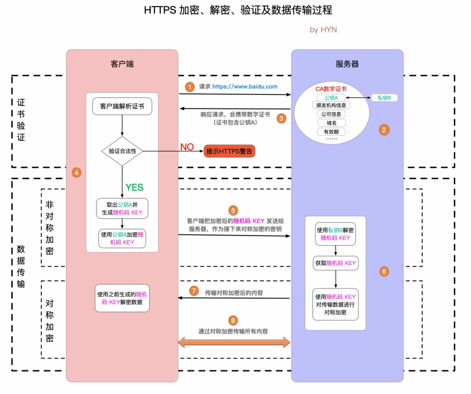

TLS（Transport Layer Security）是传输层安全协议，HTTPS 是在 HTTP 的基础上使用 TLS 来保证数据传输的安全。

HTTPS 的传输过程需要一下三个算法（协议）：
1. 数字证书认证机构（Certificate Authority，CA）签发的服务器公开证书，用于传输非对称加密算法的公钥
2. 非对称加密算法，用于传输对称加密算法的密钥
3. 对称加密算法，用于加密传输的数据

<!-- more -->

## 加密算法

**对称加密**：加密和解密用同一个密钥、计算量小、加密解密速度快，但密钥传输有被截获的可能

**非对称加密**：加密用公钥，解密用私钥，只需要传输用于加密的公钥，数据和密钥被截获了依旧获取不了数据，因此安全性比较高，但计算量比较大，比对称加密慢很多

TLS 采用非对称加密来传输对称加密的密钥，这样用于加密传输数据的密钥就不会被轻易获取（被截获了也拿不到原本密钥）。

当然也可以使用非对称加密算法来加密传输数据，但对称加密相比非对称加密更快，更适合用来加密较大的数据。

## CA 数字证书

CA 证书中包含了证书颁发机构、域名范围（Common Name，CN）等信息，证书依靠证书信任链来证明自己是可信的，客户端自己信任的 CA 列表来验证这个证书的合法性，此外还会验证 CN 的正确性。

## TLS 基本过程

1. 当客户端向服务器发送一个 **Client Hello**
2. 服务端携带已签发的 CA 数字证书发送一个 **Server Hello**给客户端，CA 证书中包含非对称加密算法所使用的**公钥**
3. 客户端解析 CA 证书，验证其合法性（不合法则提示 HTTPS 错误警告），之后提取出证书中的公钥，并生成对称加密的密钥 KEY，用公钥加密 KEY 发送给服务端
4. 服务端用私钥解密获得密钥 KEY，之后双方使用密钥 KEY 进行对称加密传输数据。



## Nginx 中开启 HTTPS

```py
 server {
    listen 443;
    server_name domain.com;
    ssl on;
    ssl_certificate /etc/nginx/cert/domain.pem;         #证书公钥文件路径
    ssl_certificate_key  /etc/nginx/cert/domain.key;    #证书私钥文件路径
    ssl_session_timeout  5m;
    ssl_protocols TLSv1 TLSv1.1 TLSv1.2;
    ssl_ciphers  ECDHE-RSA-AES128-GCM-SHA256:ECDHE:ECDH:AES:HIGH:!NULL:!aNULL:!MD5:!ADH:!RC4;
    ssl_prefer_server_ciphers on;

    location / {
    }
}
```

## 中间人攻击

**SSL 剥离**：中间人阻止用户使用 HTTPS 访问，可采用 HSTS（HTTP Strict Transport Security）技术来强制使用 HTTPS 访问。

**伪造证书攻击**：但 DNS 服务器被攻击，导致客户端访问攻击者的 IP，并且攻击者服务器也有合法证书时，浏览器则会信任对方，攻击者就可以监听客户端和真实服务端的通信，可采用 HPKP（Public Key Pinning Extension for HTTP）技术，在在返回头存储公钥指纹信息，来检查是否收到攻击。

HSTS 和 HPKP 都依赖于头部返回，无法解决第一次访问的问题，因此浏览器都会内置一些 HSTS preload list 和 HPKP 列表。

> 据说 Chrome 已经彻底移除了 HPKP 的支持

## 参考

- [HTTPS 详解一：附带最精美详尽的 HTTPS 原理图 - segmentfault](https://segmentfault.com/a/1190000021494676)
- [HTTP over SSL/TLS - 笔试面试知识整理](https://hit-alibaba.github.io/interview/basic/network/HTTPS.html)
- [Keyless SSL: The Nitty Gritty Technical Details](https://blog.cloudflare.com/keyless-ssl-the-nitty-gritty-technical-details/)
